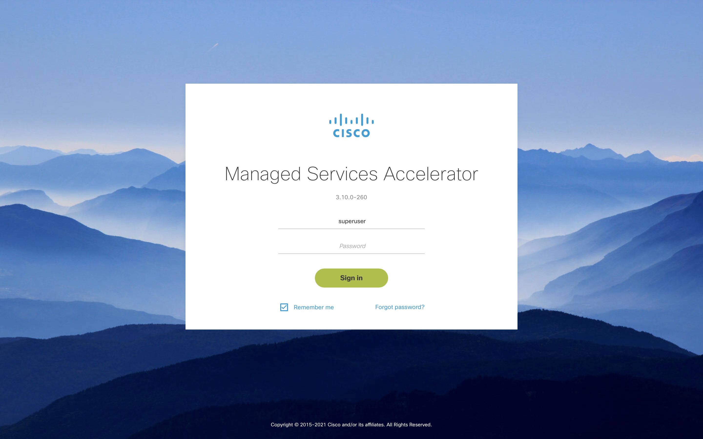
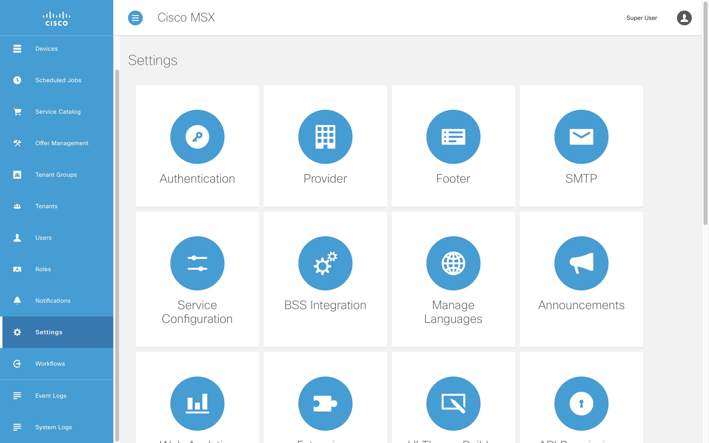
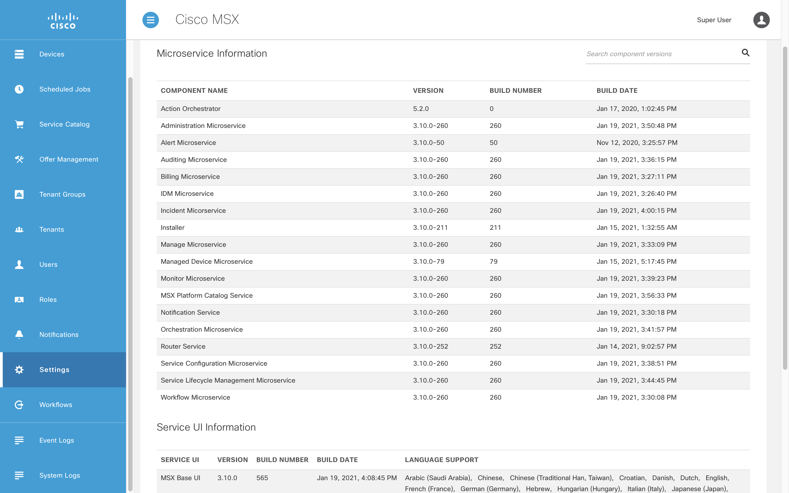
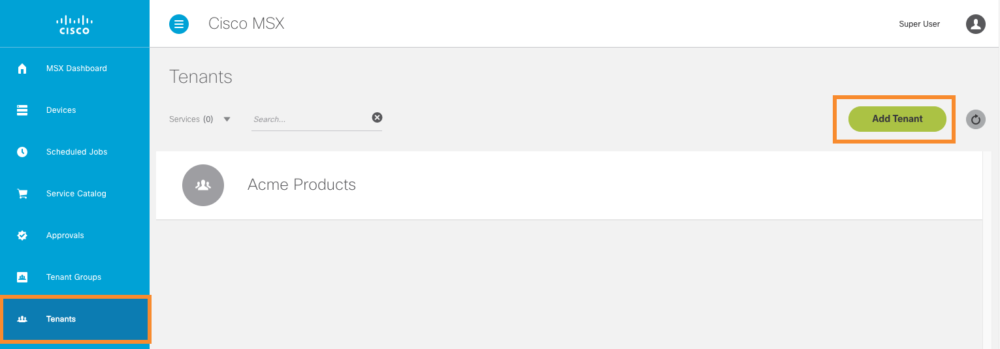
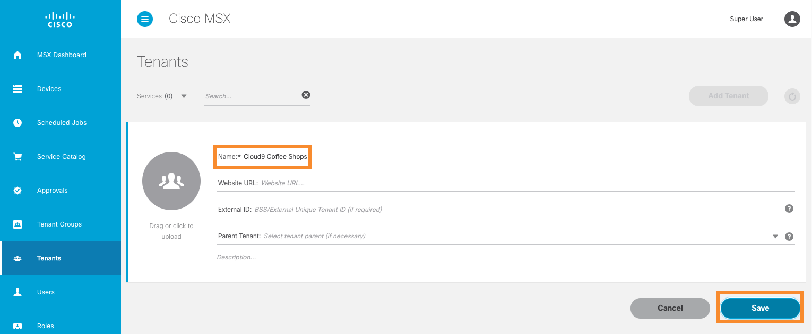
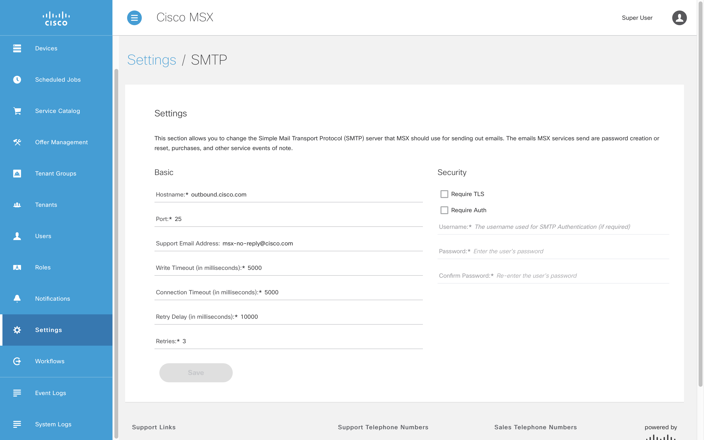
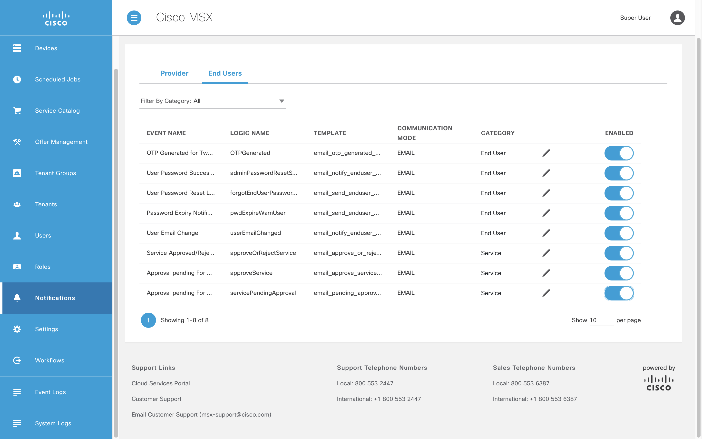
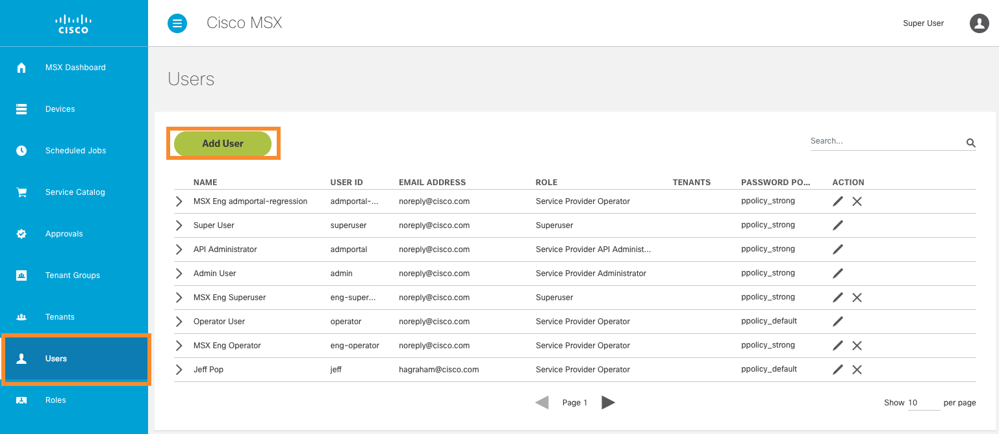
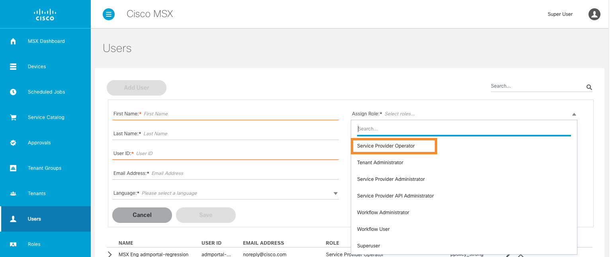

# Navigating the MSX User Interface
* [Introduction](#introduction)
* [Goals](#goals)
* [Prerequisites](#prerequisites)
* [Signing In To MSX](#signing-in-to-msx)
* [Opening the Settings Page](#opening-the-settings-page)
* [Finding the MSX Version](#finding-the-msx-version)
* [Adding a Tenant](#adding-a-tenant)
* [Adding a User](#adding-a-user)

## Introduction
The Cisco MSX Portal provides ways to manipulate most but not all aspects of the system. See the operations manual on [cisco.com](http://www.cisco.com) for full details. The purpose of this guide is to provide a whistle-stop tour of a few useful corners of the user interface. 

## Goals
* sign in to MSX
* work with settings 
* work with notifications
* create a tenant
* create a user

## Prerequisites
* access to an MSX environment [(help me)](../01-msx-developer-program-basics/02-getting-access-to-an-msx-environment.md)

## Signing In To MSX
To sign in to MSX open the link to your MSX environment in a browser and enter your username and password.

## Opening the Settings Page
Different aspects of MSX can be configured from the "Settings" page, to open it click on "Settings" in the left-hand navigation panel. The tiles presented are self-explanatory in most case, for example, "SMTP" configures the email server that allows to MSX to send email. 

## Finding the MSX Version
One of the most important pieces of information to include when reporting an issue is the version of your software. Open the "Settings" page from the left-hand navigation panel and select "Component Versions". This will show you all the microservice versions as well as the user interface version.

## Adding a Tenant
To create a tenant in MSX first sign in using your "superuser" credentials, select "Tenants" in the left-hand navigation panel, then click "Add Tenant".

 

Enter a name for your new tenant (e.g. Acme Coffee Shops) and click "Save", the other fields are optional.

 

## Adding a User
First check that outbound email is configured before attempting to create a "User". To do this select "Settings -> SMTP" from the left-hand navigation panel. MSX will not be able to send a password link to the new "User" if email is not set up, reach out to us if your environment is not configured.

 

Second check that MSX is configured to send email notifications when creating a new "User". Select "Notifications" from the left-hand navigation panel, click "End Users", and toggle all the switches to on.

 

Adding a "User" is similar to adding a "Tenant" but there are more mandatory fields. Select "Users" in the left-hand navigation panel, then click "Add User".

 

Enter the values for all the mandatory fields, you can select the "Tenant" you created above, and a "Role" of "Service Provider Operator". A user with that role will allow you to do access most of required MSX features, and best practice not to use "superuser" just because you can. 

 

After clicking "Save" the user is emailed a password reset link, you cannot choose a password for the user in the user interface. If no email arrives check the email address is correct, still no dice, check the MSX SMTP and End User Notification settings.
