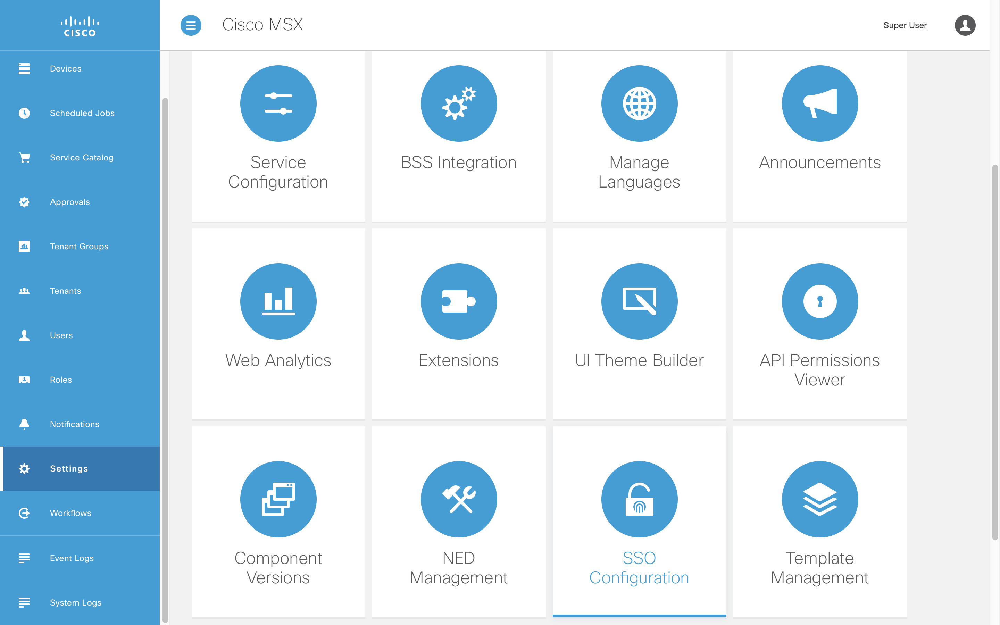

# Configuring Security Clients

* [Introduction](#introduction)
* [Goals](#goals)
* [Prerequisites](#prerequisites)
* [OAuth2 Basics](#oauth2-basics)
* [Confidential Security Clients Basics](#confidential-security-client-basics)
* [Confidential Security Clients the Hard Way](#confidential-security-clients-the-hard-way)
* [Public Security Client Basics](#public-security-client-basics)
* [Public Security Clients the Easy Way](#public-security-clients-the-easy-way)
* [Public Security Clients the Hard Way](#public-security-clients-the-hard-way)
* [References](#references)


## Introduction
You need to register an OAuth security client in MSX before your service can access the platform.

 There are two kinds:
* confidential clients - use this when you can keep the client secret safe
* public clients - for applications running in a browser or on a mobile device

Each type requires different grants, scopes, secrets, and redirects.


## Goals
* explain OAuth2 basics
* learn two ways to register a security client 
* configure security clients for development and production


## Prerequisites
Before you start you will need the following:
* access to an MSX environment [(help me)](../01-msx-developer-program-basics/02-getting-access-to-an-msx-environment.md)
* superuser credentials for that MSX environment


## OAuth2 Basics
MSX uses the OAuth2 protocol for API authorization. An understanding of the OAuth2 spec is helpful in how to get an access token from MSX for different use cases.

In particular, an OAuth2 authentication has two parts: 1. client authentication; 2. user authentication. The client is authenticated using HTTP basic auth header. The user is
authenticated via different mechanism depending on the OAuth2 grant. For example, in the auth code grant flow the user is authenticated via the login form; while in the password grant
flow, the user is authenticated directly using the username/password in the token request body.

A token is issued by MSX if both client and user are authenticated. This token represents the client and the user. Based on the client authentication, MSX can determine
the scope allowed for this token. For example, if a client has the "openid" scope, MSX will include more user details in the token as per OIDC specification. On the other hand,
based on the user authentication, MSX can determine the security context of the user when this token is used. For example, permissions and tenancy of this user.

Because of the nature of the client application, some clients can safely store the client secret while other cannot. For example, a server app is considered able to store the client
secret whereas a javascript browser app cannot, because the javascript app can be inspected by any user via the browser.

Therefore, we separate clients into public clients and confidential clients. Public clients are suitable for use by apps that cannot keep a secret, and confidential client for apps that can.
Public clients will not have a client secret, and can only be configured with limited scopes, the can also can only be configured with a subset of the oauth2 grant types.

**NOTE:** As of MSX 4.3, user will no longer need to manually create public or confidential security clients for components that are deployed by SLM. If one still wishes to create a security client, it will require writing the cli tool yourself.

## Confidential Security Client Basics
If you are creating a confidential security client first ask yourself if you need it. To create one you will need:
* the OAuth password grant 
* a client secret

You should only create a confidential security client if you can keep the client secret... well secret. Additionally, you should only use a confidential security client to make password grant requests if you can do so on a secure back channel, with credentials that are also kept safe. If you do not understand this section, do not register a confidential security client.

Note, you can also use other grants with confidential clients if the use case suits you. All OAuth2 grant types and scopes can be used by a confidential client.


## Confidential Security Clients the Hard Way
You can create a security client via the IDM Service Swagger [(help me)](../01-msx-developer-program-basics/03-navigating-the-msx-user-interface.md).


<br>

Open the IDM Swagger documentation, expand "POST /idm/api/v2/clientsecurity", then click "Try it out". Update the "clientId" and "clientSecret" values in the example payload below, then copy it into the request field and click "Execute".

```json
{
    "clientId": "my-private-client",
    "clientSecret": "there-are-no-secrets-that-time-does-not-reveal",
    "grantTypes": [
        "password", 
        "urn:cisco:nfv:oauth:grant-type:switch-tenant", 
        "urn:cisco:nfv:oauth:grant-type:switch-user"
    ],
    "maxTokensPerUser": -1,
    "useSessionTimeout": false,
    "resourceIds": [],
    "scopes": [
        "address",
        "read",
        "phone",
        "openid",
        "profile",
        "write",
        "email",
        "tenant_hierarchy", 
        "token_details"
    ],
    "autoApproveScopes": [
        "address",
        "read",
        "phone",
        "openid",
        "profile",
        "write",
        "email",
        "tenant_hierarchy", 
        "token_details"
    ],
    "authorities": [
        "ROLE_USER"
    ],
    "accessTokenValiditySeconds": 9000,
    "refreshTokenValiditySeconds": 18000,
    "additionalInformation": {
    }
}
```

## Public Security Client Basics
If you are creating a public security client you will need the following:
* the OAuth authorization_code grant
* the OAuth refresh_token grant
* a redirect URL

These grants and the redirect URL are used in combination to implement the SSO flow to get an access token safely. If your user interface is hosted inside the MSX domain then the redirect can be relative. However if you want to develop the user interface locally against a remote MSX environment you will need to provide a fully qualified local HTTPS URL like the one below. Never register a redirect URL to a destination you do not control in a production environment.
```
https://192.168.0.13:4200/callback
```

If you do not know the local IP address of your machine you can find it with the following terminal command on macOS.
```
$ ifconfig | grep 192.168.
inet 192.168.0.13 netmask 0xffffff00 broadcast 192.168.0.255
```


## Public Security Clients the Easy Way
The SSO Configuration page in the MSX Settings is the easiest way to register a security client.


<br>

You can view a list of the current security clients and add a new one.


<br>

To register a new public security client populate the form as shown below. Note you will need to change the "Client ID" and "Registered Redirect URL" for your application. Public clients do not require a "Client Secret" but confidential security clients do. 


<br>

The security client it will appear in the list once it has been saved.


## Public Security Clients the Hard Way
You can also create a security client via the IDM Service Swagger [(help me)](../01-msx-developer-program-basics/03-navigating-the-msx-user-interface.md).


<br>

Once you have opened IDM Swagger documentation expand "POST /idm/api/v2/clientsecurity" then click "Try it out". Update the client id and redirect URL in the example payload below. Then copy it into the request field before clicking "Execute".
```
{
    "clientId": "my-public-client",
    "grantTypes": [
      "refresh_token",
      "authorization_code"
    ],
    "maxTokensPerUser": -1,
    "useSessionTimeout": false,
    "resourceIds": [],
    "scopes": [
      "address",
      "read",
      "phone",
      "openid",
      "profile",
      "write",
      "email"
    ],
    "autoApproveScopes": [
      "address",
      "read",
      "phone",
      "openid",
      "profile",
      "write",
      "email"
    ],
    "authorities": [
      "ROLE_USER","ROLE_PUBLIC"
    ],
    "registeredRedirectUris": [
      "/reactSsoSdkDemo/callback"
    ],
    "accessTokenValiditySeconds": 9000,
    "refreshTokenValiditySeconds": 18000,
    "additionalInformation": {}
}
```

<br>

If the request is successful you see will an HTTP-201 response.


<br>


## References
[OAuth 2.0](https://oauth.net/2/)

[OpenID Connect 1.0](https://openid.net/connect/)

[AppAuth Project](https://appauth.io)

[AppAuth Flutter Library](https://pub.dev/packages/flutter_appauth)


| [PREVIOUS](04-using-the-swagger-documentation.md) | [NEXT](90-understanding-roles-and-permissions.md) | [HOME](../index.md#msx-developer-program-basics) |
