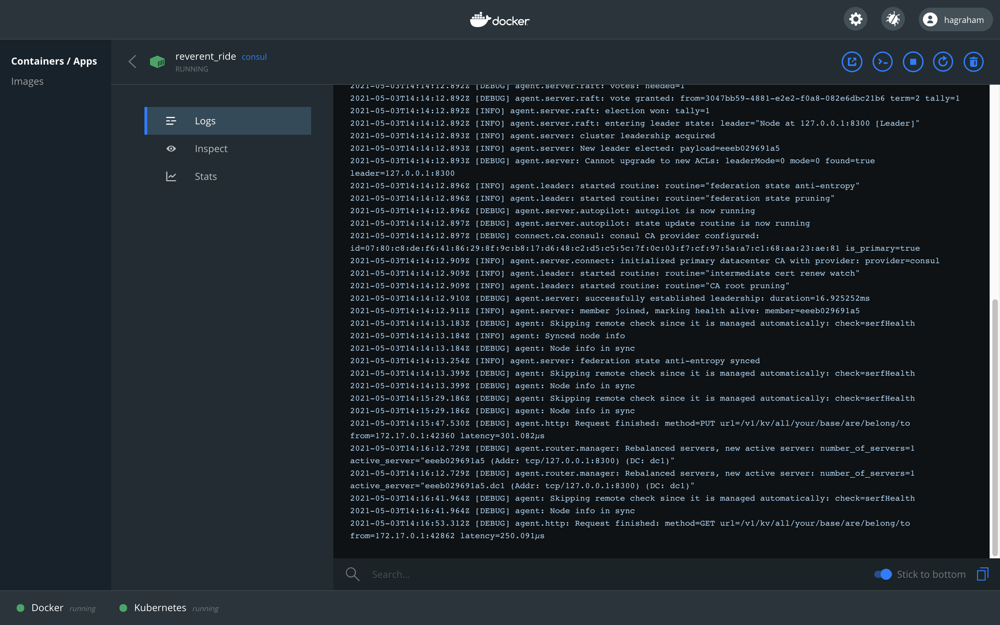
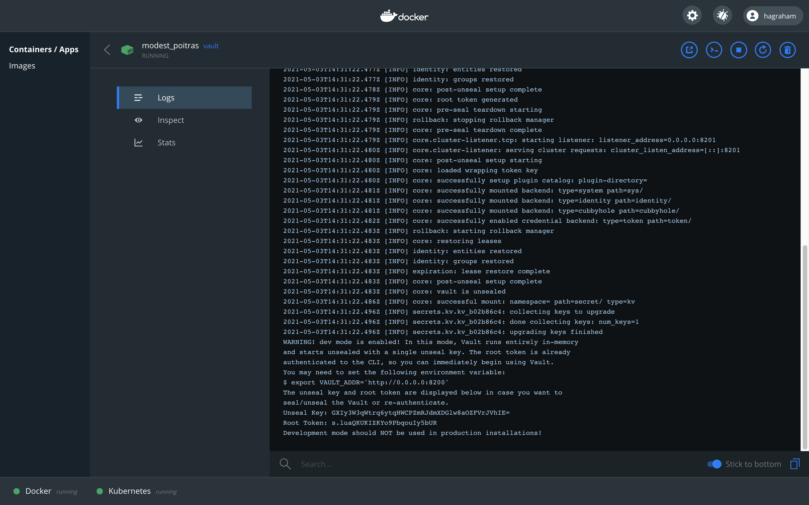

# Managing Local Infrastructure
* [Introduction](#introduction)
* [Goals](#goals)
* [Prerequisites](#prerequisites)
* [Service Configuration](#service-configuration)
* [Bootstrapping Consul](#bootstrapping-consul)
* [Bootstrapping Vault](#bootstrapping-vault)
* [Introducing Docker Desktop](#introducing-docker-desktop)
* [Running Consul for Development](#running-consul-for-development)
* [Starting Vault for Development](#running-vault-for-development)
* [Starting CockroachDB Locally](#starting-cockroachdb-locally)
* [References](#references)


## Introduction
Services deployed to MSX using the Component Manager have access to Consul, Vault, and CockroachDB. When running your service locally you can choose how to pass configuration, one option is to use Docker Desktop to stand up Consul and Vault yourself. This guide introduces this infrastructure and how to interact with it locally and via MSX. 


## Goals
* bootstrap Consul and Vault
* introduce Docker Desktop
* working with infrastructure


## Prerequisites
* [Docker Desktop](https://www.docker.com/products/docker-desktop)


## Service Configuration
All services need configuration for one thing or another. For local development it can be convenient to pass all to configuration in a file, so we do not need additional infrastructure. When deploying into MSX it is better to use Consul and Vault, and we can pass values in the Component Manager Manifest. For more flexibility consider cascading key/value sources with a priority order.
* Runtime Environment Variable (highest priority)
* Consul/Vault
* Application Configuration File (lowest priority) 


## Bootstrapping Consul
When MSX starts your service, it passes environment variables to configure Consul.

| Name                     | Example          |
|--------------------------|------------------|
| SPRING_CLOUD_CONSUL_HOST | http://127.0.0.1 |
| SPRING_CLOUD_CONSUL_PORT | 8500             |

You can pass environment variables when running locally too, but it is more convenient to pass them in a configuration file that your service loads when it starts. This is what we do in the Hello World Service examples.


## Bootstrapping Vault 
When MSX starts your service, it passes environment variables to configure Vault.

| Name                      | Example                    |
|---------------------------|----------------------------|
| SPRING_CLOUD_VAULT_SCHEME | http                       |
| SPRING_CLOUD_VAULT_HOST   | 127.0.0.1                  |
| SPRING_CLOUD_VAULT_PORT   | 8200                       |
| SPRING_CLOUD_VAULT_TOKEN  | s.erq0ll7pkPctres2fFpbjxZx |

Like Consul, you can pass environment variables when running locally too, but a configuration file is more convenient. Additional configuration might be required to set up the certificates depending on the language you are using; See the Hello World Service Go and Java examples for details.


## Introducing Docker Desktop
There is no point recreating content that is already well covered elsewhere [(help me)](https://docs.docker.com/desktop/). If you have not already installed Docker Desktop then do so now, noting that at the time of writing `Docker Engine 19` is required to work with the Cisco Artifactory. The easiest way to get that is to install `Docker Desktop 2.5.0.1` [(help me macOS)](https://docs.docker.com/docker-for-mac/release-notes/#docker-desktop-community-2501) [(help me Windows)](https://docs.docker.com/docker-for-mac/release-notes/#docker-desktop-community-2501).


## Running Consul for Development
Once you have installed Docker Desktop, follow the online instructions to start Consul [(help me)](https://hub.docker.com/_/consul). See below for the minimal steps to install and start Consul, then write and read key value pair. Note that we map port 8500 in the container to port 8500 on the Docker host, this allows us to talk to Consul without having to connect to the container.

```shell
$ docker pull consul
Using default tag: latest
latest: Pulling from library/consul
339de151aab4: Pull complete 
479a746f994b: Pull complete 
73e6c1395cf2: Pull complete 
5ceaa195774c: Pull complete 
67ff69bc8fb8: Pull complete 
4c9b2ffb3112: Pull complete 
Digest: sha256:0dc30c8081ea3cb4a90c908a571cb4aa469ae9e3d2b27d9fb713031127360e42
Status: Downloaded newer image for consul:latest
docker.io/library/consul:latest

$ docker run -p 8500:8500 consul
.
.
.

$ consul kv put all/your/base/are/belong/to us
Success! Data written to: all/your/base/are/belong/to

$ consul kv get  all/your/base/are/belong/to
us
```

You can also use the `Docker Desktop Dashboard` to stop and start your container, monitor what is going on, and connect to the container to run commands.




## Running Vault for Development
Starting Vault is just as easy [(help me)](https://hub.docker.com/_/vault). The console output below shows how to download and start Vault, then set and retrieve a secret. Note that we have to set a couple of environment variables first. When Vault is started in Development Mode, the root token is displayed in the terminal window.

| Name                     | Example                    |
|--------------------------|----------------------------|
| VAULT_ADDR               | http://localhost:8200      |
| VAULT_TOKEN              | s.luaQKUKIZKYo9PbqouIy5bUR |

```shell
$ docker pull vault
Using default tag: latest
latest: Pulling from library/vault
540db60ca938: Pull complete 
97e67639d69e: Pull complete 
1dc349bca401: Pull complete 
a0445e106649: Pull complete 
ef616976a08c: Pull complete 
Digest: sha256:10f564c947706e021e60c84bd22b1e91559db133d6d3a57e930d32cd7e0cbf77
Status: Downloaded newer image for vault:latest
docker.io/library/vault:latest

$ docker run -p 8200:8200 vault
.
.
.
Unseal Key: GXIy3W3qWtrq6ytqHWCPZmRJdmXDGlw8aOZFVrJVhIE=
Root Token: s.luaQKUKIZKYo9PbqouIy5bUR
Development mode should NOT be used in production installations!

$ export VAULT_ADDR="http://localhost:8200"

$ export VAULT_TOKEN="s.luaQKUKIZKYo9PbqouIy5bUR"

# Disable default V2 secret engine.
$ vault secrets disable secret
Success! Disabled the secrets engine (if it existed) at: secret/

# Enable V1 secret engine.
$ vault secrets enable -path=secret kv
Success! Enabled the kv secrets engine at: secret/

$ vault kv put secret/hello foo=bar
Success! Data written to: secret/hello

$ vault kv get secret/hello
=== Data ===
Key    Value
---    -----
foo    bar
```

You can also use the `Docker Desktop Dashboard` to stop and start your container, monitor what is going on, and connect to the container to run commands. Look in the log for the Vault root token if you forgot to copy it from the terminal window.




## Starting CockroachDB Locally
More work is required to start CockroachDB in Docker, rather than reproduce that content please follow the official instructions [(help me)](https://www.cockroachlabs.com/docs/v20.2/start-a-local-cluster-in-docker-mac).

The MSX Component Manager will create the database automatically when you deploy your service. When you are testing locally however, you will have to create the database yourself. We include the required steps from the linked documentation for clarity.  

```shell
$ docker exec -it roach1 ./cockroach sql --insecure
#
# Welcome to the CockroachDB SQL shell.
# All statements must be terminated by a semicolon.
# To exit, type: \q.
#
# Server version: CockroachDB CCL v20.2.8 (x86_64-unknown-linux-gnu, built 2021/04/23 13:54:57, go1.13.14) (same version as client)
# Cluster ID: 5853855e-9fb2-4795-8a31-43e2880cd812
#
# Enter \? for a brief introduction.
#
root@:26257/defaultdb> CREATE DATABASE mydatabase;
CREATE DATABASE

Time: 28ms total (execution 28ms / network 0ms)
```


## References
[Docker Documentation](https://docs.docker.com)

[Consul Documentation](https://www.consul.io/docs)

[Vault Documentation](https://www.vaultproject.io/docs)

[CockroachDB Documentation](https://www.cockroachlabs.com/docs/)

[Start CockroachDB Cluster in Docker](https://www.cockroachlabs.com/docs/v20.2/start-a-local-cluster-in-docker-mac.html)


