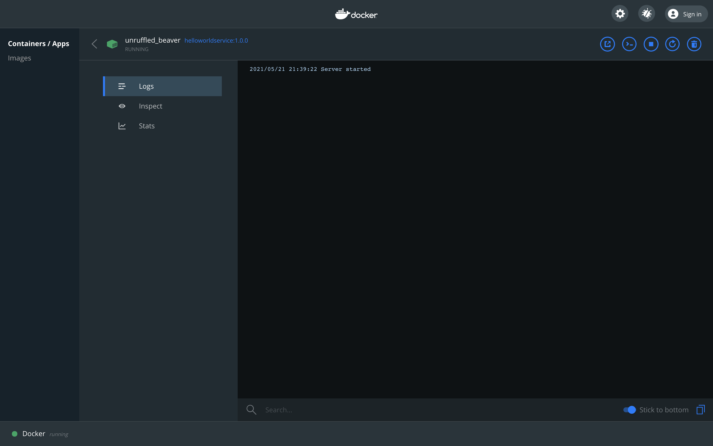

# Troubleshooting Services
* [Introduction](#introduction)
* [Goals](#goals)
* [Prerequisites](#prerequisites)
* [Running a Container Locally](#running-a-container-locally)
    * [Downloading and Component](#downloading-the-component)
    * [Registering the Container](#registering-the-container)
    * [Spinning up the Container](#spinning-up-the-container)
    * [Hitting the Container](#hitting-the-container)
* [Checking Service Health](#checking-service-health)
* [Setting Service Resource Constraints](#setting-service-resource-constraints)


## Introduction
So you have written a service and have tried to deploy it to MSX but either the deployment fails, or your service never seems to come up. This is a troubleshooting guide to help get you back on the right path.


## Goals
* run a service locally from a container
* check your service is healthy
* service resource constraints


## Prerequisites
* access to an MSX environment [(help me)](../01-msx-developer-program-basics/02-getting-access-to-an-msx-environment.md)
* an MSX Component tarball [(help me)](artifacts/helloworldservice-1.0.0-component.tar.gz)


## Running a Container Locally
If you have tried deploying your component to MSX, but it does not come up, check that you can start the container locally. Depending on what your service does, you may have to start some infrastructure locally first [(help me)](../03-msx-component-manager/08-managing-local-infrastructure.md).

### Downloading the Component
First you need to download an example MSX component tarball [(help me)](artifacts/helloworldservice-1.0.0-component.tar.gz). Then unpack it with the following terminal command so that we can get at the Docker image `helloworldservice-1.0.0.tar.gz` (note this file does not have component in the name).

```shell
$ tar xvfz helloworldservice-1.0.0-component.tar.gz
x manifest.yml
x helloworldservice-1.0.0.tar.gz
```

### Registering the Container
To register the image make sure that Docker Desktop has started, then run the Docker command below:

```shell
$ docker load -i helloworldservice-1.0.0.tar.gz
Loaded image: helloworldservice:1.0.0
```

### Spinning up the Container
Before we can spin up the container we need to check `manifest.xml` to see which port the service is exposed on.

```yaml
.
.
.
Containers:
  - Name: "helloworldservice"
    Version: "1.0.0"
    Artifact: "helloworldservice-1.0.0.tar.gz"
    Port: 8080
    ContextPath: "/helloworld"
.
.
.
```

Spin up the container with the command below, note how we bind port 8080 of the container to TCP port 8080 on the host machine. 

```shell
$ docker run -d -p 8080:8080 helloworldservice:1.0.0
edfee361b5a5275dc9b05e2b993bfccb1ca44c996ba64ecce0bc8a1877468b24
```

Check that the container is running with `docker container ls` or use `Docker Desktop`.



### Hitting the Container
We can see that the container is up, but it is more convincing to get make a request and get a response. The container implements a simple Hello World service, and we can look in `manifest.xml` again to find the endpoint used for the health check.

```yaml
.
.
.
    Check:
      Http:
        Scheme: "http"
        Host: "127.0.0.1"
        Path: "/helloworld/api/v1/items"
      IntervalSec: 60
      InitialDelaySec: 30
      TimeoutSec: 30
.
.
.
```

That provides the last piece of information required to make a `curl` request to the service.

```shell
$ curl --request GET "http://localhost:8080/helloworld/api/v1/items"
[
  {
      "id":"a619249d-8d5a-4b40-8b1f-ba4da2f8199b",
      "languageId":"20f329ac-123f-48f0-917d-a70497cfd22a",
      "languageName":"Esperanto",
      "value":"Saluton mondo"
      }
]
```

## Checking Service Health
The service health check is a simple request that can be made against your service that returns HTTP-200. The example above shows a request that gets a list of items, but you can have a simpler dedicated endpoint too. If the health check fails then you service will be reaped by Kubernetes inside MSX.

## Setting Service Resource Constraints
A failing health check is one reason your service might not come up properly inside MSX, another is that it has not been allocated enough resources. You can tune the resources you expect your container to need in `manifest.xml` as follows:

```yaml
.
.
.
    Limits:
      Memory: "256Mi"
      CPU: "1"
.
.
.
```

The Go Hello World Service is small so does not require much. Full details of what you can set here can be found in the Component Manager Manifest Reference [(help me)](../reference/component-manager-manifest-reference.md).


| [PREVIOUS](08-managing-local-infrastructure.md) | [NEXT](10-accessing-logs-with-kibana.md) | [HOME](../index.md#msx-component-manager) |
