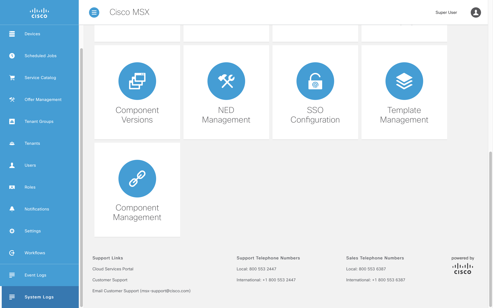
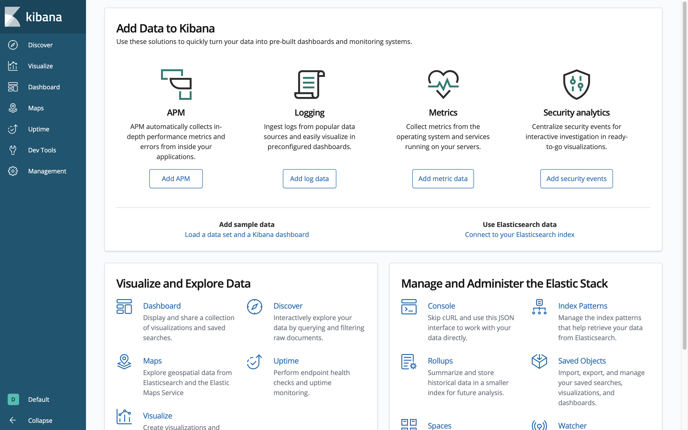
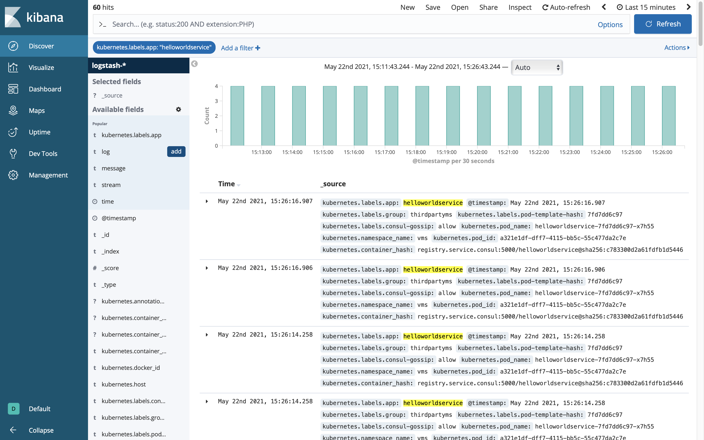
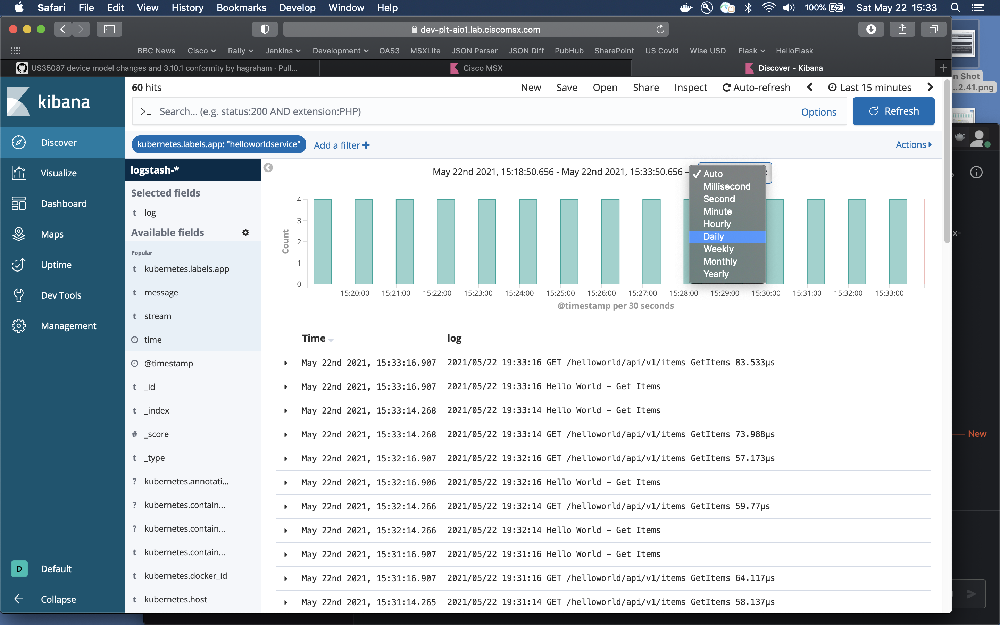
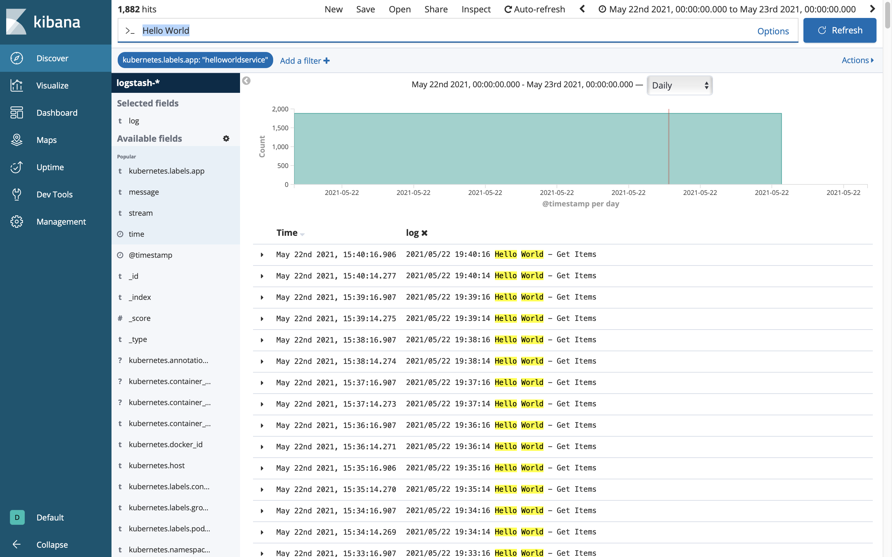
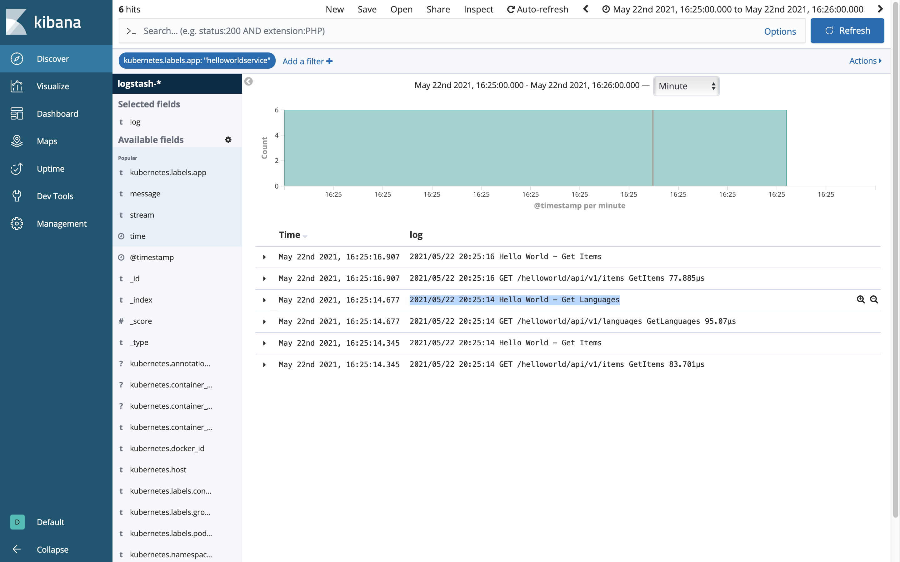

# Accessing Logs With Kibana
* [Introduction](#introduction)
* [Goals](#goals)
* [Prerequisites](#prerequisites)
* [Deploying the Component](#deploying-the-component)
* [Inspecting the Log](#inspecting-the-log)
* [Generating the Log](#generating-the-log)
* [Conclusion](#conclusion)

## Introduction
When your service is running locally, inspecting the logs is no problem. As soon as it is deployed to MSX, it is a little harder. To look at the logs in this scenario we turn to Kibana, which is accessible from the Cisco MSX Portal.

<br>

## Goals
* access logs using Kibana

<br>

## Prerequisites
* access to an MSX environment [(help me)](../01-msx-developer-program-basics/02-getting-access-to-an-msx-environment.md)
* an MSX Component tarball [(help me)](artifacts/helloworldservice-1.0.0-component.tar.gz)

<br>

## Deploying the Component
If you have not already deployed the Hello World Service to you MSX environment start by downloading it [(help me)](artifacts/helloworldservice-1.0.0-component.tar.gz), then use the Cisco MSX Portal to deploy it [(help me)](../03-msx-component-manager/04-onboarding-and-deploying-components.md)

<br>

## Inspecting the Log
The Hello World Service we deployed above writes to the log once when it starts, and then for each subsequent request. That includes the service health check which gets a list of Hello World items, so even if you do nothing the service will generate a log. We will now inspect that log using Kibana.
 
Click on `System Log` in the left-hand navigation panel of the Cisco MSX Portal.



<br>

Kibana will launch in a new window. This is not a Kibana tutorial, but we will scratch the surface deep enough to dig out the messages we wrote to the console. 



<br>

Click on `Discover` in the left-hand navigation panel of the Kibana interface. Then add a new filter of `kubernetes.labels.app is helloworldservice` as shown.


<br>

We only care about the time and log so add `log` from the `Available Fields` as shown.



<br>

One of the tricks to finding what you are looking for is being aware of `when` you are looking. Setting the time window to `Auto` or `Daily` is an easy way to make sure we see logs for the service we just deployed.



<br>

If you are looking for something in particular, enter a filter in the text box at the top of the screen. In the screenshot below we have filtered on `Hello World` to find what we are interested in.



<br>

## Generating the Log
The Hello World Service we deployed is written in Go, all it does to write a log entry is call `log.Printf`.

```go
func (s *LanguagesApiService) GetLanguages(ctx context.Context) (ImplResponse, error) {
	log.Printf(`Hello World - Get Languages`)
	list := []Language{StubLanguage}
	return Response(http.StatusOK, list), nil
}
```

Make a `curl` command to get a list of languages from your MSX enviorment then check the log again.

```bash
$ export MY_MSX_ENVIRONMENT=dev-plt-aio1.lab.ciscomsx.com
$ curl --insecure --request GET `https://$MY_MSX_ENVIRONMENT/helloworld/api/v1/languages`
[
  {
    `id`:`20f329ac-123f-48f0-917d-a70497cfd22a`,
    `name`:`Esperanto`,
    `description`:`Esperanto is a constructed auxiliary language. Its creator was L. L. Zamenhof, a Polish eye doctor.`
  }
]
```

Switch back to Kibana and set the time window to `Minute` and narrow in on the log entry we just created. 



<br>

## Conclusion
If your service works as expected locally, but has some strange behaviours when deployed to MSX, then using logging and Kibana to work out what is going on.


| [PREVIOUS](09-troubleshooting-services.md) | [HOME](../index.md#msx-component-manager) |
|---|---|