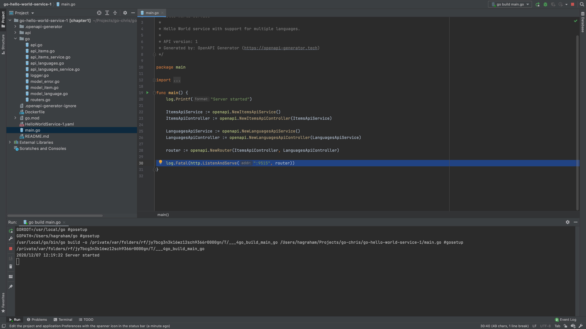
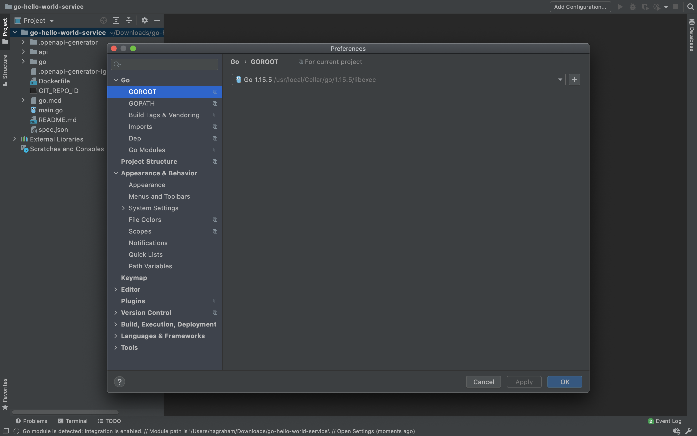
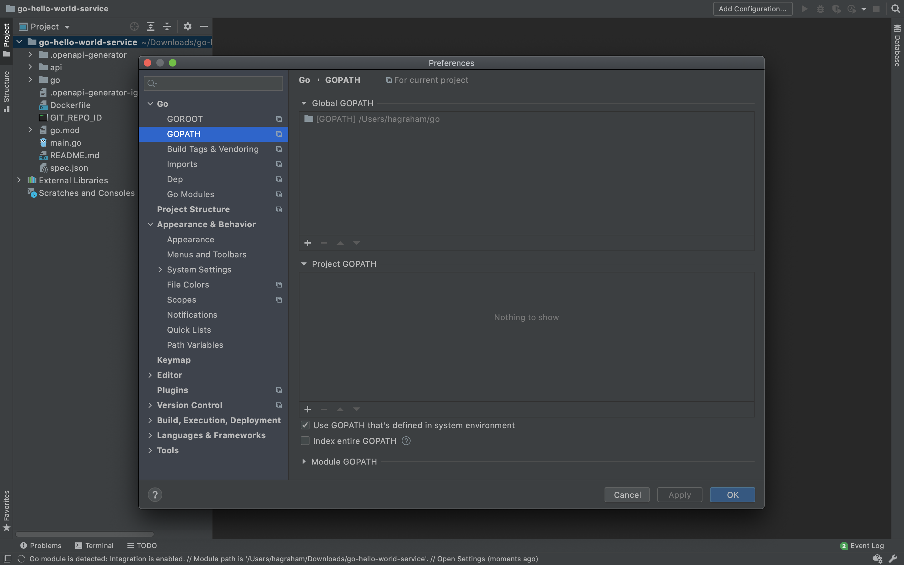
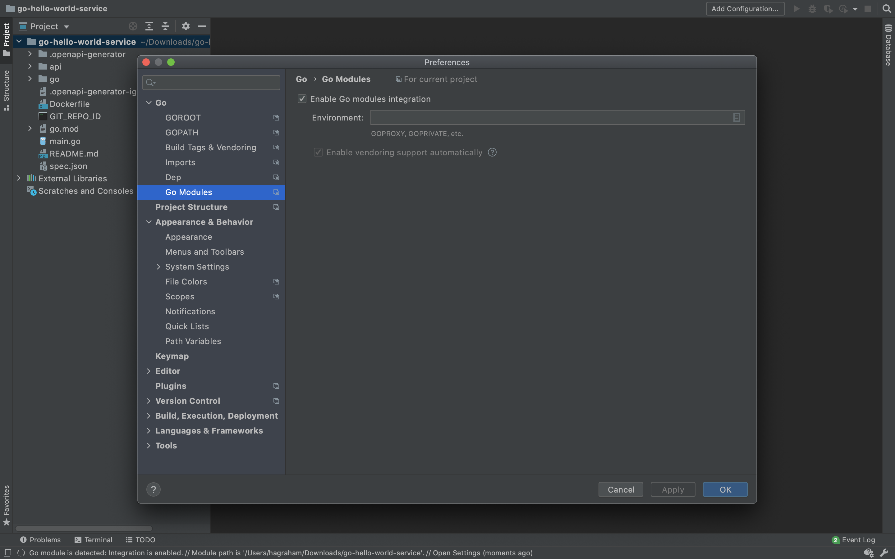

# Creating a Hello World Service in Go
* [Introduction](#introduction)
* [Goals](#goals)
* [Prerequisites](#prerequisites)
* [Generating Server Stubs](#generating-server-stubs)
* [Configuring the Project](#configuring-the-project)
  * [go.mod](#gomod)
  * [main.go](#maingo)
  * [go/routers.go](#goroutersgo)
  * [go mod tidy](#go-mod-tidy)
  * [Configuring GoLand](#configuring-goland)
* [Building the Project](#building-the-project)


## Introduction
In this guide, we describe how to build a simple Go service that exposes an API defined as an OpenAPI Specification [(help me)][help-openapi]. We cover server stub generation and project configuration, leaving security and database specifics to later guides. 

To just dive straight in, you can download the Hello World Service source [(help me)][help-hws], but we encourage you work through the guides to learn by doing.

[help-openapi]: ../03-msx-component-manager/07-working-with-openapi-specifications.md 
[help-hws]: https://github.com/CiscoDevNet/msx-examples/tree/main/go-hello-world-service-1
[hws-spec]: https://github.com/CiscoDevNet/msx-examples/tree/main/go-hello-world-service-1/HelloWorldService-1.json


## Goals
* generate server stubs from an OpenAPI Specification
* configure third party project dependencies


## Prerequisites
* Go Hello World Service 1 [(help me)](https://github.com/CiscoDevNet/msx-examples/tree/main/go-hello-world-service-1)
* [JetBrains GoLand](https://www.jetbrains.com/go/)
* [OpenAPI Generator 5.0.1](https://openapi-generator.tech)
* [OpenJDK 11](https://formulae.brew.sh/formula/openjdk@11)


## Generating Server Stubs
Even if you want to work through this example from scratch, you still need the OpenAPI Specification file `HelloWorldService-1.json` [(help me)][hws-spec]. Create a new project folder and copy the file you just downloaded to it, them check that you have the latest version of **OpenAPI Generator** installed [(help me)](https://openapi-generator.tech).

```bash
$ openapi-generator version 
5.0.1
```

We are now ready to generate the Go server stubs from`HelloWorldService-1.json` with the following command:

```bash
$ openapi-generator generate \
  --generator-name="go-server" \
  --input-spec "HelloWorldService-1.json"
.
.
.
################################################################################
# Thanks for using OpenAPI Generator.                                          #
# Please consider donation to help us maintain this project 🙏                 #
# https://opencollective.com/openapi_generator/donate                          #
################################################################################
```

The resulting project folder should look like this:

```bash
.
├── Dockerfile
├── HelloWorldService-1.json
├── README.md
├── api
│   └── openapi.yaml
├── go
│   ├── api.go
│   ├── api_items.go
│   ├── api_items_service.go
│   ├── api_languages.go
│   ├── api_languages_service.go
│   ├── helpers.go
│   ├── impl.go
│   ├── logger.go
│   ├── model_error.go
│   ├── model_item.go
│   ├── model_language.go
│   └── routers.go
├── go.mod
├── main.go
└── openapitools.json
```


## Configuring the Project
OpenAPI Generator has generated everything we need to import the project into **JetBrains GoLand** and build it. Select the project folder and open it in GoLand. If everything goes well, you should see a project structure similar to the following image.



<br>

### go.mod
Update the module path in `go.mod` and create an alias for it as shown.

```go
module github.com/CiscoDevNet/msx-examples/go-hello-world-service-1

go 1.13

require github.com/gorilla/mux v1.7.3

replace github.com/CiscoDevNet/msx-examples/go-hello-world-service-1/go => ./go/
```

<br>

### main.go
Update `main.go` to reflect the module path change.

```go
.
.
.
import (
	"log"
	"net/http"

	openapi "github.com/CiscoDevNet/msx-examples/go-hello-world-service-1/go"
)
.
.
.
```

<br>


### go/routers.go
OpenAPI Generator v5.0.1 does not declare all the required dependencies in `go/routers.go`. Update the `import()` section of that file to include the dependency `mime/multipart` as shown.

```go
.
.
.
import (
	"encoding/json"
	"io/ioutil"
	"net/http"
	"os"
	"strconv"
	"github.com/gorilla/mux"
	"mime/multipart"
)
.
.
.
```

<br>

### go mod tidy
Go can help detect missing dependencies in `go.mod` for you. Running `go mod tidy` in the root folder of the project from a terminal window can help.

```bash
$ go mod tidy
```

<br>

### Configuring GoLand
Check **GOROOT** is set from **GoLand->Preferences->Go->GOROOT**.



<br>

Check **GOPATH** is set from **GoLand->Preferences->Go->GOPATH**.



<br>


Enable **Go Modules** integration from **GoLand->Preferences->Go->Go Modules**.



<br>

## Building the Project
As long as your Go development environment is set up properly, you can get the build the service and run it locally.

```bash
$ go get -u
go: github.com/gorilla/mux upgrade => v1.8.0

$ go build
$ go run main.go
2021/03/14 11:34:04 Server started
```


| [NEXT](02-sending-mock-server-responses.md) | [HOME](../index.md#go-hello-world-service-example) |

