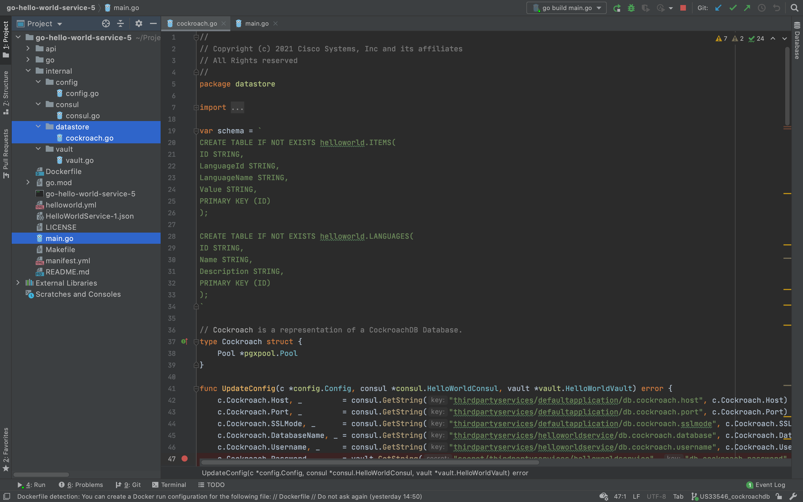

# Persisting Domain Specific Data
* [Introduction](#introduction)
* [Goals](#goals)
* [Prerequisites](#prerequisites)
* [Configuring the Project](#configuring-the-project)
  * [go.mod](#gomod)
  * [helloworld.yml](#helloworldyml)
  * [manifest.yml](#manifestyml)
  * [internal/config/config.go](#internalconfigconfiggo)
  * [internal/consul/consul.go](#internalconsulconsulgo)
  * [internal/vault/vault.go](#internalvaultvaultgo)
* [Adding the Datastore](#adding-the-datastore)
  * [internal/datastore/cockroach.go](#internaldatastorecockroachgo)
  * [main.go](#maingo)
* [Debugging Locally](#debugging-locally)
* [Testing Locally](#testing-locally)
  * [Creating Languages](#creating-languages)
  * [Getting All Languages](#getting-all-languages)
  * [Getting Single Languages](#getting-single-languages)
  * [Updating Languages](#updating-languages)
  * [Deleting Languages](#deleting-languages)
  * [Creating Greeting Items](#creating-greeting-items)
* [Building the Component](#building-the-component)
* [Deploying the Component](#deploying-the-component)
* [Testing Remotely](#testing-remotely)
* [The Missing Pieces](#the-missing-pieces)
* [References](#references)

## Introduction
So far the HelloWorldService has just returned canned responses that are baked into the implementation. This was a deliberate strategy to demonstrate a minimal application with few dependencies. To make our service more useful we need to store and return real data, which we will now do. 


## Goals
* persist domain specific data
* make real HelloWorldService requests


## Prerequisites
* Go Hello World Service 4 [(help me)](https://github.com/CiscoDevNet/msx-examples/tree/main/go-hello-world-service-4)
* access to an MSX environment [(help me)](../01-msx-developer-program-basics/02-getting-access-to-an-msx-environment.md)


## Configuring the Project
Before we can update the service to handle real data we need to update the project dependencies and configuration to the database. In this project we will be using CockroachDB.

### go.mod
Update the module path in `go.mod` and create an alias for it as shown.

```go
module github.com/CiscoDevNet/msx-examples/go-hello-world-service-5

go 1.13

require (
	github.com/google/uuid v1.2.0
	github.com/gorilla/mux v1.7.3
	github.com/hashicorp/consul/api v1.8.1
	github.com/hashicorp/vault/api v1.0.4
	github.com/jackc/pgx/v4 v4.10.1
	github.com/spf13/viper v1.7.1
)

replace github.com/CiscoDevNet/msx-examples/go-hello-world-service-5/go => ./go/
```

<br>


### helloworld.yml
When a service is deployed to MSX it must pick up the database configuration from Consul and Vault. The table below shows where to get those values and exampled values.

| Service        | Name                                                 | Example |
|----------------|------------------------------------------------------|---------|
| consul         | {prefix}/defaultapplication/db.cockroach.host        | cockroachdb-public.vms.svc.cluster.local |
| consul         | {prefix}/defaultapplication/db.cockroach.port        | 26257 |
| consul         | {prefix}/defaultapplication/db.cockroach.sslmode     | verify-full |
| consul         | {prefix}/helloworldservice/db.cockroach.databaseName | helloworld |
| consul         | {prefix}/helloworldservice/db.cockroach.username     | helloworldservice_5cf38a82c57b4872b425bb89b0d3250d |
| vault          | {prefix}/helloworldservice                           | vzorfs0UFr124K5zoevP |
| helloworld.yml | cockroach.cacert                                     | /etc/ssl/certs/ca-bundle.crt |

<br>

The prefix depends on the version of MSX you are running:

| Service  | MSX Version | Prefix                      |
|----------|-------------|-----------------------------|
| consul   | <= 4.0.0    | thirdpartyservices          |
| vault    | <= 4.0.0    | secret/thirdpartyservices   |
| consul   | >= 4.1.0    | thirdpartycomponents        |
| vault    | >= 4.1.0    | secret/thirdpartycomponents |

<br>

When developing you can run Consul, Vault, and CockroachDB [(help me)](#references). You can pass required CockroachDB configuration in `helloworld.yml` by adding the following.

```yaml
.
.
.
cockroach:
  host: "127.0.0.1"
  port: "26257"
  databasename: "helloworld"
  username: "root"
  sslmode: "disable"
  cacert: "/etc/ssl/certs/ca-bundle.crt" # Required by MSX.
.
.
.
```

<br>

### manifest.yml
When our service is deployed MSX creates the database for us, and populates Vault and Consul with the correct values. Then in our configuration code we will read those values to create our database connection string. We have to update `manifest.yml` to tell  MSX which database we want to use.

```yaml
.
.
.
Infrastructure:
  Database:
    Type: Cockroach
    Name: "helloworldservice"
.
.
.
```

<br>

### internal/config/config.go
In previous guides we created `internal/config/config.go` to bootstrap Consul and Vault into our service. That same module also serves as a common place for us to store other configuration. Update `internal/config/config.go` to include a structure to store the CockroachDB values. Note that they will be populated from Consul, Vault, and `helloworld.yml`, depending on whether your service is running on local infrastructure or in an MSX environment.

```go
.
.
.
// HelloWorld config options.
type Config struct {
	Consul      Consul
	Vault       Vault
	Cockroach   Cockroach
}

// Cockroach config options.
type Cockroach struct {
	Host         string
	Port         string
	Username     string
	Password     string
	DatabaseName string
	CACert       string
	SSLMode      string
}
.
.
.
```

### internal/consul/consul.go
We have to update `internal/consul/consul.go` to reference the new project path:

```go
package consul

import (
	"github.com/CiscoDevNet/msx-examples/go-hello-world-service-5/internal/config"
	"fmt"
	"github.com/hashicorp/consul/api"
	"net/url"
)
.
.
.
```

### internal/vault/vault.go
We have to update `internal/vault/vault.go` to reference the new project path:

```go
package vault

import (
	"errors"
	"github.com/CiscoDevNet/msx-examples/go-hello-world-service-4/internal/config"
	"github.com/hashicorp/vault/api"
)
.
.
.
```

## Adding the Datastore
We need to work on two more files before the database integration is complete, the project will look like this when we are finished.



### internal/datastore/cockroach.go
The datastore module `internal/datastore/cockroach.go` does the following.
* creates the database tables (not the database)
* replaces configuration with Consul values if they exist
* replaces configuration with Vault values if they exist
* manages connection to the database
* implements CRUD operations for Language resources
* implements CRUD operations for Item resources

> **GOTCHA**
> 
> When your service is deployed into the MSX the database will be created for you. 
> However when running locally, you will need to create the database yourself.

Create the file `internal/datastore/cockroach.go` as shown above, and paste in the contents below. This may look like a lot of code, but the bulk of it is the simple CRUD operations. 

```go
package datastore

import (
	"context"
	"fmt"
	"github.com/CiscoDevNet/msx-examples/go-hello-world-service-5/go"
	"github.com/CiscoDevNet/msx-examples/go-hello-world-service-5/internal/config"
	"github.com/CiscoDevNet/msx-examples/go-hello-world-service-5/internal/consul"
	"github.com/CiscoDevNet/msx-examples/go-hello-world-service-5/internal/vault"
	"github.com/google/uuid"
	"github.com/jackc/pgx/v4"
	"github.com/jackc/pgx/v4/pgxpool"
	"log"
)

var schema = `
CREATE TABLE IF NOT EXISTS helloworld.ITEMS(
ID STRING,
LanguageId STRING,
LanguageName STRING,
Value STRING,
PRIMARY KEY (ID)
);

CREATE TABLE IF NOT EXISTS helloworld.LANGUAGES(
ID STRING,
Name STRING,
Description STRING,
PRIMARY KEY (ID)
);
`

// Cockroach is a representation of a CockroachDB Database.
type Cockroach struct {
	Pool *pgxpool.Pool
}

func UpdateConfig(c *config.Config, consul *consul.HelloWorldConsul, vault *vault.HelloWorldVault) error {
	c.Cockroach.Host, _         = consul.GetString(c.Consul.Prefix + "/defaultapplication/db.cockroach.host", c.Cockroach.Host)
	c.Cockroach.Port, _         = consul.GetString(c.Consul.Prefix + "/defaultapplication/db.cockroach.port", c.Cockroach.Port)
	c.Cockroach.SSLMode, _      = consul.GetString(c.Consul.Prefix + "/defaultapplication/db.cockroach.sslmode", c.Cockroach.SSLMode)
	c.Cockroach.DatabaseName, _ = consul.GetString(c.Consul.Prefix + "/helloworldservice/db.cockroach.databaseName", c.Cockroach.DatabaseName)
	c.Cockroach.Username, _     = consul.GetString(c.Consul.Prefix + "/helloworldservice/db.cockroach.username", c.Cockroach.Username)
	c.Cockroach.Password, _     = vault.GetString(c.Vault.Prefix + "/helloworldservice", "db.cockroach.password", c.Cockroach.Password)
	return nil
}

func NewCockroachDB(c *config.Config) (*Cockroach, error) {
	connString := ""
	if c.Cockroach.SSLMode == "disable" {
		connString = fmt.Sprintf("postgres://%s@%s:%s/%s?sslmode=%s",
			c.Cockroach.Username,
			c.Cockroach.Host,
			c.Cockroach.Port,
			c.Cockroach.DatabaseName,
			c.Cockroach.SSLMode)
	} else {
		connString = fmt.Sprintf("postgres://%s:%s@%s:%s/%s?sslmode=%s&sslrootcert=%s",
			c.Cockroach.Username,
			c.Cockroach.Password,
			c.Cockroach.Host,
			c.Cockroach.Port,
			c.Cockroach.DatabaseName,
			c.Cockroach.SSLMode,
			c.Cockroach.CACert)
	}

	conf, err := pgxpool.ParseConfig(connString)
	if err != nil {
		return nil, err
	}
	p, err := pgxpool.ConnectConfig(context.Background(), conf)
	return &Cockroach{p}, err
}

func (c Cockroach) BuildSchema() error {
	_, err := c.Pool.Exec(context.Background(), schema)
	return err
}

func (c *Cockroach) CreateItem(ctx context.Context, i openapi.Item) (openapi.ImplResponse, error) {
	opts := pgx.TxOptions{}
	tx, err := c.Pool.BeginTx(context.Background(), opts)
	if err != nil {
		return openapi.ImplResponse{}, err
	}
	lang, err := c.GetLanguage(ctx, i.LanguageId)
	if err != nil {
		return openapi.ImplResponse{}, fmt.Errorf("languageId not found")
	}
	if i.Id == "" {
		i.Id = uuid.New().String()
	}
	defer func() {
		err = tx.Rollback(context.Background())
		if err != nil {
			log.Printf("Error rolling back transaction: %s", err.Error())
		}
	}()

	_, err = tx.Exec(context.Background(),
		"UPSERT INTO helloworld.Items (ID, LanguageId, LanguageName, Value) VALUES ($1,$2,$3,$4)",
		i.Id,
		i.LanguageId,
		(lang.Body).(openapi.Language).Name,
		i.Value,
	)
	i.LanguageName = (lang.Body).(openapi.Language).Name
	if err != nil {
		return openapi.ImplResponse{}, err
	}
	err = tx.Commit(context.Background())
	return openapi.ImplResponse{
		Code: 200,
		Body: i,
	}, err
}

func (c *Cockroach) GetItem(ctx context.Context, id string) (openapi.ImplResponse, error) {
	i := openapi.Item{}
	err := c.Pool.QueryRow(context.Background(),
		"SELECT ID, LanguageId, LanguageName, Value FROM helloworld.Items WHERE ID=$1 LIMIT 1", id).
		Scan(&i.Id, &i.LanguageId, &i.LanguageName, &i.Value)
	if err != nil {
		return openapi.ImplResponse{}, err
	}
	return openapi.ImplResponse{
		Code: 200,
		Body: i,
	}, nil
}

// TODO: when you are done, update the cockroach code in the examples too.

func (c *Cockroach) GetItems(ctx context.Context, id string) (openapi.ImplResponse, error) {
	rows, err := c.Pool.Query(context.Background(),
		"SELECT ID, LanguageId, LanguageName, Value FROM helloworld.Items",
	)
	if err != nil {
		return openapi.ImplResponse{}, err
	}
	defer rows.Close()
	var list []openapi.Item
	for rows.Next() {
		i := openapi.Item{}
		err := rows.Scan(&i.Id, &i.LanguageId, &i.LanguageName, &i.Value)
		if err != nil {
			return openapi.ImplResponse{}, err
		}
		list = append(list, i)
	}
	return openapi.ImplResponse{
		Code: 200,
		Body: list,
	}, nil
}

func (c *Cockroach) DeleteItem(ctx context.Context, id string) (openapi.ImplResponse, error) {
	opts := pgx.TxOptions{}
	tx, err := c.Pool.BeginTx(context.Background(), opts)
	if err != nil {
		return openapi.ImplResponse{}, err
	}
	defer func() {
		err = tx.Rollback(context.Background())
		if err != nil {
			log.Printf("Error rolling back transaction: %s", err.Error())
		}
	}()
	_, err = tx.Exec(context.Background(),
		"DELETE FROM helloworld.Items WHERE ID=$1", id)
	err = tx.Commit(context.Background())
	return openapi.ImplResponse{
		Code: 200,
		Body: "OK",
	}, err
}

func (c *Cockroach) UpdateItem(ctx context.Context, id string, item openapi.Item) (openapi.ImplResponse, error) {
	item.Id = id
	return c.CreateItem(ctx, item)
}

func (c *Cockroach) CreateLanguage(ctx context.Context, l openapi.Language) (openapi.ImplResponse, error) {
	opts := pgx.TxOptions{}
	tx, err := c.Pool.BeginTx(context.Background(), opts)
	if err != nil {
		return openapi.ImplResponse{}, err
	}
	if l.Id == "" {
		l.Id = uuid.New().String()
	}
	defer func() {
		err = tx.Rollback(context.Background())
		if err != nil {
			fmt.Printf("Error rolling back transaction: %s", err.Error())
		}
	}()
	_, err = tx.Exec(context.Background(),
		"UPSERT INTO helloworld.Languages (ID, Name, Description) VALUES ($1,$2,$3)",
		l.Id,
		l.Name,
		l.Description,
	)
	if err != nil {
		return openapi.ImplResponse{}, err
	}
	err = tx.Commit(context.Background())
	return openapi.ImplResponse{
		Code: 200,
		Body: l,
	}, err
}

func (c *Cockroach) GetLanguage(ctx context.Context, id string) (openapi.ImplResponse, error) {
	i := openapi.Language{}
	err := c.Pool.QueryRow(context.Background(),
		"SELECT ID, Name, Description FROM helloworld.Languages WHERE ID=$1 LIMIT 1", id).
		Scan(&i.Id, &i.Name, &i.Description)
	if err != nil {
		return openapi.ImplResponse{}, err
	}
	return openapi.ImplResponse{
		Code: 200,
		Body: i,
	}, nil
}

func (c *Cockroach) GetLanguages(ctx context.Context) (openapi.ImplResponse, error) {
	rows, err := c.Pool.Query(context.Background(),
		"SELECT ID, Name, Description FROM helloworld.Languages",
	)
	if err != nil {
		return openapi.ImplResponse{}, err
	}
	defer rows.Close()
	var list []openapi.Language
	for rows.Next() {
		i := openapi.Language{}
		err := rows.Scan(&i.Id, &i.Name, &i.Description)
		if err != nil {
			return openapi.ImplResponse{}, err
		}
		list = append(list, i)
	}
	return openapi.ImplResponse{
		Code: 200,
		Body: list,
	}, nil
}

func (c *Cockroach) DeleteLanguage(ctx context.Context, id string) (openapi.ImplResponse, error) {
	opts := pgx.TxOptions{}
	tx, err := c.Pool.BeginTx(context.Background(), opts)
	if err != nil {
		return openapi.ImplResponse{}, err
	}
	defer func() {
		err = tx.Rollback(context.Background())
		if err != nil {
			log.Printf("Error rolling back transaction: %s", err.Error())
		}
	}()
	_, err = tx.Exec(context.Background(),
		"DELETE FROM helloworld.Languages WHERE ID=$1", id)
	if err != nil {
		return openapi.ImplResponse{}, err
	}
	_, err = tx.Exec(context.Background(),
		"DELETE FROM helloworld.Items WHERE LanguageId=$1", id)
	err = tx.Commit(context.Background())
	return openapi.ImplResponse{}, err
}

func (c *Cockroach) UpdateLanguage(ctx context.Context, id string , language openapi.Language) (openapi.ImplResponse, error) {
	language.Id = id
	return c.CreateLanguage(ctx, language)
}
```

<br>

### main.go
Now that we have a datastore we need to connect to the database and plumb it into the controllers. To do this update the "main" function in `main.go` as shown.

```go
package main

import (
	"github.com/CiscoDevNet/msx-examples/go-hello-world-service-5/internal/config"
	"github.com/CiscoDevNet/msx-examples/go-hello-world-service-5/internal/consul"
	"github.com/CiscoDevNet/msx-examples/go-hello-world-service-5/internal/vault"
	"log"
	"net/http"

	openapi "github.com/CiscoDevNet/msx-examples/go-hello-world-service-5/go"
)

func main() {
    .
    .
    .
	// Setup Vault.
	vault, err := vault.NewVault(config)
	if err != nil {
		log.Printf("Could not initialize Vault: %s", err.Error())
	}
	config.Vault.Prefix = "secret/" + config.Consul.Prefix
	testVault(&vault)
	
	// Setup CockroachDB
	datastore.UpdateConfig(config, &consul, &vault)
	db, err := datastore.NewCockroachDB(config)
	if err != nil {
		log.Fatal("FATAL: Could not connect to DB: %s", err.Error())
	}
	err = db.BuildSchema()
	if err != nil {
		log.Fatal("FATAL: Could not build DB schema: %s", err.Error())
	}

	// Create the resource controllers.
	ItemsApiController := openapi.NewItemsApiController(db)
	LanguagesApiController := openapi.NewLanguagesApiController(db)

	router := openapi.NewRouter(ItemsApiController, LanguagesApiController)
	log.Fatal(http.ListenAndServe(":8080", router))
}
.
.
.
```


## Debugging Locally
At this juncture we are code complete, and all that remains is to test. If you are feeling lucky build, package, and deploy the component into MSX and cross your fingers that everything is correct. However running the service locally makes it easier to debug. First spin up Consul, Vault, and CockroachDB using Docker Desktop instances, then create the "helloworld" database [(help me)](#references).

Set a breakpoint in `main.go` by clicking next to the line number by the call to "datastore.UpdateConfig", a red dot will appear. Right click `main.go` in the left-hand project navigation panel and select **Debug 'run build main.go'** to get the ball rolling.


<br>

The service will start, load `helloworld.yml`, setup Consul, setup Vault, and stop just before we configure CockroachDB. We can use the Debugger to poke around in the "config" structure to see what has been set.


<br>

Click the "Resume Program" play button in the vertical stack of buttons in the "Debug" window to let the service run free. Switching to the "Console" window will display the logs we wrote in "testConsul" and "testVault" methods. 


<br>


## Testing Locally
Once Hello World Service is running, experiment with commands below in a terminal window. Remember we defined the contract for this API as an OpenAPI Specification so refer to that for details of requests [(help me)](../03-msx-component-manager/07-working-with-openapi-specifications.md).


### Creating Languages
Create an entry for the French language with POST request. Note that the "id" returned will be different in your request.

```bash
$ curl --request POST "http://localhost:8080/helloworld/api/v1/languages" \
--header "Content-Type: application/json" \
--data '{"name": "English", "description": "A West Germanic language that uses the Roman alphabet."}'

RESPONSE HTTP-201 Created
{
  "id":"dbedcc96-6669-4286-bc72-84fc2c7623b8",
  "name":"English",
  "description":"A West Germanic language that uses the Roman alphabet."
}

$ curl --request POST "http://localhost:8080/helloworld/api/v1/languages" \
--header "Content-Type: application/json" \
--data '{"name": "French", "description": "A West Germanic language that uses the Roman alphabet."}'

RESPONSE HTTP-201 Created
{
  "id":"0e118c70-d000-4acd-8c58-e649ce5d6fe4",
  "name":"French",
  "description":"A Romance language descended from the Vulgar Latin of the Roman Empire."
}
```

<br>

### Getting All Languages
Get a list of all languages using a GET request.

```bash
$ curl --request GET "http://localhost:8080/helloworld/api/v1/languages" \
--header "Content-Type: application/json" 

RESPONSE HTTP-200 OK
[
  {
    "id":"0e118c70-d000-4acd-8c58-e649ce5d6fe4",
    "name":"French",
    "description":"A Romance language descended from the Vulgar Latin of the Roman Empire."
  },
  {
    "id":"dbedcc96-6669-4286-bc72-84fc2c7623b8",
    "name":"English",
    "description":"A West Germanic language that uses the Roman alphabet."
  }
]
```


<br>

### Getting Single Languages
Retrieve a language by copying the "id" returned by the GET request.
```bash
$ curl --request GET "http://localhost:8080/helloworld/api/v1/languages/0e118c70-d000-4acd-8c58-e649ce5d6fe4" \
--header "Content-Type: application/json" 

RESPONSE HTTP-200 OK
{
  "id":"0e118c70-d000-4acd-8c58-e649ce5d6fe4",
  "name":"French",
  "description":"A Romance language descended from the Vulgar Latin of the Roman Empire."
}
```

<br>

### Updating Languages
We can change the description of the language with a PUT request.
```bash
$ curl --request PUT "http://localhost:8080/helloworld/api/v1/languages/0e118c70-d000-4acd-8c58-e649ce5d6fe4" \
--header "Content-Type: application/json" \
--data '{"name": "French", "description": "French evolved from the Latin spoken in Gaul by Asterix."}'

RESPONSE HTTP-200 OK
{
  "id":"0e118c70-d000-4acd-8c58-e649ce5d6fe4",
  "name":"French",
  "description":"French evolved from the Latin spoken in Gaul by Asterix."
}
```

<br>

### Deleting Languages
Finally, delete a language with a DELETE request.
```bash
$ curl --request DELETE "http://localhost:8080/helloworld/api/v1/languages/0e118c70-d000-4acd-8c58-e649ce5d6fe4" 

RESPONSE HTTP-204 No Content
```

<br>

### Creating Greeting Items
We deleted the French language item, but we can still create a greeting item for English.
```bash
$ curl --request POST "http://localhost:8080/helloworld/api/v1/items" \
--header "Content-Type: application/json" \
--data '{ "languageId": "dbedcc96-6669-4286-bc72-84fc2c7623b8", "value": "Hello, World!"}'

RESPONSE HTTP-201 OK
{
"id":"023cd7f6-37ef-4e85-90b8-9441ca2b1163",
"languageId":"dbedcc96-6669-4286-bc72-84fc2c7623b8",
"languageName":"English",
"value":"Hello, World!"
}
```

Now that you know how to make language and greeting requests try adding some languages and greetings of your own.


## Building the Component
Like we did in earlier guides, build the component `helloworldservice-1.0.0-component.tar.gz` by calling make with component "NAME" and "VERSION" parameters.
```bash
$ make NAME=helloworldservice VERSION=1.0.0 
.
.
.
Successfully built a4621de07764
Successfully tagged helloworldservice:1.0.0
docker save helloworldservice:1.0.0 | gzip > helloworldservice-1.0.0.tar.gz
tar -czvf helloworldservice-1.0.0-component.tar.gz manifest.yml helloworld.yml helloworldservice-1.0.0.tar.gz
a manifest.yml
a helloworld.yml
a helloworldservice-1.0.0.tar.gz
rm -f helloworldservice-1.0.0.tar.gz
```


## Deploying the Component
Log in to your MSX environment and deploy `helloworldservice-1.0.0-component.tar.gz` using **MSX UI->Settings->Components** [(help me)](../03-msx-component-manager/04-onboarding-and-deploying-components.md). If the helloworldservice is already deployed, delete it before uploading it again.


## Testing Remotely
Now that you have deployed your service to an MSX environment you can make remote calls but there is a wrinkle, you need to pass a valid access token in the request. The best way to iron that out is to complete the Swagger guide [(help me)](../04-java-hello-world-service-example/09-adding-swagger-support.md), but before you can do that you have to create the SSO Security Clients [(help me)](../04-java-hello-world-service-example/08-creating-the-security-clients.md).


## The Missing Pieces
Hello World Service can now persist data, next we lay the groundwork for adding Swagger and RBAC support.
* create security clients
* add Swagger documentation
* add role based access control


## References
[Running Consul for Development](https://hub.docker.com/_/consul)

[Running Vault for Development](https://hub.docker.com/_/vault)

[CockroachDB Container in Docker](https://hub.docker.com/r/cockroachdb/cockroach)

[MSX Component Manager Manifest Reference](../reference/component-manager-manifest-reference.md)


| [PREVIOUS](05-adding-vault-configuration.md) | [NEXT](08-creating-the-security-clients.md) | [HOME](../index.md#go-hello-world-service-example) |
