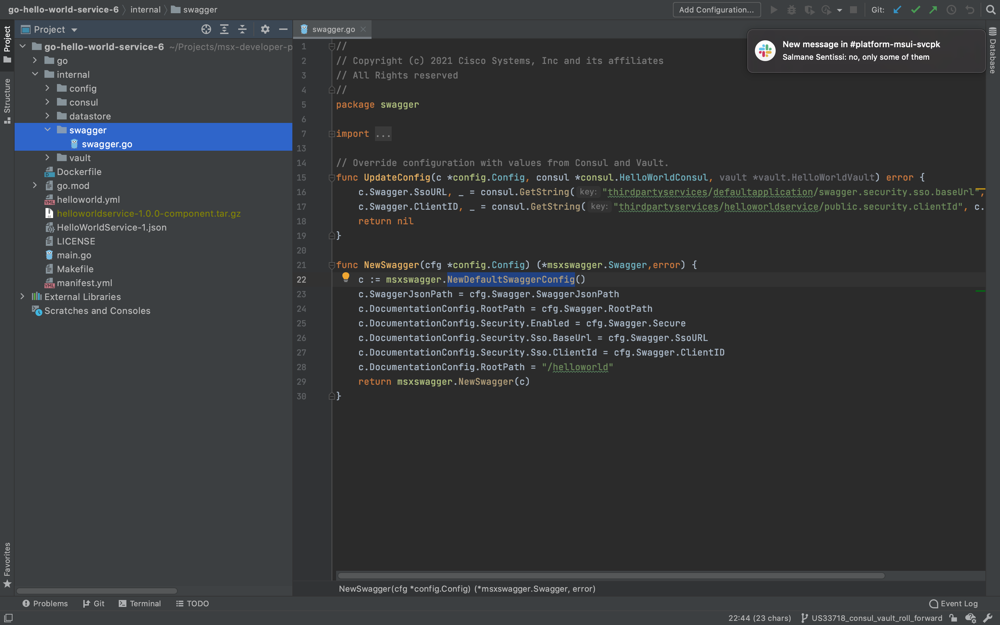
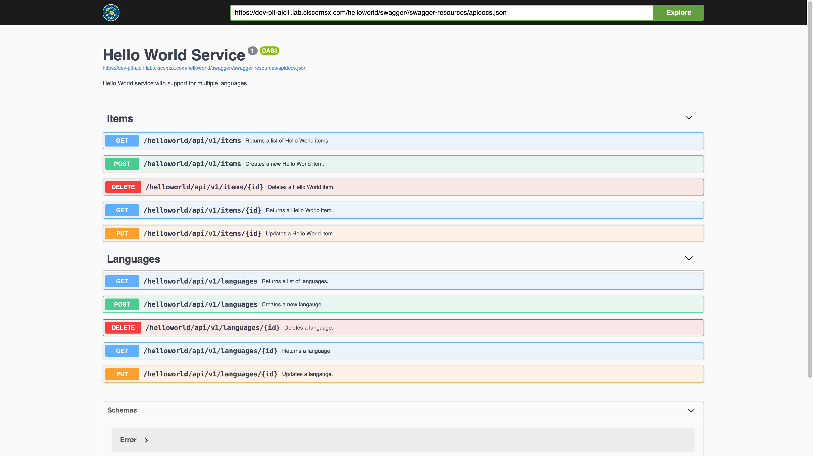

# Adding Swagger Support

* [Introduction](#introduction)
* [Goals](#goals)
* [Prerequisites](#prerequisites)
* [Configuring the Project](#configuring-the-project)
  * [go.mod](#gomod)
  * [internal/config/config.go](#internalconfigconfiggo)
  * [internal/swagger/swagger.go](#internalswaggerswaggergo)
  * [main.go](#maingo)
  * [helloworld.yml](#helloworldyml)
  * [manifest.yml](#manifestyml)
  * [Dockerfile](#dockerfile)
* [Building the Component](#building-the-component)
* [Deploying the Component](#deploying-the-component)
* [Finding the Swagger Documentation](#finding-the-swagger-documentation)
* [The Missing Pieces](#the-missing-pieces)


## Introduction
Swagger is an important tool that allows users to explore an API [(help me)](../01-msx-developer-program-basics/04-using-the-swagger-documentation.md). In this guide, we will update Hello World Service so that we can browse its 
Swagger documentation in the Cisco MSX Portal. 


## Goals
* browse Hello World Service Swagger documentation 


## Prerequisites
* Go Hello World Service 5 [(help me)](https://github.com/CiscoDevNet/msx-examples/tree/main/go-hello-world-service-5)
* access to an MSX environment [(help me)](../01-msx-developer-program-basics/02-getting-access-to-an-msx-environment.md)


## Configuring the Project
A number of changes and new files are required to add Swagger support to Hello 
World Service. The screenshot below shows what we are aiming for once the 
configuration is done.



<br>

### go.mod
Update the module path in `go.mod` from "go-hello-world-service-5" to "go-hello-world-service-6" like we have in previous guides. An MSX library is required to support Swagger, you can add the dependency with this terminal command:

```bash
$ go get github.com/CiscoDevNet/go-msx-swagger
```

<br>

### internal/config/config.go
Update `internal/config/config.go` to include a structure to store the Swagger values. Note that they will be populated from Consul, Vault, and `helloworld.yml`, depending on whether your service is running on local infrastructure or in an MSX environment.

```go
.
.
.
// HelloWorld config options.
type Config struct {
	Consul      Consul
	Vault       Vault
	Cockroach   Cockroach
	Swagger     Swagger
}

// Swagger config options.
type Swagger struct {
	Secure          bool
	SsoURL          string
	SwaggerJsonPath string
	RootPath        string
	ClientID        string
}
.
.
.
```

<br>

### internal/swagger/swagger.go
The module `internal/swagger/swagger.go` file defines an instance of the Swagger configuration that we will populate from a data file.

```go
package swagger

import (
	"github.com/CiscoDevNet/msx-examples/go-hello-world-service-6/internal/config"
	"github.com/CiscoDevNet/msx-examples/go-hello-world-service-6/internal/consul"
	"github.com/CiscoDevNet/msx-examples/go-hello-world-service-6/internal/vault"
	"github.com/CiscoDevNet/go-msx-swagger"
)

// Override configuration with values from Consul and Vault.
func UpdateConfig(c *config.Config, consul *consul.HelloWorldConsul, vault *vault.HelloWorldVault) error {
	c.Swagger.SsoURL, _ = consul.GetString(c.Consul.Prefix + "/defaultapplication/swagger.security.sso.baseUrl", c.Swagger.SsoURL)
	c.Swagger.ClientID, _ = consul.GetString(c.Consul.Prefix + "/helloworldservice/public.security.clientId", c.Swagger.ClientID)
	return nil
}

func NewSwagger(cfg *config.Config) (*msxswagger.MsxSwagger,error) {
	c := msxswagger.NewDefaultMsxSwaggerConfig()
	c.SwaggerJsonPath = cfg.Swagger.SwaggerJsonPath
	c.DocumentationConfig.RootPath = cfg.Swagger.RootPath
	c.DocumentationConfig.Security.Enabled = cfg.Swagger.Secure
	c.DocumentationConfig.Security.Sso.BaseUrl = cfg.Swagger.SsoURL
	c.DocumentationConfig.Security.Sso.ClientId = cfg.Swagger.ClientID
	c.DocumentationConfig.RootPath = "/helloworld"
	return msxswagger.NewMsxSwagger(c)
}
```

<br>

### main.go
Update the "main()" function in `main.go` to set up Swagger, and add the route for Swagger.

```go
package main

import (
	openapi "github.com/CiscoDevNet/msx-examples/go-hello-world-service-6/go"
	"github.com/CiscoDevNet/msx-examples/go-hello-world-service-6/internal/config"
	"github.com/CiscoDevNet/msx-examples/go-hello-world-service-6/internal/consul"
	"github.com/CiscoDevNet/msx-examples/go-hello-world-service-6/internal/datastore"
	"github.com/CiscoDevNet/msx-examples/go-hello-world-service-6/internal/swagger"
	"github.com/CiscoDevNet/msx-examples/go-hello-world-service-6/internal/vault"
	"log"
	"net/http"
)

func main() {
    .
    .
    .

	// Setup CockroachDB
	datastore.UpdateConfig(config, &consul, &vault)
	db, err := datastore.NewCockroachDB(config)
	if err != nil {
		log.Fatal("FATAL: Could not connect to DB: %s", err.Error())
	}
	err = db.BuildSchema()
	if err != nil {
		log.Fatal("FATAL: Could not build DB schema: %s", err.Error())
	}

	// Setup Swagger.
	swagger.UpdateConfig(config, &consul, &vault)
	swagger, err := swagger.NewSwagger(config)
	if err != nil {
		log.Fatalf("Could not setup Swagger: %s", err.Error())
	}

	// Setup Controllers
	ItemsApiController := openapi.NewItemsApiController(db)
	LanguagesApiController := openapi.NewLanguagesApiController(db)

	// Setup Router
	router := openapi.NewRouter(ItemsApiController, LanguagesApiController)

	// Add route for Swagger.
	router.PathPrefix("/helloworld/swagger").HandlerFunc(swagger.SwaggerRoutes)

	log.Fatal(http.ListenAndServe(":8080", router))
}
.
.
.
```

<br>

### helloworld.yml
Update `helloworld.yml` to include the Swagger configuration. You can download the complete file [here](https://cto-github.cisco.com/NFV-BU/msx-developer-preview/blob/develop/examples/go-hello-world-service-6/helloworld.yml).

```yaml
.
.
.
swagger:
  secure: true                                # Required by MSX.
  ssourl: "http://localhost:9515/idm"         # CONSUL {prefix}/defaultapplication/swagger.security.sso.baseUrl
  clientid:                                   # CONSUL {prefix}/helloworldservice/public.security.clientId
  swaggerjsonpath: "HelloWorldService-1.json" # Required by MSX.
.
.
.
```

<br>

### manifest.yml
For MSX <= 4.2 update `manifest.yml` to include configuration for the public security client identifier required by Swagger [(help me)](../04-java-hello-world-service-example/08-creating-the-security-clients.md).

For MSX >= 4.3 the security client will be created for you automatically.

```yml
---
Name: "helloworldservice"
Description: "Hello World service with support for multiple languages."
Version: "1.0.0"
Type: Internal

Infrastructure:
  Database:
    Type: Cockroach
    Name: "helloworld"

ConfigFiles:
  - Name: "helloworld.yml"
    MountTo:
      Container: "helloworldservice"
      Path: "/helloworld.yml"

ConsulKeys:
  - Name: "favourite.color"
    Value: "Green"
  - Name: "favourite.food"
    Value: "Pizza"
  - Name: "favourite.dinosaur"
    Value: "Moros Intrepidus"
# NOT NEEDED FOR MSX >= 4.3
#  - Name: "public.security.clientId"
#    Value: "hello-world-service-public-client"
  
Containers:
  - Name: "helloworldservice"
    Version: "1.0.0"
    Artifact: "helloworldservice-1.0.0.tar.gz"
    Port: 8080
    ContextPath: "/helloworld"
    Tags:
      - "3.10.0"
      - "4.0.0"
      - "4.1.0"
      - "4.2.0"
      - "4.3.0"
      - "5.0.0"
      - "managedMicroservice"
      - "name=Hello World Service"
      - "componentAttributes=serviceName:helloworldservice~serviceName:helloworldservice~context:/helloworld~name:Hello World Service~description:Hello World service with support for multiple languages."
    Check:
      Http:
        Scheme: "http"
        Host: "127.0.0.1"
        Path: "/helloworld/api/v1/items"
      IntervalSec: 60
      InitialDelaySec: 30
      TimeoutSec: 30
    Limits:
      Memory: "256Mi"
      CPU: "1"
    Command:
      - "/helloworld"
```

<br>

### Dockerfile
Update `Dockerfile` to copy `HelloWorldService-1.json` into the container.

```dockerfile
FROM --platform=linux/amd64 golang:alpine as builder
RUN apk update && apk add ca-certificates upx git
COPY go/ /go/src/github.com/CiscoDevNet/msx-examples/go-hello-world-service-6/go
COPY go.mod go.sum main.go /go/src/github.com/CiscoDevNet/msx-examples/go-hello-world-service-6/
COPY internal/ /go/src/github.com/CiscoDevNet/msx-examples/go-hello-world-service-6/internal
COPY HelloWorldService-1.json /
WORKDIR /go/src/github.com/CiscoDevNet/msx-examples/go-hello-world-service-6
RUN go mod vendor \
  && go build -ldflags="-s -w" -o helloworld main.go \
  && upx helloworld
# Create appuser.
ENV USER=helloworld
ENV UID=10001
# See https://stackoverflow.com/a/55757473/12429735RUN
RUN adduser \
    --disabled-password \
    --gecos "" \
    --home "/nonexistent" \
    --shell "/sbin/nologin" \
    --no-create-home \
    --uid "${UID}" \
    "${USER}"
RUN chown helloworld:helloworld /go/src/github.com/CiscoDevNet/msx-examples/go-hello-world-service-6/helloworld
RUN chown helloworld:helloworld /HelloWorldService-1.json

FROM scratch
COPY --from=builder /go/src/github.com/CiscoDevNet/msx-examples/go-hello-world-service-6/helloworld /
COPY --from=builder /HelloWorldService-1.json /
COPY --from=builder /etc/passwd /etc/passwd
COPY --from=builder /etc/group /etc/group
COPY --from=builder /etc/ssl/certs/ca-certificates.crt /etc/ssl/certs/
COPY --from=builder /lib/ld-musl-x86_64.so.1 /lib/ld-musl-x86_64.so.1
USER helloworld:helloworld
ENTRYPOINT ["/helloworld"]
```

<br>

## Building the Component
Like we did in earlier guides, build the component `helloworldservice-1.0.0-component.tar.gz` by calling make with component "NAME" and "VERSION" parameters.

```bash
$ make NAME=helloworldservice VERSION=1.0.0 
.
.
.
Successfully built a4621de07764
Successfully tagged helloworldservice:1.0.0
docker save helloworldservice:1.0.0 | gzip > helloworldservice-1.0.0.tar.gz
tar -czvf helloworldservice-1.0.0-component.tar.gz manifest.yml helloworld.yml helloworldservice-1.0.0.tar.gz
a manifest.yml
a helloworld.yml
a helloworldservice-1.0.0.tar.gz
rm -f helloworldservice-1.0.0.tar.gz
```

<br>

## Deploying the Component
Log in to your MSX environment and deploy `helloworldservice-1.0.0-component.tar.gz` using **MSX UI->Settings->Components** [(help me)](../03-msx-component-manager/04-onboarding-and-deploying-components.md). If the helloworldservice is already deployed, delete it before uploading it again.

<br>

## Finding the Swagger Documentation
There are two ways to find the Swagger documentation for Hello World Service in the Cisco MSX Portal. The first is to browse to this URL once you have made replaced the hostname.

```
https://dev-plt-aio1.lab.ciscomsx.com/helloworld/swagger/
```

The second is to use the Cisco MSX Portal to navigate to the Swagger documentation 
for all services [(help me)](../01-msx-developer-program-basics/04-using-the-swagger-documentation.md). 
Whichever path you take once you get there it will look like this.



This ability to try the API is a powerful tool than can help you refine your service before you ship it. If you have not used Swagger before, take this opportunity to explore. 

<br>

## The Missing Pieces
Users can now try out Hello World Service using Swagger, the last pieces of the puzzle are:
* add role based access control


| [PREVIOUS](08-creating-the-security-clients.md) | [NEXT](10-implementing-role-based-access-control.md) | [HOME](../index.md#go-hello-world-service-example) |
