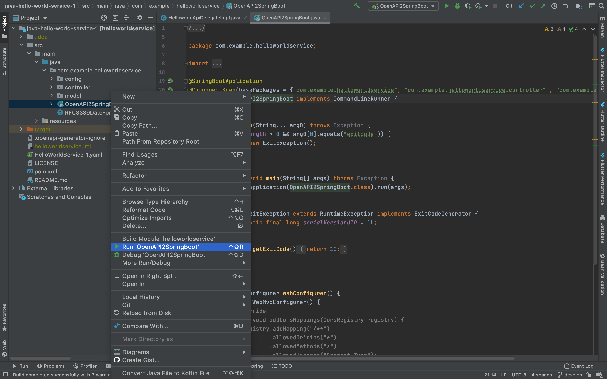

# Creating a Hello World Service in Java
* [Introduction](#introduction)
* [Goals](#goals)
* [Prerequisites](#prerequisites)
* [Generating Server Stubs](#generating-server-stubs)
* [Importing and Building the Project](#importing-and-building-the-project)
* [Configuring the Project](#configuring-the-project)
    * [pom.xml](#pomxml)
    * [application.properties](#srcmainresourcesapplicationproperties)
    * [src/main/resources/application.yml](#srcmainresourcesapplicationyml)
    * [src/main/resources/bootstrap.yml](#srcmainresourcesbootstrapyml)
    * [src/main/resources/bootstrap-legacy.yml](#srcmainresourcesbootstrap-legacyyml)
    * [src/main/java/com/example/helloworldservice/config/OpenAPIDocumentationConfig.java](#srcmainjavacomexamplehelloworldserviceconfigopenapidocumentationconfigjava)
* [Running it Locally](#running-it-locally)
  * [Building the Service](#building-the-service)
  * [Starting Consul](#starting-consul)
  * [Running the Service](#running-the-service)
  * [Testing the Service](#testing-the-service)


## Introduction
In this guide we describe how to build a simple Java service that exposes an API defined as an OpenAPI Specification [(help me)](../03-msx-component-manager/07-working-with-openapi-specifications.md). We cover server stub generation and project configuration, leaving security and database specifics to later guides. To just dive straight in you can download the Hello World Service source [(help me)](https://github.com/CiscoDevNet/msx-examples/tree/main/java-hello-world-service-1), but we encourage you work through the guides to learn by doing.


## Goals
* generate server stubs from an OpenAPI Specification
* configure third party project dependencies


## Prerequisites
* Java Hello World Service 1 [(help me)](https://github.com/CiscoDevNet/msx-examples/tree/main/java-hello-world-service-1)
* [IntelliJ IDEA](https://www.jetbrains.com/idea/)
* [OpenAPI Generator](https://openapi-generator.tech)
* [Maven](https://maven.apache.org)
* [OpenJDK 11](https://formulae.brew.sh/formula/openjdk@11)
* [Docker Desktop](https://www.docker.com/products/docker-desktop)
* [Hashicorp Consul](https://learn.hashicorp.com/tutorials/consul/docker-container-agents)


## Generating Server Stubs
Even if you want to work through this example from scratch you still need the Hello World Service OpenAPI Specification [(help me)](../03-msx-component-manager/07-working-with-openapi-specifications.md). First check that you have this version of OpenAPI Generator installed:
```shell
$ openapi-generator --version
openapi-generator-cli 5.0.1
  commit : c7fcb39
  built  : 2021-02-06T09:14:19Z
  source : https://github.com/openapitools/openapi-generator
  docs   : https://openapi-generator.tech/
```

<br>

Create a workspace folder and copy the Hello World Service OpenAPI Specification file `HelloWorldService-1.yaml` into it [(help me)](https://github.com/CiscoDevNet/msx-examples/tree/main/java-hello-world-service-1). Then generate the Java server stubs from `HelloWorldService-1.yaml` with the following command:
```shell
$ openapi-generator generate \
  --generator-name="spring" \
  --input-spec "HelloWorldService-1.yaml" \
  --artifact-id="helloworldservice" \
  --artifact-version="1.0.0" \
  --group-id="com.example" \
  --invoker-package="com.example.helloworldservice" \
  --api-package="com.example.helloworldservice.controller" \
  --model-package="com.example.helloworldservice.model" \
  --additional-properties='title="Hello World Service",srcFolder=src/main/java,basePackage=com.example.helloworldservice,configPackage=com.example.helloworldservice.config,artifactDescription="Hello World service with support for multiple languages.",delegatePattern=true,java8=true,dateLibrary=java8'
.
.
.
################################################################################
# Thanks for using OpenAPI Generator.                                          #
# Please consider donation to help us maintain this project 🙏                 #
# https://opencollective.com/openapi_generator/donate                          #
################################################################################
```

<br>

Your project folder should look like this:
```shell 
.
├── HelloWorldService-1.yaml
├── README.md
├── generate.sh
├── openapitools.json
├── pom.xml
└── src
    └── main
        ├── java
        │   └── com
        │       └── example
        │           └── helloworldservice
        │               ├── OpenAPI2SpringBoot.java
        │               ├── RFC3339DateFormat.java
        │               ├── config
        │               │   ├── HomeController.java
        │               │   └── OpenAPIDocumentationConfig.java
        │               ├── controller
        │               │   ├── ApiUtil.java
        │               │   ├── HelloworldApi.java
        │               │   ├── HelloworldApiController.java
        │               │   └── HelloworldApiDelegate.java
        │               └── model
        │                   ├── Error.java
        │                   ├── Item.java
        │                   └── Language.java
        └── resources
            └── application.properties
```


## Importing and Building the Project
OpenAPI Generator has generated everything we need to import the project into IntelliJ IDEA and build it. Open IntelliJ and import the `pom.xml` as a project then build it. The screenshot below show the choices we passed to the code generator reflected in the project structure.


<br>

Before you proceed you run **mvn clean install** and verify that everything builds correctly.
```shell
$ mvn clean install
[INFO] Scanning for projects...
[INFO] 
[INFO] -------------------< com.example:helloworldservice >--------------------
[INFO] Building hello-world-service 1.0.0
[INFO] --------------------------------[ jar ]---------------------------------
.
.
.
[INFO] ------------------------------------------------------------------------
[INFO] BUILD SUCCESS
[INFO] ------------------------------------------------------------------------
[INFO] Total time:  11.303 s
[INFO] Finished at: 2021-03-12T19:29:42-05:00
[INFO] ------------------------------------------------------------------------
```


## Configuring the Project

Despite already being able to build the project we have to configure things like default properties and infrastructure before we can proceed. We will describe each file in turn, but the screenshot below shows what we are aiming for.


<br>

### pom.xml
OpenAPI Generator created a pom.xml which is what enabled us to build the project. In the interests of completeness we show the final file.

```xml
<project xmlns="http://maven.apache.org/POM/4.0.0"
         xmlns:xsi="http://www.w3.org/2001/XMLSchema-instance"
         xsi:schemaLocation="http://maven.apache.org/POM/4.0.0 http://maven.apache.org/maven-v4_0_0.xsd">
    <modelVersion>4.0.0</modelVersion>
    <groupId>com.example</groupId>
    <artifactId>helloworldservice</artifactId>
    <packaging>jar</packaging>
    <name>helloworldservice</name>
    <version>1.0.0</version>
    <properties>
        <java.version>1.8</java.version>
        <maven.compiler.source>${java.version}</maven.compiler.source>
        <maven.compiler.target>${java.version}</maven.compiler.target>

        <springfox-version>2.9.2</springfox-version>
        <spring-cloud.version>Hoxton.SR8</spring-cloud.version>
        <springfox-version>2.9.2</springfox-version>
        <server.port>9515</server.port>
        <server.contextpath>/helloworldservice</server.contextpath>
    </properties>
    <parent>
        <groupId>org.springframework.boot</groupId>
        <artifactId>spring-boot-starter-parent</artifactId>
        <version>2.3.4.RELEASE</version>
    </parent>

    <build>
        <finalName>helloworldservice</finalName>
        <sourceDirectory>src/main/java</sourceDirectory>

        <resources>
            <resource>
                <directory>src/main/resources</directory>
                <filtering>true</filtering>
            </resource>
        </resources>

        <plugins>
            <plugin>
                <groupId>org.springframework.boot</groupId>
                <artifactId>spring-boot-maven-plugin</artifactId>
                <executions>
                    <execution>
                        <goals>
                            <goal>repackage</goal>
                        </goals>
                    </execution>
                </executions>
            </plugin>
        </plugins>
    </build>

    <dependencyManagement>
        <dependencies>
            <dependency>
                <groupId>org.springframework.cloud</groupId>
                <artifactId>spring-cloud-dependencies</artifactId>
                <version>${spring-cloud.version}</version>
                <type>pom</type>
                <scope>import</scope>
            </dependency>
        </dependencies>
    </dependencyManagement>

    <dependencies>
        <dependency>
            <groupId>org.springframework.boot</groupId>
            <artifactId>spring-boot-starter-web</artifactId>
        </dependency>
        <dependency>
            <groupId>org.springframework.data</groupId>
            <artifactId>spring-data-commons</artifactId>
        </dependency>
      
        <!-- Consul -->
        <dependency>
            <groupId>org.springframework.cloud</groupId>
            <artifactId>spring-cloud-starter-consul-config</artifactId>
        </dependency>

        <dependency>
            <groupId>org.springframework.cloud</groupId>
            <artifactId>spring-cloud-starter-consul-discovery</artifactId>
        </dependency>

        <!-- SpringFox -->
        <dependency>
            <groupId>io.springfox</groupId>
            <artifactId>springfox-swagger2</artifactId>
            <version>${springfox-version}</version>
        </dependency>
        <dependency>
            <groupId>io.springfox</groupId>
            <artifactId>springfox-swagger-ui</artifactId>
            <version>${springfox-version}</version>
        </dependency>
        <dependency>
            <groupId>javax.xml.bind</groupId>
            <artifactId>jaxb-api</artifactId>
            <version>2.3.1</version>
        </dependency>
        <dependency>
            <groupId>com.fasterxml.jackson.datatype</groupId>
            <artifactId>jackson-datatype-jsr310</artifactId>
        </dependency>
        <dependency>
            <groupId>org.openapitools</groupId>
            <artifactId>jackson-databind-nullable</artifactId>
            <version>0.2.1</version>
        </dependency>

        <!-- Bean Validation -->
        <dependency>
            <groupId>javax.validation</groupId>
            <artifactId>validation-api</artifactId>
        </dependency>
        <dependency>
            <groupId>com.fasterxml.jackson.core</groupId>
            <artifactId>jackson-databind</artifactId>
        </dependency>
    </dependencies>
</project>
```

<br>

Once you have finished editing `pom.xml` right click it in the project navigation panel and select the menu item **Maven->Reload project**.


<br>

### src/main/resources/application.properties
**Delete** this file.

<br>

### src/main/resources/application.yml
**Create** this file if it does not exist.

This file configures application properties, but for we just add a single line. We will configure Spring and the database later.

```yaml
debug: false
```

<br>

### src/main/resources/bootstrap.yml
**Create** this file if it does not exist.

This file configures the project context, port, and runtime information for *MSX >= 4.1.0*. Customize the details based on your application and environment.

```yaml
info:
  component: Hello World Service
  app:
    name: helloworldservice
    description: Hello World service with support for multiple languages.
    version: 1.0.0
    attributes:
      displayName: Hello World Service

spring:
  application:
    name: helloworldservice
  cloud:
    consul:
      host: localhost
      port: 8500
      config:
        enabled: true
        prefix: thirdpartycomponents
        defaultContext: defaultapplication

server:
  port: @server.port@ # see pom.xml
  servlet:
    context-path: @server.contextpath@ # see pom.xml
```

<br>


### src/main/resources/bootstrap-legacy.yml
**Create** this file if it does not exist.

This file configures the project context, port, and runtime information for *MSX <= 4.0.0*. Customize the details based on your application and environment.

```yaml
info:
  component: Hello World Service
  app:
    name: helloworldservice
    description: Hello World service with support for multiple languages.
    version: 1.0.0
    attributes:
      displayName: Hello World Service

spring:
  application:
    name: helloworldservice
  cloud:
    consul:
      host: localhost
      port: 8500
      config:
        enabled: true
        prefix: thirdpartyservices
        defaultContext: defaultapplication

server:
  port: @server.port@ # see pom.xml
  servlet:
    context-path: @server.contextpath@ # see pom.xml
```

<br>

### src/main/java/com/example/helloworldservice/config/OpenAPIDocumentationConfig.java
**Delete** this file.

<br>

## Running It Locally

### Building the Service
Build the service with **Maven** from IntelliJ or a terminal window:
```shell
$ mvn clean install
.
.
.
[INFO] ------------------------------------------------------------------------
[INFO] BUILD SUCCESS
[INFO] ------------------------------------------------------------------------
[INFO] Total time:  3.773 s
[INFO] Finished at: 2021-02-01T11:33:58-08:00
[INFO] ------------------------------------------------------------------------
```

<br>


### Starting Consul 
Install Docker Desktop if you have not already [(help me)](https://www.docker.com/products/docker-desktop). Then use Docker to fetch and start Consul in a terminal window [(help me)](https://learn.hashicorp.com/tutorials/consul/docker-container-agents).

```shell
# Fetch the recent Docker image for Consul.
$ docker pull consul
Using default tag: latest
latest: Pulling from library/consul
Digest: sha256:6476d32fd71d3d740593068bc950672fe6835f462500cf4d01ccadaf42c8788c
Status: Image is up to date for consul:latest
docker.io/library/consul:latest

# Check that Consul Docker image exists.
$ docker images -f 'reference=consul'
REPOSITORY          TAG                 IMAGE ID            CREATED             SIZE
consul              latest              7c239afe7006        13 hours ago        120MB

# Start Consul.
$ docker run \
    -d \
    -p 8500:8500 \
    -p 8600:8600/udp \
    --name=badger \
    consul agent -server -ui -node=server-1 -bootstrap-expect=1 -client=0.0.0.0

# Confirm that Consul is running.
$ docker ps
4a40948178e5        consul              "docker-entrypoint.s…"   5 seconds ago       
Up 3 seconds        8300-8302/tcp, 8600/tcp, 
8301-8302/udp, 0.0.0.0:8500->8500/tcp, 0.0.0.0:8600->8600/udp
```

<br>


### Running the Service
Run the service by right clicking `OpenApi2SpringBoot.java` in the IDE and selecting `Run OpenApi2SpringBoot`.



<br>


### Testing the Service
To test the service you can run curl in a terminal window. We configured `9515` as our port, and `/helloworldservice` as our context path, in `pom.xml` so run the command below.

```shell
$ curl http://localhost:9515/helloworldservice --verbose
*   Trying 127.0.0.1...
* TCP_NODELAY set
* Connected to localhost (127.0.0.1) port 9515 (#0)
> GET /helloworldservice HTTP/1.1
> Host: localhost:9515
> User-Agent: curl/7.64.1
> Accept: */*
> 
< HTTP/1.1 302 
< Location: http://localhost:9515/helloworldservice/
< Transfer-Encoding: chunked
< Date: Sat, 13 Mar 2021 01:25:10 GMT
< 
* Connection #0 to host localhost left intact
* Closing connection 0
```
