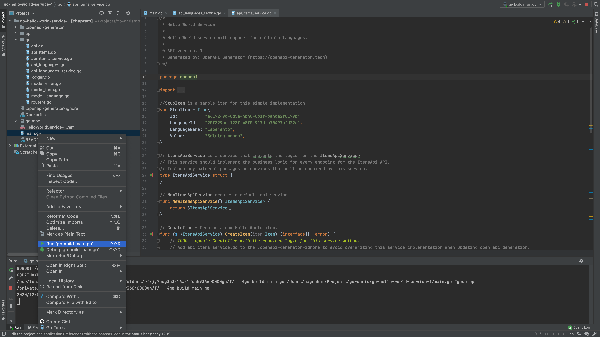

# Sending Mock Server Responses
* [Introduction](#introduction)
* [Goals](#goals)
* [Prerequisites](#prerequisites)
* [Updating the Project](#updating-the-project)
  * [go/api_languages_service.go](#goapi_languages_servicego)
  * [go/api_items_service.go](#goapi_items_servicego)
* [Running the Service Locally](#running-the-service-locally)
* [The Missing Pieces](#the-missing-pieces)


## Introduction
In this guide, we will add some mock responses to the Hello World Service.
This will enable us to make some requests and see things working locally.


## Goals
* add mock server responses 
* run Hello World Service locally 
* make some server requests


## Prerequisites
* Go Hello World Service 1 [(help me)](https://github.com/CiscoDevNet/msx-examples/tree/main/go-hello-world-service-1)
* [JetBrains GoLand](https://www.jetbrains.com/go/)


## Updating the Project

### go/api_languages_service.go
Open `go/api_languages_service.go` and add this `StubLanguage` mock object at 
the module level. You can put it right after your import declarations:

```go
.
.
.
// StubLanguage is a sample language for this example
var StubLanguage = Language{
	Id:          "20f329ac-123f-48f0-917d-a70497cfd22a",
	Name:        "Esperanto",
	Description: "Esperanto is a constructed auxiliary language. Its creator was L. L. Zamenhof, a Polish eye doctor.",
}
.
.
.
```

Then update the `GetLanguage()` and `GetLanguages()` methods to return 
`StubLanguage` as shown.

```go
.
.
.
// GetLanguage - Returns a language.
func (s *LanguagesApiService) GetLanguage(ctx context.Context, id string) (ImplResponse, error) {
    .
    .
    .
	return Response(http.StatusOK, StubLanguage), nil
}

// GetLanguages - Returns a list of languages.
func (s *LanguagesApiService) GetLanguages(ctx context.Context) (ImplResponse, error) {
    .
    .
    .
	list := []Language{StubLanguage}
	return Response(http.StatusOK, list), nil
}
.
.
.
```

<br>

### go/api_items_service.go
Open `go/api_items_service.go` and add this `StubItem` mock object at the 
module level. You can put it right after your `import` declarations.

```go
.
.
.
// StubItem is a sample item for this simple implementation
var StubItem = Item{
	Id:           "a619249d-8d5a-4b40-8b1f-ba4da2f8199b",
	LanguageId:   "20f329ac-123f-48f0-917d-a70497cfd22a",
	LanguageName: "Esperanto",
	Value:        "Saluton mondo",
}
.
.
.
```

<br>

Then as before, update `GetItem()` and `GetItems()` to return `StubItem` as shown.

```go
.
.
.
// GetItem - Returns a Hello World item.
func (s *ItemsApiService) GetItem(ctx context.Context, id string) (ImplResponse, error) {
    .
    .
    .
	return Response(http.StatusOK, StubItem), nil
}

// GetItems - Returns a list of Hello World items.
func (s *ItemsApiService) GetItems(ctx context.Context, languageId string) (ImplResponse, error) {
    .
    .
    .
	list := []Item{StubItem}
	return Response(http.StatusOK, list), nil
}
.
.
.
```


## Running the Service Locally
We can now run Hello World Service locally and make some requests. 

To start the service, right click `./main.go` and select **Run 'go build main.go'**. 



Once the project starts successfully, you’ll see something similar to the 
following in the terminal:

```text
GOROOT=/usr/local/go #gosetup
GOPATH=/Users/volkan/go #gosetup
/usr/local/go/bin/go build -o /private/var/folders/6x//___MSX_SDK_GO . #gosetup
/private/var/folders/6x/21npmvd17d7gj7p0qn5yjb700000gn/T/___MSX_SDK_GO
2021/02/23 12:55:24 Server started
```

Once the service has started make some local requests using `curl`.

```bash
$ curl http://localhost:8080/helloworld/api/v1/languages
[
  {
    "id":"20f329ac-123f-48f0-917d-a70497cfd22a", 
    "name":"Esperanto",
    "description":"Esperanto is a constructed auxiliary language. Its creator was L. L. Zamenhof, a Polish eye doctor."
  }
]
 
$ curl http://localhost:8080/helloworld/api/v1/items
[
  {
    "id":"a619249d-8d5a-4b40-8b1f-ba4da2f8199b",
    "languageId":"20f329ac-123f-48f0-917d-a70497cfd22a",
    "languageName":"Esperanto",
    "value":"Saluton mondo"
  }
]

$ curl http://localhost:8080/helloworld/api/v1/items/a619249d-8d5a-4b40-8b1f-ba4da2f8199b
{
  "id":"a619249d-8d5a-4b40-8b1f-ba4da2f8199b",
  "languageId":"20f329ac-123f-48f0-917d-a70497cfd22a","languageName":"Esperanto",
  "value":"Saluton mondo"
}
```


## The Missing Pieces
Running the service locally is a good start but there are still a number of missing pieces before our service is useful:
* containerize the service
* package the service
* deploy the service
* add Consul support
* add Vault support
* persist domain specific data
* create security clients
* add Swagger documentation
* add role based access control


| [PREVIOUS](01-creating-a-hello-world-service-in-go.md) | [NEXT](03-building-the-component.md) | [HOME](../index.md#go-hello-world-service-example) |
|---|---|---|