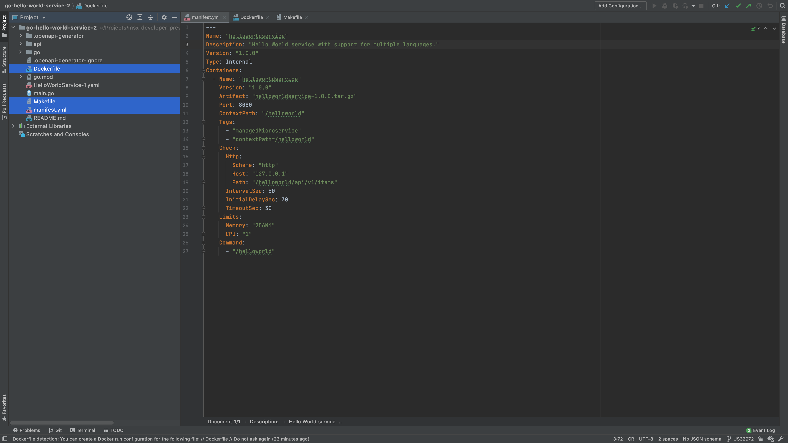
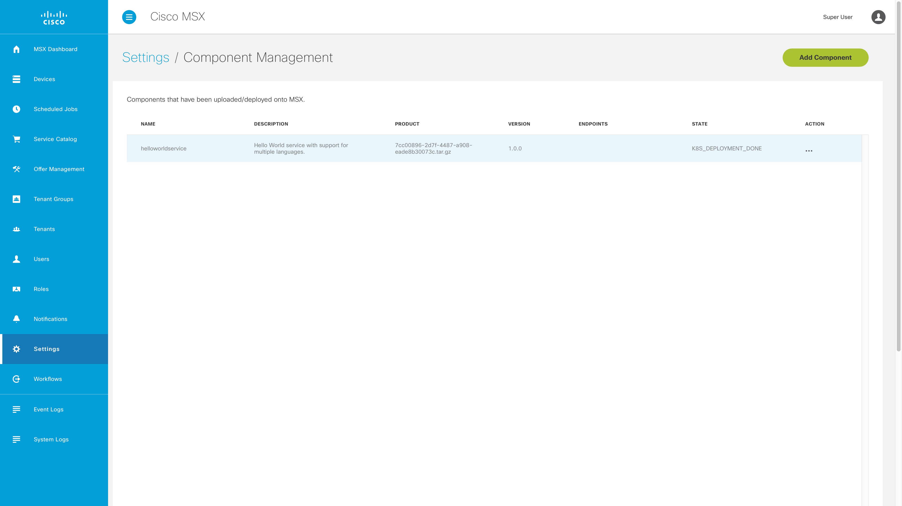

# Building the Component
* [Introduction](#introduction)
* [Goals](#goals)
* [Prerequisites](#prerequisites)
* [Configuring the Project](#configuring-the-project)
  * [go.mod](#gomod)
  * [main.go](#maingo)    
  * [manifest.yml](#manifestyml)
  * [Dockerfile](#dockerfile)
  * [Makefile](#makefile)
* [Packaging the Component](#packaging-the-component)
* [Deploying the Component](#deploying-the-component)
* [Testing the Component](#testing-the-component)
* [The Missing Pieces](#the-missing-pieces)


## Introduction
Before we install the Hello World Service in MSX, we need to containerize it and write a Component Manager manifest. This guide describes how to do those things.


## Goals
* containerize Hello World Service
* write a Component Manger manifest
* create a Component Manager component


## Prerequisites
* Go Hello World Service 1 [(help me)](https://github.com/CiscoDevNet/msx-examples/tree/main/go-hello-world-service-1)
* access to an MSX environment [(help me)](../01-msx-developer-program-basics/02-getting-access-to-an-msx-environment.md)
* basic understanding of SLM [(help me)](../03-msx-component-manager/01-what-is-component-manager-in-a-nutshell.md)
* [Docker Desktop](https://www.docker.com/products/docker-desktop)


## Configuring the Project
Before we can package up the Hello World Service component and deploy it into MSX with Component Manager [(help me)][slm-help], we need to create some configuration files. The project will look like this when all the configuration files have been added:

[slm-help]: ../03-msx-component-manager/01-what-is-component-manager-in-a-nutshell.md 



<br>

### go.mod
Update the module path in `go.mod` and create an alias for it as shown.

```go
module github.com/CiscoDevNet/msx-examples/go-hello-world-service-2

go 1.13

require github.com/gorilla/mux v1.7.3

replace github.com/CiscoDevNet/msx-examples/go-hello-world-service-2/go => ./go/
```

<br>

### main.go
Update `main.go` to reflect the module path change.

```go
.
.
.
import (
	"log"
	"net/http"

	openapi "github.com/CiscoDevNet/msx-examples/go-hello-world-service-2/go"
)
.
.
.
```

### manifest.yml
The first file is the SLM manifest which tells MSX how to deploy the associated containers. Create a `manifest.yml` in the root folder of the project with the following contents:

```yaml
---
Name: "helloworldservice"
Description: "Hello World service with support for multiple languages."
Version: "1.0.0"
Type: Internal
Containers:
  - Name: "helloworldservice"
    Version: "1.0.0"
    Artifact: "helloworldservice-1.0.0.tar.gz"
    Port: 8080
    ContextPath: "/helloworld"
    Tags:
      - "3.10.0"
      - "4.0.0"
      - "4.1.0"
      - "4.2.0"
      - "name=Hello World Service"
      - "componentAttributes=serviceName:helloworldservice~context:/helloworld~name:Hello World Service~description:Hello World service with support for multiple languages."
    Check:
      Http:
        Scheme: "http"
        Host: "127.0.0.1"
        Path: "/helloworld/api/v1/items"
      IntervalSec: 60
      InitialDelaySec: 30
      TimeoutSec: 30
    Limits:
      Memory: "256Mi"
      CPU: "1"
    Command:
      - "/helloworld"
```

<br>

### Dockerfile
Next we create or edit `Dockerfile`, so that we can containerize Hello World Service. Create `Dockerfile` as shown below:

```dockerfile
FROM golang:alpine as builder
RUN apk update && apk add ca-certificates upx git
COPY go/ /go/src/github.com/CiscoDevNet/msx-examples/go-hello-world-service-2/go
COPY go.mod go.sum main.go /go/src/github.com/CiscoDevNet/msx-examples/go-hello-world-service-2/
WORKDIR /go/src/github.com/CiscoDevNet/msx-examples/go-hello-world-service-2
RUN go mod vendor \
  && go build -ldflags="-s -w" -o helloworld main.go \
  && upx helloworld
# Create appuser.
ENV USER=helloworld
ENV UID=10001
# See https://stackoverflow.com/a/55757473/12429735RUN
RUN adduser \
    --disabled-password \
    --gecos "" \
    --home "/nonexistent" \
    --shell "/sbin/nologin" \
    --no-create-home \
    --uid "${UID}" \
    "${USER}"
RUN chown helloworld:helloworld /go/src/github.com/CiscoDevNet/msx-examples/go-hello-world-service-2/helloworld

FROM scratch
COPY --from=builder /go/src/github.com/CiscoDevNet/msx-examples/go-hello-world-service-2/helloworld /
COPY --from=builder /etc/passwd /etc/passwd
COPY --from=builder /etc/group /etc/group
COPY --from=builder /etc/ssl/certs/ca-certificates.crt /etc/ssl/certs/
COPY --from=builder /lib/ld-musl-x86_64.so.1 /lib/ld-musl-x86_64.so.1
USER helloworld:helloworld
ENTRYPOINT ["/helloworld"]
```

<br>


### Makefile
There are several steps to containerize and package the component. This will be 
done multiple times during development, so we use a build utility. Create a file called `Makefile` with the contents below.

```bash
IMAGE = ${NAME}-${VERSION}.tar.gz
OUTPUT = ${NAME}-${VERSION}-component.tar.gz

export GO111MODULE=on

build: clean package

# The following sections MUST be indented using tabs not spaces.
package:
	docker build -t ${NAME}:${VERSION} .
	docker save ${NAME}:${VERSION} | gzip > ${IMAGE}
	tar -czvf ${OUTPUT} manifest.yml ${IMAGE}
	rm -f ${IMAGE}

clean:
	rm -f ${IMAGE}
	rm -f ${OUTPUT}
```


## Packaging the Component
Build the component tarball `helloworldservice-1.0.0-component.tar.gz` by calling make with component "NAME" and "VERSION" parameters. 

```bash
$ make NAME=helloworldservice VERSION=1.0.0 
.
.
.
Successfully built 922f77a54aab
Successfully tagged helloworldservice:1.0.0
docker save helloworldservice:1.0.0 | gzip > helloworldservice-1.0.0.tar.gz
tar -czvf helloworldservice-1.0.0-component.tar.gz manifest.yml helloworldservice-1.0.0.tar.gz
a manifest.yml
a helloworldservice-1.0.0.tar.gz
rm -f helloworldservice-1.0.0.tar.gz
```

If everything goes well the tarball `helloworldservice-1.0.0-component.tar.gz` will be created in  the project root.


## Deploying the Component
Log in to your MSX environment and deploy `helloworldservice-1.0.0-component.tar.gz` using the “Component Manager” in the “Settings” blade [(help me)][slm-blade]. The component will appear in the manager as shown.

[slm-blade]: ../03-msx-component-manager/04-onboarding-and-deploying-components.md 




## Testing the Component
We can now test the component by updating the request we made to localhost. 
The HelloWorldService component has been installed on MSX, and we can make service requests. Set the value of "MY_MSX_ENVIRONMENT" to match your MSX environment, then run the curl command.

```bash
$ export MY_MSX_ENVIRONMENT=dev-plt-aio1.lab.ciscomsx.com
$ curl --insecure --request GET "https://$MY_MSX_ENVIRONMENT/helloworld/api/v1/languages"
[
  {
    "id":"20f329ac-123f-48f0-917d-a70497cfd22a",
    "name":"Esperanto",
    "description":"Esperanto is a constructed auxiliary language. Its creator was L. L. Zamenhof, a Polish eye doctor."
  }
]
```

## The Missing Pieces
We have already built a useful framework and run code in MSX, but we still need to:
* add Consul support
* add Vault support
* persist domain specific data
* create security clients
* add Swagger documentation
* add role based access control


| [PREVIOUS](02-sending-mock-server-responses.md) | [NEXT](04-adding-consul-configuration.md) | [HOME](../index.md#go-hello-world-service-example) |
