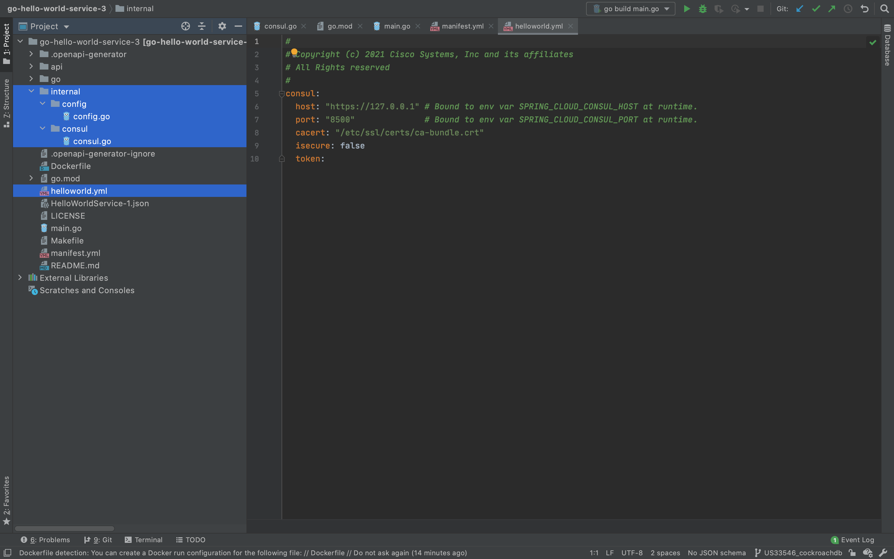
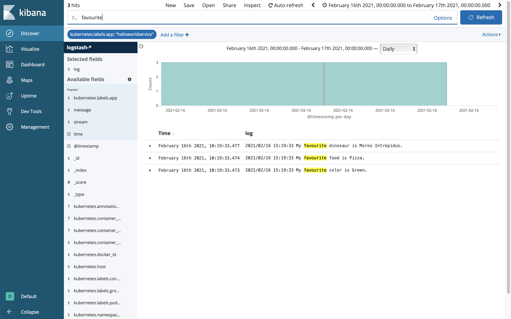

# Adding Consul Configuration
* [Introduction](#introduction)
* [Goals](#goals)
* [Prerequisites](#prerequisites)
* [Bootstrapping Consul](#bootstrapping-consul)
  * [go.mod](#gomod)
  * [helloworld.yml](#helloworldyml)
  * [manifest.yml](#manifestyml)
  * [internal/config/config.go](#internalconfigconfiggo)
  * [internal/consul/consul.go](#internalconsulconsulgo)
  * [main.go](#maingo)
  * [Dockerfile](#Dockerfile)
  * [Makefile](#makefile)
* [Updating the Dependencies](#updating-the-dependencies)
* [Building the Component](#building-the-component)
* [Deploying the Component](#deploying-the-component)
* [Inspecting the Server Log](#inspecting-the-server-log)
* [The Missing Pieces](#the-missing-pieces)
* [References](#references)


## Introduction
Services and applications need to be passed configuration to control integrations and behaviours. In this guide will show how to bootstrap Consul integration and pass non-sensitive key value pairs through `manifest.xml`.


## Goals
* bootstrap Consul integration
* pass non-sensitive key value pairs
* inspect service logs with Kibana


## Prerequisites
* Go Hello World Service 2 [(help me)](https://github.com/CiscoDevNet/msx-examples/tree/main/go-hello-world-service-2)
* access to an MSX environment [(help me)](../01-msx-developer-program-basics/02-getting-access-to-an-msx-environment.md)


## Bootstrapping Consul
When a service is started inside MSX it is passed the required Consul configuration as environment variables:

```
SPRING_CLOUD_CONSUL_HOST = https://localhost
SPRING_CLOUD_CONSUL_PORT = 8500
```

We also need a convenient way to configure Consul when developing locally, and a common mechanism to surface those key value pairs to our service or application. Your project will look like this once you have added the required files.




<br>

### go.mod
Update the module path in `go.mod` and create an alias for it as shown.

```go
module github.com/CiscoDevNet/msx-examples/go-hello-world-service-3

go 1.13

require (
	github.com/gorilla/mux v1.7.3
	github.com/hashicorp/consul/api v1.8.1
	github.com/spf13/viper v1.7.1
)

replace github.com/CiscoDevNet/msx-examples/go-hello-world-service-3/go => ./go/
```

<br>

### helloworld.yml
This is where we pass the values to bootstrap Consul, some of which will be overridden by environment variables at runtime when deployed in to MSX. Create `helloworld.yml` with the Consul bootstrapping values below.

```yaml
consul:
  host: "http://127.0.0.1" # Bound to env var SPRING_CLOUD_CONSUL_HOST at runtime.
  port: "8500"             # Bound to env var SPRING_CLOUD_CONSUL_PORT at runtime.
  cacert: "/etc/ssl/certs/ca-bundle.crt"
  insecure: false
  token:
```


<br>

### manifest.yml
We have to update `manifest.xml` that we introduced in the last example to tell the container where to pick up the bootstrap configuration, and create some **Consul** key value pairs for testing.

```yaml
.
.
.
ConfigFiles:
  - Name: "helloworld.yml"
    MountTo:
      Container: "helloworldservice"
      Path: "/helloworld.yml"

ConsulKeys:
  - Name: "favourite.color"
    Value: "Green"
  - Name: "favourite.food"
    Value: "Pizza"
  - Name: "favourite.dinosaur"
    Value: "Moros Intrepidus"
.
.
.
```

<br>

### internal/config/config.go
The file `internal/config/config.go` defines the configuration structures for Hello World Service, and a convenience method for loading them. It also binds the environment variables passed by MSX to the configuration.

```go
package config

import (
	"github.com/spf13/viper"
	"log"
	"strings"
)


// Config represents the complete helloworldservice config options.
type Config struct {
	Consul     Consul
}

// Consul represent the Consul config options.
type Consul struct {
	Host     string
	Port     string
	CACert   string
	Insecure bool
	Token    string
}

func ReadConfig() *Config {
	v := viper.New()
	v.SetConfigName("helloworld")
	v.AddConfigPath("/etc/helloworld/")
	v.AddConfigPath(".")
	v.SetEnvPrefix("helloworld")
	v.SetEnvKeyReplacer(strings.NewReplacer(".", "_"))
	v.AutomaticEnv()
	if err := v.ReadInConfig(); err != nil {
		log.Printf("%s",err.Error())
		if _, ok := err.(viper.ConfigFileNotFoundError); ok {
			log.Print("No config found.")
		} else {
			log.Printf("Error reading config: %s", err.Error())
		}
	}

	// Bind config to environment based on expected injections.
	bindConfig(v,"Consul.Host", "SPRING_CLOUD_CONSUL_HOST")
	bindConfig(v,"Consul.Port", "SPRING_CLOUD_CONSUL_PORT")

	var c Config
	v.Unmarshal(&c)
	return &c
}

func bindConfig(v *viper.Viper, keyName string, envName string) {
	err := v.BindEnv(keyName, envName)
	if err != nil {
		log.Printf("Could not bind env vars: %s", err.Error())
	}
}
```

<br>

### internal/consul/consul.go
The module `internal/consul/consul.go` provides the code to connect to Consul and retrieve the value for a given key.

```go
package consul

import (
	"github.com/CiscoDevNet/msx-examples/go-hello-world-service-3/internal/config"
	"fmt"
	"github.com/hashicorp/consul/api"
	"net/url"
)

type HelloWorldConsul struct {
	Client  *api.Client
	Service api.AgentServiceRegistration
	Config  config.Consul
}

func (p *HelloWorldConsul) Connect() error {
	conf := api.DefaultConfig()
	u, err := url.Parse(p.Config.Host + ":" + p.Config.Port)
	if err != nil {
		return err
	}
	conf.Address = u.Host
	conf.Scheme = u.Scheme
	conf.Token = p.Config.Token
	if u.Scheme == "https" {
		conf.TLSConfig = api.TLSConfig{
			CAFile:             p.Config.CACert,
			InsecureSkipVerify: p.Config.Insecure,
		}
	}
	client, err := api.NewClient(conf)
	p.Client = client
	return err
}

func (p *HelloWorldConsul) RegisterService() error {
	return p.Client.Agent().ServiceRegister(&p.Service)
}

func (p *HelloWorldConsul) DeregisterService() error {
	return p.Client.Agent().ServiceDeregister(p.Service.ID)
}

func (p *HelloWorldConsul) GetValue(key string) ([]byte, error) {
	kv, _, err := p.Client.KV().Get(key, nil)
	if kv != nil {
		return kv.Value, err
	}
	return []byte{}, fmt.Errorf("key not found")
}

func (p *HelloWorldConsul) GetString(key string, defaultValue string) (string, error) {
	value, error := p.GetValue(key)
	if error == nil {
		return string(value), error
	}
	return defaultValue, error
}

func NewConsul(cfg *config.Config) (HelloWorldConsul, error) {
	ic := HelloWorldConsul{
		Config: cfg.Consul,
	}
	err := ic.Connect()
	if err != nil {
		return ic, err
	}
	return ic, nil
}
```

<br>

### main.go
We have to do a few things in `main.go`, for brevity we only include the new code.
* load the configuration file
* connect to Consul
* retrieve and print Consul values

```go
package main

import (
	"github.com/CiscoDevNet/msx-examples/go-hello-world-service-3/internal/config"
	"github.com/CiscoDevNet/msx-examples/go-hello-world-service-3/internal/consul"
	"log"
	"net/http"

	openapi "github.com/CiscoDevNet/msx-examples/go-hello-world-service-3/go"
)

func main() {
	// Read the configuration.
	config := config.ReadConfig()
	log.Printf("Server started")

	// Setup Consul.
	consul, err := consul.NewConsul(config)
	if err != nil {
		log.Printf("Could not initialize Consul: %s", err.Error())
	}
	testConsul(&consul)
	.
	.
	.
}

func testConsul(c *consul.HelloWorldConsul) {
	// Read our favourites from Consul and print them to the console.
	// Do not leak config in production as it is a security violation.
	favouriteColor, _:= c.GetString("thirdpartyservices/helloworldservice/favourite.color", "UNKNOWN")
	log.Printf("My favourite color is %s.", favouriteColor)
	favouriteFood, _ := c.GetString("thirdpartyservices/helloworldservice/favourite.food", "UNKNOWN")
	log.Printf("My favourite food is %s.", favouriteFood)
	favouriteDinosaur, _ := c.GetString("thirdpartyservices/helloworldservice/favourite.dinosaur", "UNKNOWN")
	log.Printf("My favourite dinosaur is %s.", favouriteDinosaur)
}
```

Pay attention to the key path in the "testConsul", there are two possible patterns:
* thirdpartyservices/helloworldservice/my.key - for service specific values
* thirdpartyservices/defaultapplication/my.key - for common system values

<br>

### Dockerfile
In the last guide we learnt how to containerize HelloWorldService, so we could deploy it into MSX. As we have added some new Go source files we need to update the `Dockerfile`, so it knows about them. In the interests of completeness we include the entire `Dockerfile` below. In addition to changing "go-hello-world-service-2" to "go-hello-world-service-3" we marked other additions with start and end region comments.

```Dockerfile
FROM golang:alpine as builder
RUN apk update && apk add ca-certificates upx git
COPY go/ /go/src/github.com/CiscoDevNet/msx-examples/go-hello-world-service-3/go
COPY go.mod go.sum main.go /go/src/github.com/CiscoDevNet/msx-examples/go-hello-world-service-3/
# REGION BOOTSTRAP FILES
COPY internal/ /go/src/github.com/CiscoDevNet/msx-examples/go-hello-world-service-3/internal
# ENDREGION BOOTSTRAP FILES
WORKDIR /go/src/github.com/CiscoDevNet/msx-examples/go-hello-world-service-3
RUN go mod vendor \
  && go build -ldflags="-s -w" -o helloworld main.go \
  && upx helloworld
# Create appuser.
ENV USER=helloworld
ENV UID=10001
# See https://stackoverflow.com/a/55757473/12429735RUN
RUN adduser \
    --disabled-password \
    --gecos "" \
    --home "/nonexistent" \
    --shell "/sbin/nologin" \
    --no-create-home \
    --uid "${UID}" \
    "${USER}"
RUN chown helloworld:helloworld /go/src/github.com/CiscoDevNet/msx-examples/go-hello-world-service-3/helloworld


FROM scratch
COPY --from=builder /go/src/github.com/CiscoDevNet/msx-examples/go-hello-world-service-3/helloworld /
COPY --from=builder /etc/passwd /etc/passwd
COPY --from=builder /etc/group /etc/group
COPY --from=builder /etc/ssl/certs/ca-certificates.crt /etc/ssl/certs/
COPY --from=builder /lib/ld-musl-x86_64.so.1 /lib/ld-musl-x86_64.so.1
USER helloworld:helloworld
ENTRYPOINT ["/helloworld"]
```

<br>

### Makefile
If you followed the project structure described in the guides, then your service will find the configuration file `helloworld.yml` in the working folder when you start the service locally. We have to update the `Makefile` to include it on our MSX Component tarball.

```Makefile
.
.
.
package:
    docker build -t ${NAME}:${VERSION} .
    docker save ${NAME}:${VERSION} | gzip > ${IMAGE}
    # REGION ADD BOOTSTRAP FILE
    tar -czvf ${OUTPUT} manifest.yml helloworld.yml ${IMAGE}
    # ENDREGION ADD BOOTSTRAP FILE
    rm -f ${IMAGE}
.
.
.
```


## Updating the Dependencies
The code we added above has dependencies on Viper and Consul, so we have to include references to them in "go.mod". You can add them manually, but it is easier to use **go mod tidy** in a terminal window:

```bash
$ go mod tidy
go: finding module for package github.com/spf13/viper
go: finding module for package github.com/hashicorp/consul/api
go: found github.com/spf13/viper in github.com/spf13/viper v1.7.1
go: found github.com/hashicorp/consul/api in github.com/hashicorp/consul/api v1.8.1
```

After you have run the command check that the "require" section in `go.mod` looks like this:

```go
.
.
.
require (
	github.com/gorilla/mux v1.7.3
	github.com/hashicorp/consul/api v1.8.1
	github.com/spf13/viper v1.7.1
)
.
.
.
```


## Building the Component
Like we did in earlier guides build the component `helloworldservice-1.0.0-component.tar.gz` by calling make with component "NAME" and "VERSION" parameters. If you do not see `helloworld.yml` being added to the tarball you need to back and check the Makefile.

```bash
$ make NAME=helloworldservice VERSION=1.0.0 
.
.
.
Successfully built 9a93e54249d8
Successfully tagged helloworldservice:1.0.0
docker save helloworldservice:1.0.0 | gzip > helloworldservice-1.0.0.tar.gz
tar -czvf helloworldservice-1.0.0-component.tar.gz manifest.yml helloworld.yml helloworldservice-1.0.0.tar.gz
a manifest.yml
a helloworld.yml
a helloworldservice-1.0.0.tar.gz
rm -f helloworldservice-1.0.0.tar.gz
```


## Deploying the Component
Log in to your MSX environment and deploy `helloworldservice-1.0.0-component.tar.gz` using **MSX UI->Settings->Components** [(help me)](../03-msx-component-manager/04-onboarding-and-deploying-components.md). If the helloworldservice is already deployed, delete it before uploading it again.


## Inspecting the Server Log
Leaking Consul configuration to the console is a security violation, but it is convenient for testing this example. Recall that we specified some Consul key value pairs in `manifest.xml`, and retrieved and printed them in `main.go`. To prove that it worked we will use Kibana.
 
Click on "System Logs" in the left-hand navigation panel of the Cisco MSX Portal.


<br>

Kibana will launch in a new window. This is not a Kibana tutorial, but we will scratch the surface deep enough to dig out the messages we wrote to the console. 


<br>

Click on "Discover" in the left-hand navigation panel of the Kibana interface. Then add a new filter of "kubernetes.labels.app is helloworldservice" as shown.


<br>

We only care about the time and log so add "log" from the "Available Fields" as shown.


<br>

One of the tricks to finding what you are looking for is being aware of "when" you are looking. Setting the time window to "Daily" is an easy way to make sure we see logs for the service we just deployed.


<br>

The last step is to filter on the word "favourite" in the search box at the top of the screen. If you do not see my favourite dinosaur then check back through your work.



<br>

You have now boot-strapped Consul into your service and passed some configuration. In the next guide we add support for Vault.


## The Missing Pieces
We can now pass configuration to our service, the remaining pieces are:
* add Vault support
* persist domain specific data
* create security clients
* add Swagger documentation
* add role based access control


## References
[Consul Container in Docker](https://hub.docker.com/_/consul)

[Kibana Data Visualization Dashboard](https://www.elastic.co/kibana)

[MSX Component Manager Manifest Reference](/docs/reference/component-manager-manifest)

