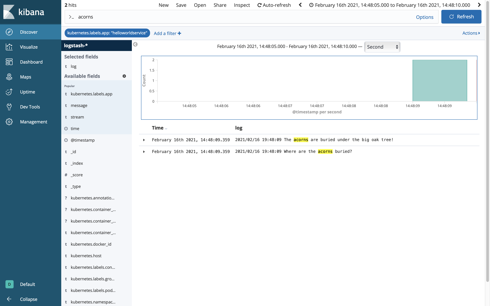

# Adding Vault Configuration
* [Introduction](#introduction)
* [Goals](#goals)
* [Prerequisites](#prerequisites)
* [Bootstrapping Vault](#bootstrapping-vault)
  * [go.mod](#gomod)
  * [helloworld.yml](#helloworldyml)
  * [manifest.yml](#manifestyml)
  * [internal/config/config.go](#internalconfigconfiggo)
  * [internal/vault/consul.go](#internalconsulconsulgo)
  * [internal/vault/vault.go](#internalvaultvaultgo)
  * [main.go](#maingo)
  * [Dockerfile](#Dockerfile)
  * [Makefile](#makefile)
* [Updating the Dependencies](#updating-the-dependencies)
* [Building the Component](#building-the-component)
* [Deploying the Component](#deploying-the-component)
* [Inspecting the Server Log](#inspecting-the-server-log)
* [The Missing Pieces](#the-missing-pieces)
* [References](#references)


## Introduction
In addition to non-sensitive configuration that we can pass with Consul, we also need a way to pass sensitive values like passwords and secrets. In this guide will show how to bootstrap Vault integration and pass sensitive key value pairs through `manifest.xml`.


## Goals
* bootstrap Vault integration
* pass sensitive key value pairs
* inspect service logs with Kibana


## Prerequisites
* Go Hello World Service 3 [(help me)](https://github.com/CiscoDevNet/msx-examples/tree/main/go-hello-world-service-3)
* access to an MSX environment [(help me)](../01-msx-developer-program-basics/02-getting-access-to-an-msx-environment.md)


## Bootstrapping Vault
When a service is started inside MSX it is passed the required Vault configuration as environment variables:

```
SPRING_CLOUD_VAULT_HOST   = vault.service.consul
SPRING_CLOUD_VAULT_PORT   = 8200
SPRING_CLOUD_VAULT_SCHEME = https
SPRING_CLOUD_VAULT_TOKEN  = [a valid vault token]
```

As with Consul, we also need a convenient way to configure Vault when developing locally, and a common mechanism to surface those key value pairs to our service or application. We laid the groundwork for this in the previous guide on Consul, so for brevity we will document the required incremental changes.

> **GOTCHA**
> 
> The Vault token passed as environment variable SPRING_CLOUD_VAULT_TOKEN expires after 30 days. 
Renewing the Vault token is left as an exercise for the reader.

<br>

### go.mod
Update the module path in `go.mod` and create an alias for it as shown.

```go
module github.com/CiscoDevNet/msx-examples/go-hello-world-service-4

go 1.13

require (
	github.com/gorilla/mux v1.7.3
	github.com/hashicorp/consul/api v1.8.1
	github.com/hashicorp/vault/api v1.0.4
	github.com/spf13/viper v1.7.1
)

replace github.com/CiscoDevNet/msx-examples/go-hello-world-service-4/go => ./go/
```

<br>

### helloworld.yml
The file `helloworld.yml` is where we pass the values to bootstrap Vault, some of which will be overridden by environment variables at runtime when deployed in to MSX.

```yaml
.
.
.
vault:
  scheme: "http"                      # Bound to env var SPRING_CLOUD_VAULT_SCHEME at runtime.
  host: "127.0.0.1"                   # Bound to env var SPRING_CLOUD_VAULT_HOST at runtime.
  port: "8200"                        # Bound to env var SPRING_CLOUD_VAULT_PORT at port.
  token: "s.erq0ll7pkPctres2fFpbjxZx" # Bound to env var SPRING_CLOUD_VAULT_TOKEN at port.
  cacert: "/etc/ssl/certs/ca-bundle.crt"
  insecure: false
.
.
.
```

<br>

### manifest.yml
Update `manifest.yml` to set a secret in Vault that we can retrieve at runtime.

```yaml
.
.
.
Secrets:
  - Name: "secret.squirrel.location"
    Value: "The acorns are buried under the big oak tree!"
.
.
.
```

<br>

### internal/config/config.go
First add a struct to `internal/config/config.go` for the Vault configuration, and add it to service configuration.

```go
.
.
.
// Config represents the complete helloworldservice config options.
type Config struct {
	Consul    Consul
	Vault     Vault
}

// Vault represents Vault config options.
type Vault struct {
	Scheme          string
	Host            string
	Port            string
	Token           string
	CACert          string
	Insecure        bool
	Prefix          string
}
.
.
.
```

Second update "ReadConfig" to bind the Vault environment variables to the Viper instance.

```go
func ReadConfig() *Config {
    .
    .
    .
	// Bind config to environment based on expected injections.
	bindConfig(v,"Consul.Host", "SPRING_CLOUD_CONSUL_HOST")
	bindConfig(v,"Consul.Port", "SPRING_CLOUD_CONSUL_PORT")
	bindConfig(v,"Vault.Scheme", "SPRING_CLOUD_VAULT_SCHEME")
	bindConfig(v,"Vault.Host", "SPRING_CLOUD_VAULT_HOST")
	bindConfig(v,"Vault.Port", "SPRING_CLOUD_VAULT_PORT")
	bindConfig(v,"Vault.Token", "SPRING_CLOUD_VAULT_TOKEN")
    .
    .
    .
}
```

<br>

### internal/consul/consul.go
We have to update `internal/consul/consul.go` to reference the new project path:

```go
package consul

import (
	"github.com/CiscoDevNet/msx-examples/go-hello-world-service-4/internal/config"
	"fmt"
	"github.com/hashicorp/consul/api"
	"net/url"
)
.
.
.
```

<br>

### internal/vault/vault.go
The module `internal/vault/vault.go` provides the code to connect to Vault and retrieve the value for a given key.

```go
package vault

import (
	"errors"
	"github.com/CiscoDevNet/msx-examples/go-hello-world-service-4/internal/config"
	"github.com/hashicorp/vault/api"
)

type HelloWorldVault struct {
	Client *api.Client
	Config config.Vault
}

func (v *HelloWorldVault) Connect() error {
	c := api.DefaultConfig()
	c.Address = v.Config.Scheme + "://" + v.Config.Host + ":" + v.Config.Port

	if v.Config.Scheme == "https" {
		t := api.TLSConfig{
			CACert:   v.Config.CACert,
			Insecure: v.Config.Insecure,
		}
		err := c.ConfigureTLS(&t)
		if err != nil {
			return err
		}
	}
	client, err := api.NewClient(c)
	if err != nil {
		return err
	}
	client.SetToken(v.Config.Token)
	v.Client = client
	return nil
}

func (v *HelloWorldVault) GetSecret(s string) (*api.Secret, error) {
	result, err := v.Client.Logical().Read(s)
	return result, err
}

func (v *HelloWorldVault) getValue(secret string, key string) (interface{}, error) {
	s, err := v.GetSecret(secret)
	if err != nil {
		return nil, err
	}
	if s == nil {
		e := errors.New("Value " + secret + " not found.")
		return nil, e
	}
	for k, v := range s.Data {
		if k == key {
			return v, nil
		}
	}
	// It is possible that this is a versioned secret so look just in case.
	if s.Data["data"] != nil {
		for k, v := range s.Data["data"].(map[string]interface{}) {
			if k == key {
				return v, nil
			}
		}
	}
	e := errors.New("Value not found.")
	return nil, e
}

func (v *HelloWorldVault) GetString(secret string, key string, defaultValue string) (string, error) {
	value, error := v.getValue(secret, key)
	if error == nil {
		return value.(string), error
	}
	return defaultValue, error
}

func NewVault(c *config.Config) (HelloWorldVault, error) {
	pv := HelloWorldVault{
		Config: c.Vault,
	}
	err := pv.Connect()
	if err != nil {
		return pv, err
	}
	return pv, nil
}
```

<br>

### main.go
We have to do a few things in "main.go", for brevity we only include the changes.
* connect to Vault
* retrieve and print Vault values

```go
package main

import (
	"github.com/CiscoDevNet/msx-examples/go-hello-world-service-4/internal/config"
	"github.com/CiscoDevNet/msx-examples/go-hello-world-service-4/internal/consul"
	"github.com/CiscoDevNet/msx-examples/go-hello-world-service-4/internal/vault"
	"log"
	"net/http"

	openapi "github.com/CiscoDevNet/msx-examples/go-hello-world-service-4/go"
)

func main() {
    .
    .
    .
	// Setup Consul.
	consul, err := consul.NewConsul(config)
	if err != nil {
		log.Printf("Could not initialize Consul: %s", err.Error())
	}
	config.Consul.Prefix = consul.FindPrefix()
	testConsul(config, &consul)
		
	// Setup Vault.
	vault, err := vault.NewVault(config)
	if err != nil {
		log.Printf("Could not initialize Vault: %s", err.Error())
	}
	config.Vault.Prefix = "secret/" + config.Consul.Prefix
	testVault(config, &vault)
    .
    .
    .
}
.
.
.
func testVault(config *config.Config, vault *vault.HelloWorldVault) {
	// Read a secret from Vault  and it to the console.
	// Do not leak secrets in production as it is a security violation.
	secretSquirrelLocation, _ := vault.GetString(config.Vault.Prefix + "/helloworldservice/", "secret.squirrel.location", "UNKNOWN")
	log.Printf("Where are the acorns buried?")
	log.Print(secretSquirrelLocation)
}
```

Pay attention to the key path in `testVault` as there are different patterns for different MSX versions and uses.

| Pattern                              | Description                  |
|--------------------------------------|------------------------------|
| {prefix}/helloworldservice/my.key    | for service specific secrets |
| {prefix}/defaultapplication/my.key   | for common system secrets    |

<br>

The prefix depends on the version of MSX you are running:

| MSX Version | Prefix                      |
|-------------|-----------------------------|
| <= 4.0.0    | secret/thirdpartyservices   |
| >= 4.1.0    | secret/thirdpartycomponents |

<br>


### Dockerfile
If you copied the `Dockerfile` from the previous guide, make sure you update "go-hello-world-service-3" to "go-hello-world-service-4". Also make sure you have the line that pulls in the new Go files:

```Dockerfile
.
.
.
COPY internal/ /go/src/github.com/CiscoDevNet/msx-examples/go-hello-world-service-4/internal
.
.
.

```

<br>

### Makefile
No changes are required in the Makefile from the Consul guide where we added `helloworld.yml`, which contains the configuration to bootstrap Consul and Vault.


## Updating the Dependencies
The code we added above has dependencies on Vault, so we have to include references to them in `go.mod`. You can add them manually, but it is easier to use **go mod tidy** in a terminal window:

```bash
$ go mod tidy
go: finding module for package github.com/hashicorp/vault/api
go: found github.com/hashicorp/vault/api in github.com/hashicorp/vault/api v1.0.4
```

After you have run the command check that the "require" section in `go.mod` looks like this:

```go
.
.
.
require (
	github.com/gorilla/mux v1.7.3
	github.com/hashicorp/consul/api v1.8.1
	github.com/hashicorp/vault/api v1.0.4
	github.com/spf13/viper v1.7.1
)
.
.
.
```


## Building the Component
Like we did in earlier guides, build the component `helloworldservice-1.0.0-component.tar.gz` by calling make with component "NAME" and "VERSION" parameters. If you do not see `helloworld.yml` being added to the tarball you need to back and check the Makefile.

```bash
$ make NAME=helloworldservice VERSION=1.0.0 
.
.
.
Successfully built a4621de07764
Successfully tagged helloworldservice:1.0.0
docker save helloworldservice:1.0.0 | gzip > helloworldservice-1.0.0.tar.gz
tar -czvf helloworldservice-1.0.0-component.tar.gz manifest.yml helloworld.yml helloworldservice-1.0.0.tar.gz
a manifest.yml
a helloworld.yml
a helloworldservice-1.0.0.tar.gz
rm -f helloworldservice-1.0.0.tar.gz
```


## Deploying the Component
Log in to your MSX environment and deploy `helloworldservice-1.0.0-component.tar.gz` using **MSX UI->Settings->Components** [(help me)](../03-msx-component-manager/04-onboarding-and-deploying-components.md). If the helloworldservice is already deployed, delete it before uploading it again.


## Inspecting the Server Log
Leaking Vault configuration to the console is a security violation, but it is convenient for testing this example. Recall that we specified a Vault key "secret.squirrel.location" in `manifest.xml`, and retrieved and printed it in `main.go`. To prove that it worked we will use Kibana in the same we did for the Consul guide, but this time we will search for "acorns".




## The Missing Pieces
Our service can now accept sensitive and non-sensitive configuration, the missing pieces are:
* persist domain specific data
* create security clients
* add Swagger documentation
* add role based access control


## References
[Vault Container in Docker](https://hub.docker.com/_/vault)

[MSX Component Manager Manifest Reference](../reference/component-manager-manifest-reference.md)

[Kibana Data Visualization Dashboard](https://www.elastic.co/kibana)


| [PREVIOUS](04-adding-consul-configuration.md) | [NEXT](06-persisting-domain-specific-data.md) | [HOME](../index.md#go-hello-world-service-example) |
