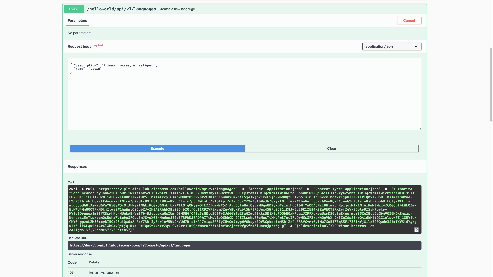

# Implementing Role Based Access Control
* [Introduction](#introduction)
* [Goals](#goals)
* [Prerequisites](#prerequisites)
* [Configuring the Project](#configuring-the-project)
    * [go.mod](#gomod)
    * [go/routers.mod](#goroutersgo)
    * [go/api_items.go](#goapi_itemsgo)
    * [go/api_languages.go](#goapi_languagesgo)
    * [internal/config/config.go](#internalconfigconfiggo)
    * [internal/security/security.go](#internalsecuritysecuritygo)
    * [main.go](#maingo)
    * [helloworld.yml](#helloworldyml)
    * [manifest.yml](#manifestyml)
* [Building the Component](#building-the-component)
* [Deploying the Component](#deploying-the-component)
* [Testing the Component](#testing-the-component)
    * [Creating Custom Permissions](#creating-custom-permissions)
    * [Creating Custom Roles](#creating-custom-roles)
    * [Creating a Special User](#creating-a-special-user)
    * [Making Requests As Jeff](#making-requests-as-jeff)
* [The Missing Pieces](#the-missing-pieces)


## Introduction
All the Hello World Service requests we have made so were insecure because we have not passed an access token in the
header. In this guide, we will add that security and show how to validate the access token and get a list of permissions
associated with it.


## Goals
* secure the API requests
* validate the access token
* define and enforce RBAC rules


## Prerequisites
* Go Hello World Service 6 [(help me)](https://github.com/CiscoDevNet/msx-examples/tree/main/go-hello-world-service-6)
* access to an MSX environment [(help me)](../01-msx-developer-program-basics/02-getting-access-to-an-msx-environment.md)


## Configuring the Project
Adding security to the Hello World Service is an exercise in configuration. In addition to updating some existing files, we will also add some new ones. Take note of the vertical ellipsis which are used to demarcate partial updates.

There are quite a few files to add in this guide but once you have completed the configuration, the project will look like this.


<br>

### go.mod
Update the module path in `go.mod` from "go-hello-world-service-5" to "go-hello-world-service-6" like we have in previous guides. An MSX library is required to support security, you can add the dependency with this terminal command.

```bash
$ go get github.com/CiscoDevNet/go-msx-security
```

<br>

### internal/config/config.go
Start by updating `./internal/config/config.go` to include RBAC (role-based access control) settings:

```go
.
.
.
// HelloWorld config options.
type Config struct {
	Consul      Consul
	Vault       Vault
	Cockroach   Cockroach
	Swagger     Swagger
	Security    Security
}

// Security config options.
type Security struct {
	SsoURL       string
	ClientID     string
	ClientSecret string
}
.
.
.
```

<br>

### go/routers.go
Update the "Route" struct in `go/routers.go` to include a "Permission" member.

```go
.
.
.
// A Route defines the parameters for an api endpoint
type Route struct {
	Name        string
	Method      string
	Pattern     string
	HandlerFunc http.HandlerFunc
	Permission  string 
}
.
.
.
```

<br>

### go/api_items.go
We need to specify the permission required for each request in `go/api_items.go`. We will show how to create the permissions in the system later.

```go
.
.
.
// Routes returns all of the api route for the ItemsApiController
func (c *ItemsApiController) Routes() Routes {
	return Routes{ 
		{
			"CreateItem",
			strings.ToUpper("Post"),
			"/helloworld/api/v1/items",
			c.CreateItem,
			"HELLOWORLD_WRITE_ITEM",
		},
		{
			"DeleteItem",
			strings.ToUpper("Delete"),
			"/helloworld/api/v1/items/{id}",
			c.DeleteItem,
			"HELLOWORLD_WRITE_ITEM",
		},
		{
			"GetItem",
			strings.ToUpper("Get"),
			"/helloworld/api/v1/items/{id}",
			c.GetItem,
			"HELLOWORLD_READ_ITEM",
		},
		{
			"GetItems",
			strings.ToUpper("Get"),
			"/helloworld/api/v1/items",
			c.GetItems,
			"HELLOWORLD_READ_ITEM",
		},
		{
			"UpdateItem",
			strings.ToUpper("Put"),
			"/helloworld/api/v1/items/{id}",
			c.UpdateItem,
			"HELLOWORLD_WRITE_ITEM",
		},
	}
}
.
.
.
```

<br>

### go/api_languages.go
We do the same for `go/api_languages.go`.

```go
.
.
.
// Routes returns all of the api route for the LanguagesApiController
func (c *LanguagesApiController) Routes() Routes {
	return Routes{ 
		{
			"CreateLanguage",
			strings.ToUpper("Post"),
			"/helloworld/api/v1/languages",
			c.CreateLanguage,
			"HELLOWORLD_WRITE_LANGUAGE",
		},
		{
			"DeleteLanguage",
			strings.ToUpper("Delete"),
			"/helloworld/api/v1/languages/{id}",
			c.DeleteLanguage,
			"HELLOWORLD_WRITE_LANGUAGE",
		},
		{
			"GetLanguage",
			strings.ToUpper("Get"),
			"/helloworld/api/v1/languages/{id}",
			c.GetLanguage,
			"HELLOWORLD_READ_LANGUAGE",
		},
		{
			"GetLanguages",
			strings.ToUpper("Get"),
			"/helloworld/api/v1/languages",
			c.GetLanguages,
			"HELLOWORLD_READ_LANGUAGE",
		},
		{
			"UpdateLanguage",
			strings.ToUpper("Put"),
			"/helloworld/api/v1/languages/{id}",
			c.UpdateLanguage,
			"HELLOWORLD_WRITE_LANGUAGE",
		},
	}
}
.
.
.
```


<br>

### internal/security/security.go
The module `internal/security/security.go` interfaces with `go-msx-security` to exchange an access token for a security context, so we can enforce role based access control.

```go
package security

import (
	openapi "github.com/CiscoDevNet/msx-examples/go-hello-world-service-7/go"
	"github.com/CiscoDevNet/msx-examples/go-hello-world-service-7/internal/config"
	"github.com/CiscoDevNet/msx-examples/go-hello-world-service-7/internal/consul"
	"github.com/CiscoDevNet/msx-examples/go-hello-world-service-7/internal/vault"
	"github.com/CiscoDevNet/go-msx-security"
	"fmt"
	"github.com/gorilla/mux"
	"net/http"
)

// The Security global will represent the Security validator provided by msx-security.
var Security = &msxsecurity.MsxSecurity{}

// EnsureAuth will wrap http handle funcs that require auth.
type EnsureAuth struct {
	permission string
	handler    http.Handler
}

// Override configuration with values from Consul and Vault.
func UpdateConfig(c *config.Config, consul *consul.HelloWorldConsul, vault *vault.HelloWorldVault) error {
	c.Security.SsoURL, _ = consul.GetString(c.Consul.Prefix + "/defaultapplication/swagger.security.sso.baseUrl", c.Security.SsoURL)
	c.Security.ClientID, _ = consul.GetString(c.Consul.Prefix + "/helloworldservice/integration.security.clientId", c.Security.ClientID)
	c.Security.ClientSecret, _ = vault.GetString(c.Vault.Prefix + "/helloworldservice", "integration.security.clientSecret", c.Security.ClientSecret)
	return nil
}

// ServeHTTP will perform the auth on behalf of the embedded handlerfunc.
func (ea *EnsureAuth) ServeHTTP(w http.ResponseWriter, r *http.Request) {
	permitted, _ := Security.HasPermission(r,ea.permission)
	if permitted {
		ea.handler.ServeHTTP(w, r)
	} else {
		w.WriteHeader(http.StatusForbidden)
		fmt.Fprint(w, "Access denied")
	}
}

// NewEnsureAuth will be used to generate an auth wrapper.
func NewEnsureAuth(handlerToWrap http.Handler, permission string) http.Handler {

	return &EnsureAuth{
		permission: permission,
		handler:    handlerToWrap,
	}
}

// Sets up a new Security handler.
func NewSecurity(cfg *config.Config) error {
	c := msxsecurity.DefaultMsxSecurityConfig()
	c.SsoURL = cfg.Security.SsoURL
	c.ClientID = cfg.Security.ClientID
	c.ClientSecret = cfg.Security.ClientSecret
	Security = msxsecurity.NewMsxSecurity(c)
	return nil
}

// NewSecureRouter creates a new router for any number of api routers.
// Routes are secured using our ensure auth wrapper.
func NewSecureRouter(routers ...openapi.Router) *mux.Router {
	router := mux.NewRouter().StrictSlash(true)
	for _, api := range routers {
		for _, route := range api.Routes() {
			var handler http.Handler
			handler = route.HandlerFunc
			handler = openapi.Logger(handler, route.Name)
			handler = NewEnsureAuth(handler, route.Permission)

			router.
				Methods(route.Method).
				Path(route.Pattern).
				Name(route.Name).
				Handler(handler)
		}
	}

	return router
}

// AddSecureRoutes adds api routes to an existing router.
func AddSecureRoutes(router *mux.Router, routers ...openapi.Router) *mux.Router {
	for _, api := range routers {
		for _, route := range api.Routes() {
			var handler http.Handler
			handler = route.HandlerFunc
			handler = openapi.Logger(handler, route.Name)
			handler = NewEnsureAuth(handler, route.Permission)

			router.
				Methods(route.Method).
				Path(route.Pattern).
				Name(route.Name).
				Handler(handler)
		}
	}

	return router
}
```

<br>

### main.go
Update `main.go` with the code belo, we have included the entire text here even though not all of it has changed. See if you can spot the differences.

```go
package main

import (
	openapi "github.com/CiscoDevNet/msx-examples/go-hello-world-service-7/go"
	"github.com/CiscoDevNet/msx-examples/go-hello-world-service-7/internal/config"
	"github.com/CiscoDevNet/msx-examples/go-hello-world-service-7/internal/consul"
	"github.com/CiscoDevNet/msx-examples/go-hello-world-service-7/internal/datastore"
	"github.com/CiscoDevNet/msx-examples/go-hello-world-service-7/internal/security"
	"github.com/CiscoDevNet/msx-examples/go-hello-world-service-7/internal/swagger"
	"github.com/CiscoDevNet/msx-examples/go-hello-world-service-7/internal/vault"
	"log"
	"net/http"
)

func main() {
    .
    .
    .
	// Setup Swagger
	swagger.UpdateConfig(config, &consul, &vault)
	swagger, err := swagger.NewSwagger(config)
	if err != nil {
		log.Fatalf("Could not setup Swagger: %s", err.Error())
	}

	// Setup Security.
	security.UpdateConfig(config, &consul, &vault)
	err = security.NewSecurity(config)
	if err != nil {
		log.Fatalf("Could not setup Security: %s", err.Error())
	}

	// Setup Controllers
	ItemsApiController := openapi.NewItemsApiController(db)
	LanguagesApiController := openapi.NewLanguagesApiController(db)

	// Add insecure routes for Items.
	router := openapi.NewRouter(ItemsApiController)

	// Add secure routes for Languages.
	secureRouter := security.AddSecureRoutes(router, LanguagesApiController)

	// Add route for Swagger.
	router.PathPrefix("/helloworld/swagger").HandlerFunc(swagger.SwaggerRoutes)

	log.Fatal(http.ListenAndServe(":8080", secureRouter))
}
.
.
.
```

<br>

### helloworld.yml
The bootstrap configuration file `helloworld.yml` is where we pass the RBAC configuration values.

```yaml
.
  .
  .
security:
  ssourl: "http://localhost:9515/idm" # CONSUL thirdpartyservices/defaultapplication/swagger.security.sso.baseUrl
  clientid: "local-private-client" # CONSUL thirdpartyservices/helloworldservice/integration.security.clientId
  clientsecret: "make-up-a-private-client-secret-and-keep-it-safe" # Required by MSX.
  .
  .
  .
```

<br>

### manifest.yml
Update `manifest.yml` to include configuration for the confidential security client identifier and secret required by RBAC [(help me)](../04-java-hello-world-service-example/08-creating-the-security-clients.md).

```yml
.
.
.
ConsulKeys:
  - Name: "favourite.color"
    Value: "Green"
  - Name: "favourite.food"
    Value: "Pizza"
  - Name: "favourite.dinosaur"
    Value: "Moros Intrepidus"
  - Name: "public.security.clientId"
    Value: "hello-world-service-public-client" # For MSX 4.3 and up, configuring values here will override automatic value creation by SLM.
  - Name: "integration.security.clientId"
    Value: "hello-world-service-private-client" # For MSX 4.3 and up, configuring values here will override automatic value creation by SLM.

Secrets:
  - Name: "secret.squirrel.location"
    Value: "The acorns are buried under the big oak tree!" # For MSX 4.3 and up, configuring values here will override automatic value creation by SLM.
  - Name: "integration.security.clientSecret"
    Value: "make-up-a-private-client-secret-and-keep-it-safe" # For MSX 4.3 and up, configuring values here will override automatic value creation by SLM.
.
.
.
```

Similar to the Swagger guide [(help me)](../04-java-hello-world-service-example/09-adding-swagger-support.md#manifestyml), you may have noticed we are passing the confidential security client details in two places. If you look back at `internal/security/security.go` you will see that some values from `./helloworld.yml` are overridden with values from **Consul** and **Vault** at runtime.


## Building the Component
Like we did in earlier guides, build the component `helloworldservice-1.0.0-component.tar.gz` by calling make with
component "NAME" and "VERSION" parameters.

```bash
$ make NAME=helloworldservice VERSION=1.0.0 
.
.
.
Successfully built a4621de07764
Successfully tagged helloworldservice:1.0.0
docker save helloworldservice:1.0.0 | gzip > helloworldservice-1.0.0.tar.gz
tar -czvf helloworldservice-1.0.0-component.tar.gz manifest.yml helloworld.yml helloworldservice-1.0.0.tar.gz
a manifest.yml
a helloworld.yml
a helloworldservice-1.0.0.tar.gz
rm -f helloworldservice-1.0.0.tar.gz
```


## Deploying the Component
Log in to your MSX environment and deploy `helloworldservice-1.0.0-component.tar.gz` using **MSX UI -> Settings -> Components** [(help me)](../03-msx-component-manager/04-onboarding-and-deploying-components.md). If the helloworldservice is already deployed, delete it before uploading it again.


## Testing the Component
Looking at the code above in `main.go` you can see that we only secured the Languages controller. So you can still make insecure Item requests like this.

```bash
$ export MY_MSX_HOSTNAME=dev-plt-aio1.lab.ciscomsx.com
$ curl --insecure --request GET https://$MY_MSX_HOSTNAME/helloworld/api/v1/items
[
  {
    "id":"a619249d-8d5a-4b40-8b1f-ba4da2f8199b",
    "languageId":"20f329ac-123f-48f0-917d-a70497cfd22a",
    "languageName":"Esperanto",
    "value":"Saluton mondo"
  }
]
```

However, if you try to get a collection of Languages without passing an access token, you will get an "Access denied" response.

```bash
$ export MY_MSX_HOSTNAME=dev-plt-aio1.lab.ciscomsx.com
$ curl --insecure --request GET https://$MY_MSX_HOSTNAME/helloworld/api/v1/languages
Access denied
```

If you log in to the Cisco MSX Portal as superuser and go to the Swagger documentation for the Hello World Service, you will be able to make a request that works because the superuser can do everything. To restrict access to the API, we need to create some roles and permissions then assign them to a user.

<br>


### Creating Custom Permissions
To keep things simple, we will use Swagger to create the Permissions.

Capabilities are synonymous with Permissions in the UI, so use the payload below with **Swagger -> IDM Microservice ->Roles -> POST /idm/api/v1/roles/capabilities** to create the Permissions.

```json
{
  "capabilities": [
    {
      "name": "HELLOWORLD_WRITE_LANGUAGE",
      "displayName": "com.example.helloworldservice.HELLOWORLD_WRITE_LANGUAGE",
      "description": "Permission to write Hello World Language resources."
    },
    {
      "name": "HELLOWORLD_READ_LANGUAGE",
      "displayName": "com.example.helloworldservice.HELLOWORLD_READ_LANGUAGE",
      "description": "Permission to read Hello World Language resources."
    },
    {
      "name": "HELLOWORLD_WRITE_ITEM",
      "displayName": "com.example.helloworldservice.HELLOWORLD_WRITE_ITEM",
      "description": "Permission to write Hello World Item resources."
    },
    {
      "name": "HELLOWORLD_READ_ITEM",
      "displayName": "com.example.helloworldservice.HELLOWORLD_READ_ITEM",
      "description": "Permission to read Hello World Item resources."
    }
  ]
}
```

<br>

The response will look like this but with different identifiers.

```json
{
  "capabilities": [
    {
      "id": "2c6cfb30-3f2d-11eb-8762-6dbfa7fa7420",
      "name": "HELLOWORLD_WRITE_LANGUAGE",
      "displayName": "com.example.helloworldservice.HELLOWORLD_WRITE_LANGUAGE",
      "description": "Permission to write Hello World Language resources.",
      "isSeeded": "false",
      "owner": "system",
      "category": null,
      "objectName": null,
      "operation": null,
      "isDefault": null,
      "resources": null
    },
    {
      "id": "2c722b50-3f2d-11eb-8762-6dbfa7fa7420",
      "name": "HELLOWORLD_READ_LANGUAGE",
      "displayName": "com.example.helloworldservice.HELLOWORLD_READ_LANGUAGE",
      "description": "Permission to read Hello World Language resources.",
      "isSeeded": "false",
      "owner": "system",
      "category": null,
      "objectName": null,
      "operation": null,
      "isDefault": null,
      "resources": null
    },
    {
      "id": "2c73b1f0-3f2d-11eb-8762-6dbfa7fa7420",
      "name": "HELLOWORLD_WRITE_ITEM",
      "displayName": "com.example.helloworldservice.HELLOWORLD_WRITE_ITEM",
      "description": "Permission to write Hello World Item resources.",
      "isSeeded": "false",
      "owner": "system",
      "category": null,
      "objectName": null,
      "operation": null,
      "isDefault": null,
      "resources": null
    },
    {
      "id": "2c755fa0-3f2d-11eb-8762-6dbfa7fa7420",
      "name": "HELLOWORLD_READ_ITEM",
      "displayName": "com.example.helloworldservice.HELLOWORLD_READ_ITEM",
      "description": "Permission to read Hello World Item resources.",
      "isSeeded": "false",
      "owner": "system",
      "category": null,
      "objectName": null,
      "operation": null,
      "isDefault": null,
      "resources": null
    }
  ]
}
```

<br>

### Creating Custom Roles
Now that we have some Permissions we can create an administration role with read/write access to the Language resources, and a consumer role with read-only access.

Create the consumer role with read-only access with the following payload, and an `owner` of `helloworld` using **Swagger -> IDM Microservice -> Roles -> POST /idm/api/v1/roles**.

```json
{
  "roleName": "HELLOWORLD_CONSUMER",
  "description": "A consumer role for the Hello World Service.",
  "capabilitylist": [
    "HELLOWORLD_READ_LANGUAGE",
    "HELLOWORLD_READ_ITEM"
  ],
  "displayName": "Hello World Consumer"
}
```

Save the response, as we will need the `roleid` when we create the user in the next step. Note that the `roleid` from your system will be different.

```json
{
  "status": "Success",
  "href": "/v1/roles/HELLOWORLD_CONSUMER",
  "roleid": "1811c107-9433-4285-872b-84d6130c8dcf",
  "roleName": "HELLOWORLD_CONSUMER",
  "capabilitylist": [
    "HELLOWORLD_READ_ITEM",
    "HELLOWORLD_READ_LANGUAGE"
  ],
  "displayName": "Hello World Consumer",
  "description": "A consumer role for the Hello World Service.",
  "isSeeded": "false",
  "owner": "helloworld",
  "resourceDescriptor": null
}
```

Creating the administration role is left as an exercise for the reader. You need to update the name and description in the original payload and add the other Permissions.

<br>

### Creating a Special User
We still need to create a user that is assigned the Role `HELLOWORLD_CONSUMER`, but for it to have access to the Cisco MSX Portal we also need to give it the `OPERATOR` role.

Use **Swagger -> IDM Microservice -> Roles -> GET /idm/api/v1/roles/{name}** in the Swagger documentation to look up the role identifier for `OPERATOR`. On the system we used that requests looks like as follows, but your access token and response will be different.

```bash
$ export MY_MSX_HOSTNAME=dev-plt-aio1.lab.ciscomsx.com
$ curl -k -X GET "https://$MY_MSX_HOSTNAME/idm/api/v1/roles/OPERATOR" \
-H  "accept: application/json" \
-H  "Authorization: Bearer eyJhb…truncated…abc"
```

You now have role identifiers for `HELLOWORLD_CONSUMER` and `OPERATOR` which we can use to create a user.

Expand the Swagger documentation for Users and find **Swagger -> IDM Microservice -> User -> POST /idm/api/v8/user**”, plug your role identifiers into the payload below, then call it.

```json
{
  "email": "nobody@example.com",
  "firstName": "Jeff",
  "lastName": "Pop",
  "password": "Password@1",
  "passwordPolicyName": "ppolicy_default",
  "roleIds": [
    "1811c107-9433-4285-872b-84d6130c8dcf",
    "d6660cd0-38cf-11eb-9843-0916e7f369e0"
  ],
  "username": "jeff"
}
```

If everything went according to plan you have created a user called `Jeff` with roles `OPERATOR` and `HELLOWORLD_CONSUMER`, and a terrible password of `Password@1`. The response from our test environment looks like the following, but your identifiers will be different.

```json
{
  "id": "9bce0e6e-6902-4254-b939-8758c51c8e87",
  "status": "true",
  "deleted": "false",
  "username": "jeff",
  "firstName": "Jeff",
  "lastName": "Pop",
  "email": "nobody@example.com",
  "roleIds": [
    "d6660cd0-38cf-11eb-9843-0916e7f369e0",
    "1811c107-9433-4285-872b-84d6130c8dcf"
  ],
  "tenantIds": [
    "d66e4a30-38cf-11eb-9843-0916e7f369e0"
  ],
  "passwordPolicyName": "ppolicy_default",
  "password": null
}
```

## Making Requests As Jeff
If you have not used Swagger much, the last few steps might have seemed like a chore, but we hope you made it. We will cover scripting the creation of roles and permissions in a future guide to take the sting out of it.

We are now ready to make some requests as Jeff. Open the Cisco MSX Portal in an incognito browser window and login in a `jeff` with password `Password@1`.

Once you logged in navigate to the Hello World Service Swagger documentation
[(help me)](../01-msx-developer-program-basics/04-using-the-swagger-documentation.md).


<br>

Our implementation only enforces RBAC rules on the language resources and `HELLOWORLD_CONSUMER` can only read language resources, so we should be able to do a `GET` but not `POST`, `PUT`, or `DELETE`. Here is a screenshot showing a successful `GET` request.


<br>

The RBAC rules will prevent Jeff from creating a new language; Poor Jeff. _Aut viam inveniam aut faciam._



<br>


## The Missing Pieces
That is it folks. We created a service from an OpenAPI Specification that integrates with Consul, Vault, CockroachDB, Swagger, and MSX Security. Then we containerized, packaged, deployed, and tested it in a production-like MSX environment.

Please check back periodically for new MSX development guides.


| [PREVIOUS](09-adding-swagger-support.md) | [HOME](../index.md#go-hello-world-service-example) |
