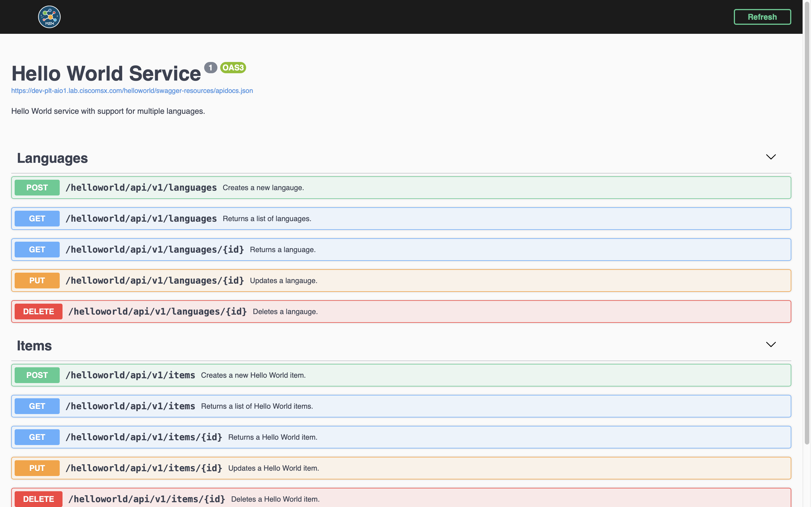

# Adding Swagger Support
* [Introduction](#introduction)
* [Goals](#goals)
* [Prerequisites](#prerequisites)
* [Configuring the Project](#configuring-the-project)
    * [requirements.txt](#requirementstxt)
    * [Dockerfile](#dockerfile)
    * [helloworld.yml](helloworldyml)
    * [manifest.yml](#manifestyml)
* [Updating the Project](#updating-the-project)
    * [swagger.json](#swaggerjson)
    * [helpers/swagger_helper.py](#helpersswagger_helperpy)
    * [config.py](#configpy)
    * [app.py](#apppy)
* [Building the Component](#building-the-component)
* [Deploying the Component](#deploying-the-component)
* [Finding the Swagger Documentation](#finding-the-swagger-documentation)
* [Conclusion](#conclusion)

## Introduction
Swagger is an important tool that allows users to explore an API [(help me)](../01-msx-developer-program-basics/04-using-the-swagger-documentation.md). In this guide, we will update Hello World Service so that we can browse the Swagger documentation in the Cisco MSX Portal. 

<br>

## Goals
* browse Hello World Service Swagger documentation 

<br>

## Prerequisites
* Python Hello World Service 2 [(help me)](https://github.com/CiscoDevNet/msx-examples/tree/main/python-hello-world-service-2)
* access to an MSX environment [(help me)](../01-msx-developer-program-basics/02-getting-access-to-an-msx-environment.md)
* Python MSX Swagger [(help me)](https://github.com/CiscoDevNet/python-msx-swagger)

<br>

## Configuring the Project
A number of changes and new files are required to add Swagger support to Hello World Service. The screenshot below shows what we are aiming for once the configuration is done.


### requirements.txt
In order to add Swagger support we need to add the MSX Python Swagger package to `requirements.txt`. This is the file we created in the first example to manage the project dependencies, update the contents as shown.

```
Flask==1.1.2
Flask-Cors==3.0.10
flask-restplus==0.13.0
Werkzeug==0.16.1
psycopg2-binary==2.9.1
PyYAML==5.4.1
python-consul==1.1.0
urllib3==1.26.5
hvac==0.10.14
msxswagger @ git+https://github.com/CiscoDevNet/python-msx-swagger@v0.6.0
```

### Dockerfile
The MSX Swagger package is hosted on GitHub, so we have to make some changes to the `Dockerfile` so that it can be installed in the container. 

```dockerfile
FROM python:3.9.6-slim-buster
WORKDIR /app
ADD . /app
RUN apt-get update \
&& apt-get install -y --no-install-recommends git \
&& apt-get purge -y --auto-remove \
&& rm -rf /var/lib/apt/lists/*
RUN pip3 install -r requirements.txt
EXPOSE 8082
ENTRYPOINT ["flask", "run", "--host", "0.0.0.0", "--port", "8082"]
```

<br> 

### helloworld.yml
When a service is deployed to MSX it will pick up the Swagger configuration from Consul and Vault. When developing locally you can pass values in `helloworld.yml` instead.

```yaml
.
.
.
swagger:
  rootpath: "/helloworld"             # Required by MSX.
  secure: true                        # Required by MSX.
  ssourl: "http://localhost:9515/idm" # CONSUL {prefix}/defaultapplication/swagger.security.sso.baseUrl
  clientid:                           # CONSUL {prefix}/helloworldservice/public.security.clientId
  swaggerjsonpath: "swagger.json"     # Required by MSX.
.
.
.
```

<br>

### manifest.yml
For MSX <= 4.2 update `manifest.yml` to include configuration for the public security client identifier required by Swagger [(help me)](../04-java-hello-world-service-example/08-creating-the-security-clients.md).

For MSX >= 4.3 the security client will be created for you automatically.

```yml
---
Name: "helloworldservice"
Description: "Hello World service with support for multiple languages."
Version: "1.0.0"
Type: Internal

Containers:
  - Name: "helloworldservice"
    Version: "1.0.0"
    Artifact: "helloworldservice-1.0.0.tar.gz"
    Port: 8082
    ContextPath: "/helloworld"
    Tags:
      - "3.10.0"
      - "4.0.0"
      - "4.1.0"
      - "4.2.0"
      - "4.3.0"
      - "5.0.0"
      - "managedMicroservice"
      - "name=Hello World Service"
      - "componentAttributes=serviceName:helloworldservice~context:/helloworld~name:Hello World Service~description:Hello World service with support for multiple languages."
    Check:
      Http:
        Scheme: "http"
        Host: "127.0.0.1"
        Path: "/helloworld/api/v1/items"
      IntervalSec: 60
      InitialDelaySec: 30
      TimeoutSec: 30
    Limits:
      Memory: "1000Mi"
      CPU: "1"
    Command:
      - "/usr/local/bin/gunicorn"
      - "--bind"
      - "0.0.0.0:8082"
      - "wsgi:app"

ConfigFiles:
  - Name: "helloworld.yml"
    MountTo:
      Container: "helloworldservice"
      Path: "/helloworld.yml"

ConsulKeys:
  - Name: "favourite.color"
    Value: "Green"
  - Name: "favourite.food"
    Value: "Pizza"
  - Name: "favourite.dinosaur"
    Value: "Moros Intrepidus"
# NOT NEEDED FOR MSX >= 4.3
#  - Name: "public.security.clientId"
#    Value: "hello-world-service-public-client"

Secrets:
  - Name: "secret.squirrel.location"
    Value: "The acorns are buried under the big oak tree!"

Infrastructure:
  Database:
    Type: Cockroach
    Name: "helloworld"
```


## Updating the Project
Now that the project is configured we need to add the OpenAPI Specification and update the application to serve up a Swagger UI for it.

### swagger.json
Create `swagger.json` in the root folder of the project with the contents of the OpenAPI specification from the example [(download me)](https://github.com/CiscoDevNet/msx-examples/tree/main/python-hello-world-service-6/swagger.json). 

<br>

### helpers/swagger_helper.py
The module `helpers/swagger_helper.py` provides the code to integrate with Swagger.

```python
from msxswagger import DocumentationConfig, Security, Sso

from config import Config
from helpers.consul_helper import ConsulHelper


class SwaggerHelper(object):
    def __init__(self, config: Config, consul_helper: ConsulHelper):
        self._config = config
        self._consul_helper = consul_helper

    def get_documentation_config(self):
        sso_url = self._consul_helper.get_string(
            key=f"{self._config.config_prefix}/defaultapplication/swagger.security.sso.baseUrl",
            default=self._config.swagger.ssourl)
        client_id = self._consul_helper.get_string(
            key=f"{self._config.config_prefix}/helloworldservice/public.security.clientId",
            default=self._config.swagger.clientid)

        return DocumentationConfig(
            root_path='/helloworld',
            security=Security(
                enabled=self._config.swagger.secure,
                sso=Sso(base_url=sso_url, client_id=client_id)))

    def get_swagger_resource(self):
        return self._config.swagger.swaggerjsonpath
```

<br>

### config.py
In previous guides we created `config.py` to bootstrap Consul and Vault into our service. That same module also serves as a common place for us to store other configuration. Update `config.py` to include a structure to store the Swagger values. Note that they will be populated from Consul, Vault, and `helloworld.yml`, depending on whether your service is running on local infrastructure or in an MSX environment.

Add a named tuple to `config.py` for the Swagger configuration:

```python
.
.
.
ConsulConfig = namedtuple("ConsulConfig", ["host", "port", "cacert"])
VaultConfig = namedtuple("VaultConfig", ["scheme", "host", "port", "token", "cacert"])
CockroachConfig = namedtuple("CockroachConfig", ["host", "port", "databasename","username", "sslmode", "cacert"])
SwaggerConfig = namedtuple("SwaggerConfig", ["rootpath", "secure", "ssourl", "clientid", "swaggerjsonpath"])
.
.
.
```

Then populate it in the `__init__` method:

```python
    def __init__(self, resource_name):
        .
        .
        .
        # Create Cockroach config object.
        self.cockroach = CockroachConfig(**config["cockroach"])

        # Create Swagger config object.
        self.swagger = SwaggerConfig(**config["swagger"])
        .
        .
        .
```

<br>

### app.py
The service we wrote in the first example already conforms to the contract above, so all that remains is to serve up the Swagger UI. Open `app.py` and update the contents as shown. In our example we load `swagger.json` and display a Swagger UI for it when the user hits `/helloworld/swagger`. The Python MSX Swagger package can also generate the Swagger UI from annotations in the code [(help me)](https://github.com/CiscoDevNet/python-msx-swagger/blob/main/README.md).

```python
from flask import Flask
from msxswagger import MSXSwaggerConfig

from config import Config

from controllers.items_controller import ItemsApi, ItemApi
from controllers.languages_controller import LanguageApi, LanguagesApi
from helpers.consul_helper import ConsulHelper
from helpers.swagger_helper import SwaggerHelper
from helpers.vault_helper import VaultHelper
from helpers.cockroach_helper import CockroachHelper

config = Config("helloworld.yml")
consul_helper = ConsulHelper(config.consul)
vault_helper = VaultHelper(config.vault)
config.find_consul_vault_prefix(consul_helper)
swagger_helper = SwaggerHelper(config, consul_helper)

app = Flask(__name__)
consul_helper.test(config.config_prefix)
vault_helper.test(config.config_prefix)

with CockroachHelper(config) as db:
    db.test()

swagger = MSXSwaggerConfig(
    app=app,
    documentation_config=swagger_helper.get_documentation_config(),
    swagger_resource=swagger_helper.get_swagger_resource())

swagger.api.add_resource(ItemsApi, "/api/v1/items", resource_class_kwargs={"config": config})
swagger.api.add_resource(ItemApi, "/api/v1/items/<id>", resource_class_kwargs={"config": config})
swagger.api.add_resource(LanguagesApi, "/api/v1/languages", resource_class_kwargs={"config": config})
swagger.api.add_resource(LanguageApi, "/api/v1/languages/<id>", resource_class_kwargs={"config": config})
app.register_blueprint(swagger.api.blueprint)

if __name__ == '__main__':
    app.run()
```


## Building the Component
Like we did in earlier guides build the component `helloworldservice-1.0.0-component.tar.gz` by calling make with component "NAME" and "VERSION" parameters. If you do not see `helloworld.yml` being added to the tarball you need to back and check the Makefile.

```bash
$ make NAME=helloworldservice VERSION=1.0.0
.
.
.
docker save helloworldservice:1.0.0 | gzip > helloworldservice-1.0.0.tar.gz
tar -czvf helloworldservice-1.0.0-component.tar.gz manifest.yml helloworld.yml helloworldservice-1.0.0.tar.gz
a manifest.yml
a helloworld.yml
a helloworldservice-1.0.0.tar.gz
rm -f helloworldservice-1.0.0.tar.gz
```


## Deploying the Component
Log in to your MSX environment and deploy `helloworldservice-1.0.0-component.tar.gz` using **MSX UI->Settings->Components** [(help me)](../03-msx-component-manager/04-onboarding-and-deploying-components.md). If the helloworldservice is already deployed, delete it before uploading it again.


## Finding the Swagger Documentation
There are two ways to find the Swagger documentation for Hello World Service in 
the Cisco MSX Portal. The first is to browse to this URL once you have made 
replaced the hostname.

```
https://MY_MSX_HOSTNAME/helloworld/swagger/
```

The second is to use the Cisco MSX Portal to navigate to the Swagger documentation 
for all services [(help me)](../01-msx-developer-program-basics/04-using-the-swagger-documentation.md). 
Whichever path you take once you get there it will look like this.



This ability to try the API is a powerful tool than can help you refine your service before you ship it. If you have not used Swagger before, take this opportunity to explore. 

<br>

## Conclusion
We have now built a Hello World Service that we can deploy to MSX, that has a Swagger interface that can be used to make real requests. When you are ready to write your own service consider starting with an OpenAPI Specification and using a generator to write the boilerplate code.


| [PREVIOUS](08-creating-the-security-clients.md) | [NEXT](10-implementing-role-based-access-control.md) | [HOME](../index.md#python-hello-world-service-example) |
