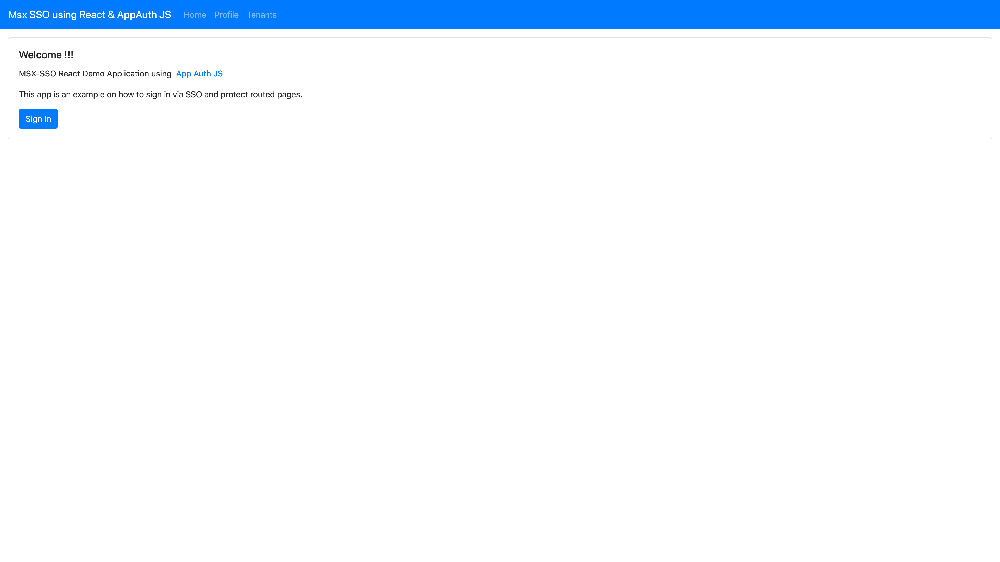
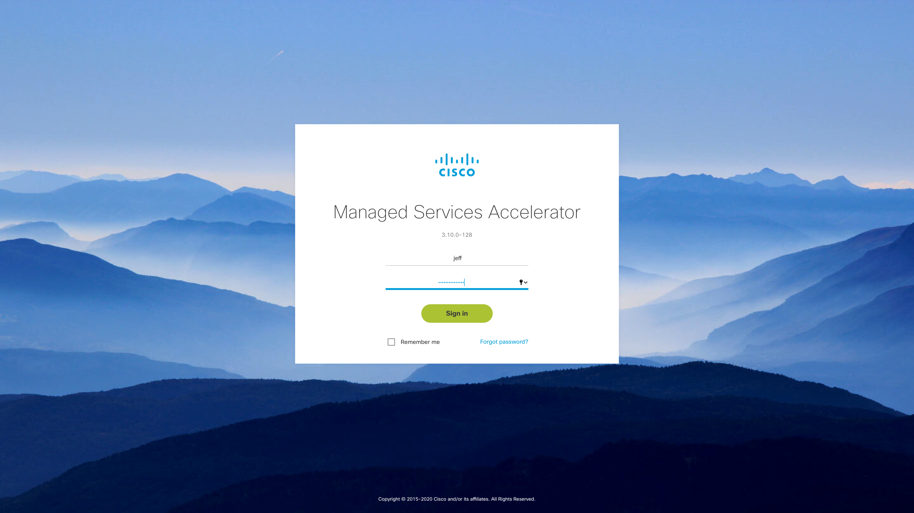
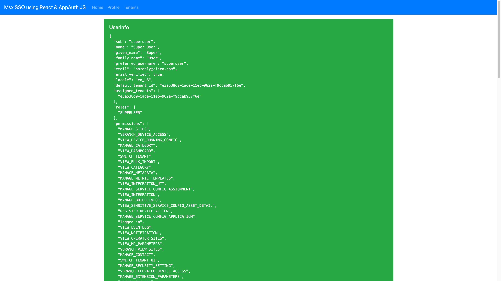
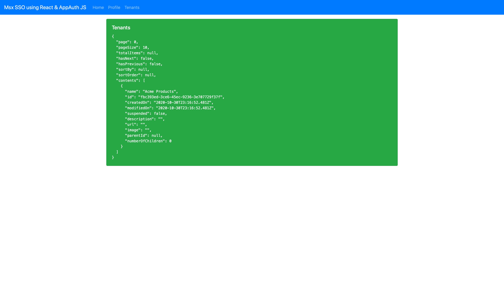

# Writing an Application With React

* [Introduction](#introduction)
* [Goals](#goals)
* [Prerequisites](#prerequisites)
* [Downloading the Example](#downloading-the-example)
* [Installing the Dependencies](#installing-the-dependencies)
* [Creating the Security Client](#creating-the-security-client)
* [Configuring the Application](#configuring-the-application)
* [Creating Tenants and Users](#creating-tenants-and-users)
* [Firing It Up Locally](#firing-it-up-locally)
  * [Install the Application](#install-the-application)
  * [Start the Application](#start-the-application)
  * [Configure the Redirect URL](#configure-the-redirect-url)
  * [Run the Applicatio](#run-the-application)
* [References](#references)


## Introduction
This guide you will explain how to build a React application that implements an SSO flow and calls an MSX SDK client to get a list of tenants. Experience with web development frameworks is useful but not required.


## Goals
* build an example React application
* follow an SSO flow to get an access token
* use that access token to make an MSX request
 

## Prerequisites
* access to an MSX environment [(help me)](../01-msx-developer-program-basics/02-getting-access-to-an-msx-environment.md)
* a public security client for your application [(help me)](../01-msx-developer-program-basics/80-configuring-security-clients.md) 
* the example source code [(help me)](https://github.com/CiscoDevNet/msx-examples/tree/main/react-sso-sdk-demo)
* [npm 6.14.8+](https://www.npmjs.com/get-npm)
* [node 14.15.0+](https://nodejs.org/en/download/)


## Downloading the Example 
Download the example source to your computer from [here](https://github.com/CiscoDevNet/msx-examples/tree/main/react-sso-sdk-demo) and unpack it. We will draw attention to key parts of the example, but you will need to download the source in order to run it. 
```shell
$ ls -1
config
Dockerfile
README.md
package.json
public
src
```


## Installing the Dependencies
You can check which versions of npm and Node you have installed with the terminal commands shown below. If you need to update either visit the sites listed in the prerequisites and follow the instructions.  
```
$ npm --version
6.14.8

$ node --version
v14.15.0
```
<br>

Unlike Android and iOS development there is no need to explicitly install React. Instead, we declare React as a dependency in the application file "package.json". Let us take a closer look at that dependencies section.
```  
  "dependencies": {
    "@openid/appauth": "^1.3.0",
    "bootstrap": "^4.5.3",
    "msx-platform-client": "git+https://cto-github.cisco.com/NFV-BU/msx-platform-javascript-client.git",
    "react": "^17.0.1",
    "react-dom": "^17.0.1",
    "react-router-dom": "^5.2.0",
    "react-scripts": "4.0.0"
  }
```
<br>

Note that in addition to React we declare dependencies for "openid/appauth" and "msx-platform-client". The former provides an SSO flow to enable us to get an access token, the latter is the MSX Platform SDK Client that lets us talk to MSX.


## Creating the Security Client
If you have not already created a public security client for your application do that first [(help me)](../01-msx-developer-program-basics/80-configuring-security-clients.md). Use the payload below:
```
{
    "clientId": "my-public-client",
    "grantTypes": [
      "refresh_token",
      "authorization_code"
    ],
    "maxTokensPerUser": -1,
    "useSessionTimeout": false,
    "resourceIds": [],
    "scopes": [
      "address",
      "read",
      "phone",
      "openid",
      "profile",
      "write",
      "email"
    ],
    "autoApproveScopes": [
      "address",
      "read",
      "phone",
      "openid",
      "profile",
      "write",
      "email"
    ],
    "authorities": [
      "ROLE_USER","ROLE_PUBLIC"
    ],
    "registeredRedirectUris": [
      "/reactSsoSdkDemo/callback"
    ],
    "accessTokenValiditySeconds": 9000,
    "refreshTokenValiditySeconds": 18000,
    "additionalInformation": {}
}
```

    
## Configuring the Application
Turn your attention to the "prod" section in "src/config.js".
```
// customize this for development
const dev = {
  sso: {
    clientId: 'my-public-client',
    ssoBaseUrl: 'https://dev-plt-aio1.lab.ciscomsx.com/idm',
    redirectUrl: 'https://192.168.0.15:4200/reactSsoSdkDemo/callback',
    scope: 'openid email profile read write'
  },
  msxApi: {
    basePath: "https://dev-plt-aio1.lab.ciscomsx.com"
  }
};

// customize this for production
const prod = {
  sso: {
    clientId: 'my-public-client',
    ssoBaseUrl: window.location.protocol + "//" + window.location.hostname +  '/idm',
    redirectUrl: window.location.protocol + "//" + window.location.hostname + '/reactSsoSdkDemo/callback',
    scope: 'openid email profile read write'
  },
  msxApi: {
    basePath: window.location.protocol + "//" + window.location.hostname
  }
};
```

Make sure the "clientId" and "redirectUrl" int the "dev" section match the security client you created.


## Creating Tenants and Users
Before we start the application for the first time we need to make some users and tenants. Although you have superuser credentials for the MSX environment you are using, it is good practice to create a user with fewer permissions for testing. Treat it as a security precaution that will also prevent you from shooting yourself in the foot.

Create a user with the role "Service Provider Operator" [(help me)](../01-msx-developer-program-basics/03-navigating-the-msx-user-interface.md), 
then make some tenants for the application to retrieve and display. 


## Firing It Up Locally
It is possible to run the application locally and point it at a remote MSX environment. This is a boon during development because it allows you to test the application without having to deploy it to MSX every five minutes. SSO takes care of authentication for us, but we have to jump through some extra hoops on the MSX environment to configure it. 


### Install the Application
Open up a terminal window and install the application.
```shell
$ npm install
npm WARN bootstrap@4.5.3 requires a peer of jquery@1.9.1 - 3 but none is installed. You must install peer dependencies yourself.
npm WARN bootstrap@4.5.3 requires a peer of popper.js@^1.16.1 but none is installed. You must install peer dependencies yourself.
npm WARN tsutils@3.19.0 requires a peer of typescript@>=2.8.0 || >= 3.2.0-dev || >= 3.3.0-dev || >= 3.4.0-dev || >= 3.5.0-dev || >= 3.6.0-dev || >= 3.6.0-beta || >= 3.7.0-dev || >= 3.7.0-beta but none is installed. You must install peer dependencies yourself.

audited 1919 packages in 5.931s

129 packages are looking for funding
  run `npm fund` for details

found 0 vulnerabilities
```


### Start the Application
Then start the application with HTTPS; this is required for the SSO flow to work.
```shell
$ HTTPS=true npm run start 
Compiled successfully!

You can now view sso-app-auth in the browser.

  Local:            https://localhost:4200
  On Your Network:  https://192.168.0.15:4200

Note that the development build is not optimized.
To create a production build, use npm run build.
```


### Configure the Redirect URL
The application is now running, but we are not quite done. We need to tell the application, and the MSX environment where to redirect to at the end of the SSO flow. This chicken and egg situation only exists when running the application locally against a remote MSX environment.

First update the "dev" section in "src/config.js" to reflect where your application is being served from. On our test machine that turned out to be https://192.168.0.15:4200, but yours will most likely be different. Then restart the application.

Second login into the Cisco MSX Portal and go to "Settings->SSO Configuration" and add redirect URL to your public security client that points to your local application. 


<br>

You should now one relative redirect URL for production, and one absolute URL for development that look something like this:

| URL Type | Redirect URL |
|----------|--------------|
| Relative (production) | /reactSsoSdkDemo/callback |
| Absolute (development) |  https://192.168.0.15:4200/reactSsoSdkDemo/callback |


### Run the Application
Open an incognito window in your browser and browse to the application. We use an incognito window so that we are forced through the SSO flow. On our test machine the url was https://192.168.0.15:4200.

Once the application has started, click the "Sign In" button.



<br>

The application will initiate the SSO flow, and you will be prompted to sign in.  



<br>

When the SSO flow has completed the application will show the user info. 



<br>

Clicking on "Tenants" in the application bar at the top of the screen will fetch a list of tenants from MSX. Take a look at "src/Tenants.js" to see what is going on.




## References
[npm 6.14.8+](https://www.npmjs.com/get-npm)

[Node 14.15.0+](https://nodejs.org/en/download/)

[React 17.0.1+](https://reactjs.org)

[OAuth 2.0](https://oauth.net/2/)

[AppAuth 1.3.0](https://appauth.io)


| [PREVIOUS](02-working-with-self-signed-certifcates.md) | [NEXT](04-building-the-component.md) | [HOME](../index.md#react-user-interface-example) |
|---|---|---|