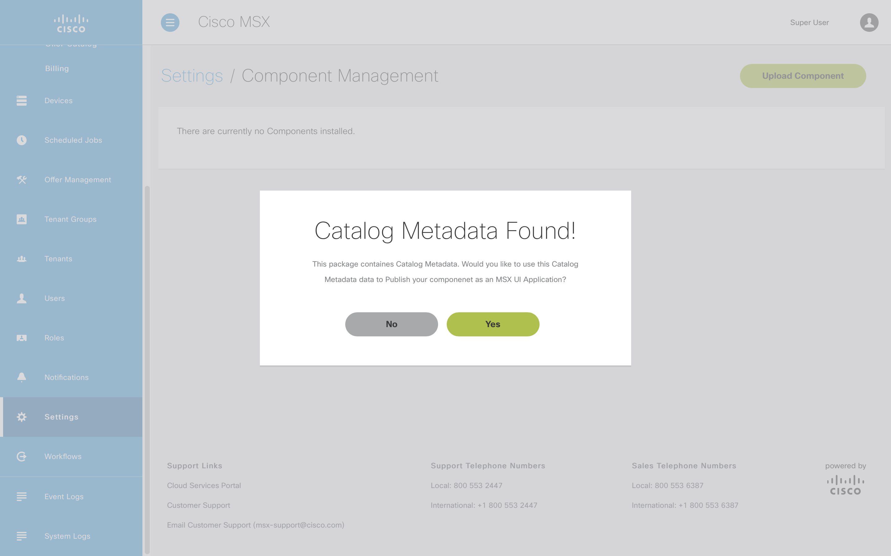
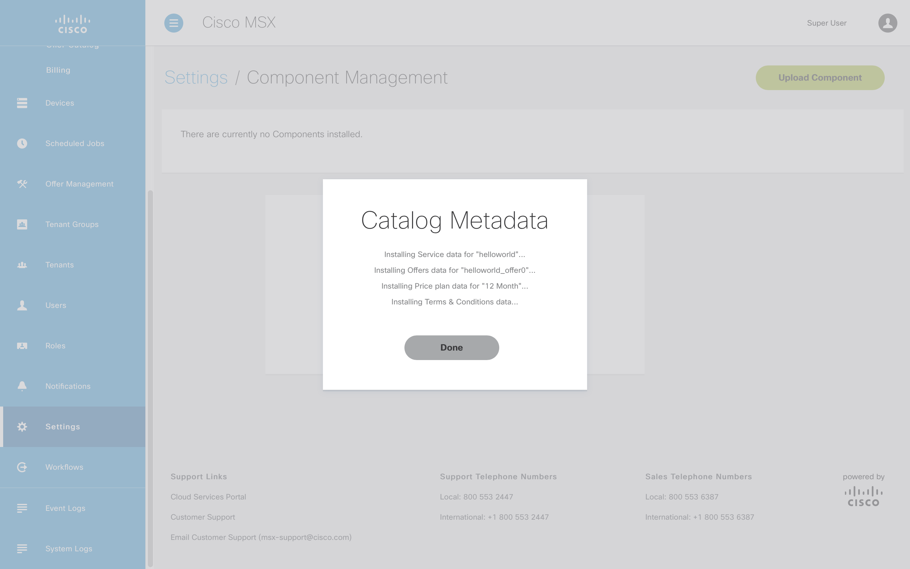
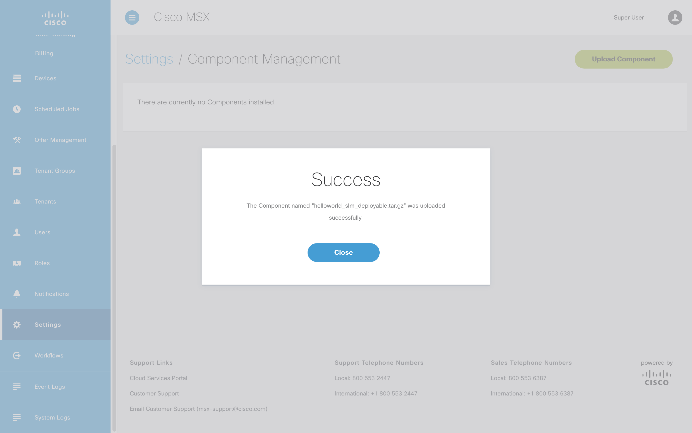
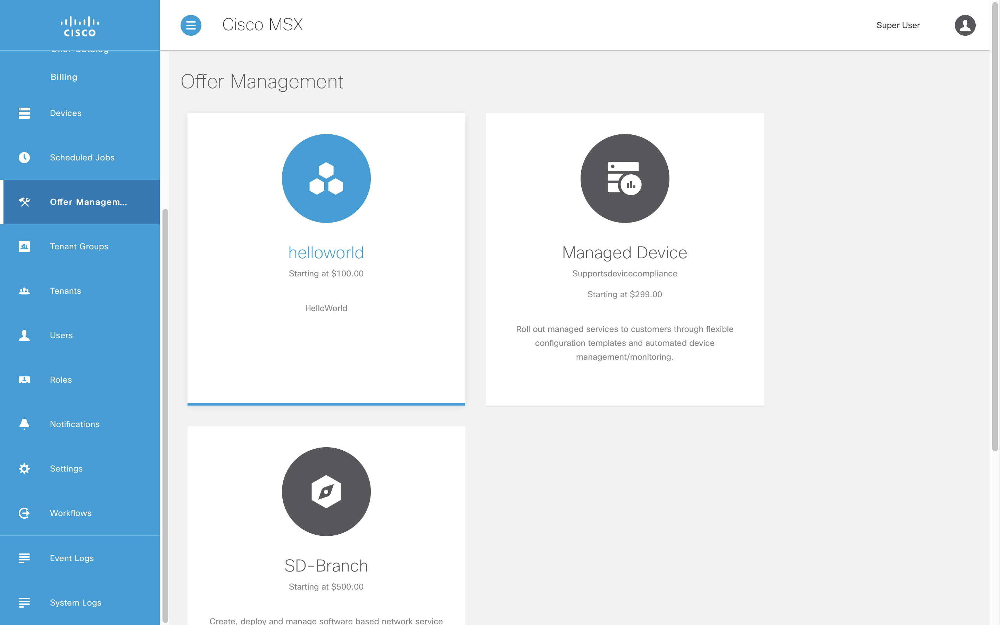

# Introduction to MSX Tenant-Centric UI
* [Introduction](#introduction)
* [Prerequisites](#prerequisites)
* [Generating Your Sample Service Pack](#generating-your-sample-service-pack)
    * [Parameters Explained](#parameters-explained)
* [Deployment](#deployment)
* [References](#references)


## Introduction
Angular 9 is the default framework used by MSX UI. As a result, there are many features and components at your disposal to integrate with MSX. The full range of features available is listed in the MSX Common Components reference [(help me)](https://developer.cisco.com/docs/msx/#!msx-common-components-msx-common-components). In the following sections we will cover a number of those features in detail.


## Prerequisites
In order to create a service pack for MSX, the following must be present:
- MSX >= 4.0.0
- Docker
- Linux based OS
- node >= v8 and <= 14
- npm 6 * cannot be version 7
- webpack 


## Generating Your Sample Service Pack
- Clone the following project to your local environment: 

```bash
$ git clone https://github.com/CiscoDevNet/angular9-msx-service-pack-ui-generator
```

- Change directories to the clone repository.

```bash
$ cd angular9-msx-service-pack-ui-generator
```

- Run the following command, using `helloworld` as the servicepack name,

```bash
$ ./createTemplate.sh -project-name="helloworld" -project-description="HelloWorld" -output-dir="./helloworld"
```

### Parameters Explained

| Parameter | Description |
|-----------------------|-------------|
| project-name          | The name of your service pack. |
| project-description   | A description of the service pack. |
| image-file (optional) | An con to display in the service catalog.|
| output-dir            | Output location of the generated service pack files. |


Now you can go to your directory, and see the service pack named `helloworld`. This is functional Angular 9 code that you can modify anyway you want.

Just to test out that our build process works, let us change the way our project name will be displayed in the catalog.

```shell
$ cd helloworld/helloworld/src/ui/i18n
```

There is a file there named `i18n.json`, this file has all the resource strings for the text that will be displayed in this service pack. The key we want to modify is `helloworld.service.property.name`.

Change "Angular 9 Application" to "Hello World Service" and build by running:

```bash
$ npm run build
```

## Deployment
Once the package has built successfully, there will be a new directory called `build` that contains an archive filed called `helloworld_slm_deployable.tar.gz`. This is the file you want to upload using Component Manager in MSX [(help me)](../03-msx-component-manager/04-onboarding-and-deploying-components.md). 

When the component has been uploaded you will be prompted with `Catalog Metadata Found!` to automatically publish the application and  create an offer, click `Yes` to do this. You can perform these steps later through the Cisco MSX Portal if you prefer [(help me)](../06-react-user-interface-example/05-subscribing-to-your-application.md).



<br>

Once the application has been published, and the offer created, click `Done` to dismiss the dialog box.



<br>

If the operation was successful you will see confirmation that you can `Close`.



<br>

You should now see your service pack in the offer catalog under tenant workspace on the left. If you do not log out of MSX and log back in.



<br>

## References
[MSX Common Components](https://developer.cisco.com/docs/msx/#!msx-common-components-msx-common-components)


| [NEXT](03-working-with-devices.md) | [HOME](../index.md#angular-user-interface-example) |
|---|---|