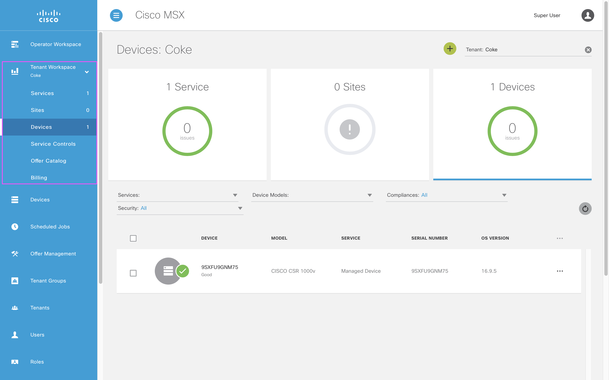
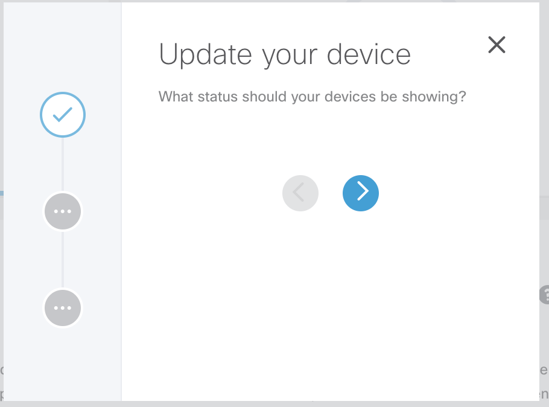
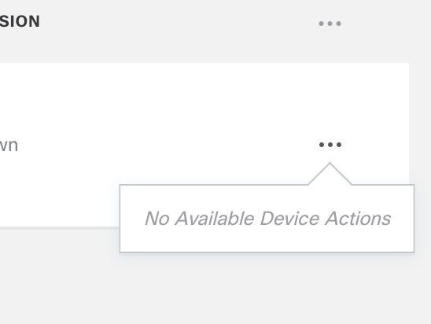

# Working with Devices
* [Introduction](#introduction)
* [Goals](#goals)
* [Adding a Device](#adding-a-device)
    * [Using Swagger](#using-swagger)
    * [Device Payload Explanation](#device-payload-explanation)
    * [Using Angular Provider](#using-angular-provider)
* [Adding a Device Model](#adding-a-device-model)
    * [Device Model Payload Explanation](#device-model-payload-explanation)
* [Updating a Device](#updating-a-device)
* [Adding a Device Action](#adding-a-device-action)
  * [Other Device Customization](#other-device-customization)
* [References](#references)
* [Appendix](#appendix)


## Introduction
Device management is a central part of some MSX Services. In this guide we introduce a number of ways to work with devices, from setting up a device manually using Swagger, to integrating device management in your user interface.

## Goals
* create devices
* update devices
* create device models
* add device actions

## Adding a Device
Developers have two different ways to add devices to MSX:
* with an API
* with a built-in service

Once a device has been added, it will show up in the side panel as shown:




### Using Swagger
The first way to add a device is to call `POST /manage/api/v8/devices` from the Manage Microservice Swagger page [(help me)](../01-msx-developer-program-basics/04-using-the-swagger-documentation.md), with the payload below:

```json
{
  "attributes": {
    "deviceRegistrationInProgress": true
  },
  "managed": false,
  "model": "CSRV",
  "name": "name",
  "onboardInformation": {
    "serviceType": "helloworld"
  },
  "onboardType": "direct",
  "serialKey": "device unique identifier",
  "serviceInstanceId": "service instance id ",
  "serviceType": "helloworld",
  "subscriptionId": "subscription id",
  "tags": {
    "resourceProvider": "nso"
  },
  "tenantId": "tenant id",
  "type": "CPE"
}
```

### Device Payload Explanation
The following properties must all reference existing resources:
* tenantId
* serviceInstanceId
* subscriptionId 

The `tenantId` can be retrieved using MSX local storage, and you will need it to retrieve other values.

```javascript
let tenantId = JSON.parse(localStorage.getItem('ngStorage-tenantItem')).tenantId
```

You will need to make a separate API call To retrieve `subscriptionId` and `serviceInstanceId` from the Manage Service Swagger page [(help me)](../01-msx-developer-program-basics/04-using-the-swagger-documentation.md).

```
GET /manage/api/v3/subscriptions?page=0&pageSize=10&serviceType=helloworld&tenantIds=tenantId
```

The `serviceType` is the name of the service pack, which in this case is `helloworld`. 


### Using Angular Provider
Alternatively, you can use an Angular Provider to add the device. 

```typescript
let serviceType = 'helloworld';
let serialKey = 'YB5XER9ORD1ABR92';
let model = 'CISCO ISR 1100'; // matches model in API above
let type = 'CPE'; // corresponds to type
let deviceName = 'DV100'; // anything you choose
let attributes = {
  dateAdded: '2020-10-10',
  type: 'replacement'
}; // attributes can be anything you want
let onboardType = 'direct';
let managed = true;
let lifeCycleStatus = 'PROVISIONING';
let heatlhStatus = 'UNKNOWN';
// these last three are optional
let pnpStatus = null;
let syncStatus = null;
let tunnelStatus = null;
devicesService.addDevice(tenantId, subscriptionId, serviceType, serialKey, model, type, deviceName, attributes, onboardType, managed, lifeCycleStatus, heatlhStatus, pnpStatus, syncStatus, tunnelStatus);
```

An explanation of how to reference this Angular Provider in your component will be provided later. See the appendix for a list of possible values for each status property [(help me)](#appendix).


## Adding a Device Model
In addition to adding a device, there is the option to add custom device models for your users to choose from. To create a device model call `POST /manage/api/v8/devicemodels` from the Manage Service Swagger page [(help me)](../01-msx-developer-program-basics/04-using-the-swagger-documentation.md), with the payload below:

```json
{
  "deviceType": "string",
  "directSecureTemplate": "string",
  "directTemplate": "string",
  "interfaces": [
    "string"
  ],
  "lan": [
    "string"
  ],
  "name": "string",
  "nedId": "string",
  "platformDeviceSubtype": "string",
  "platformDeviceType": "string",
  "pnpDayZeroFile": "string",
  "wan": [
    "string"
  ]
}
```

### Device Model Payload Explanation

| Property | Description |
|----------|-------------|
| deviceType             | This is your choice, and will show up in the type column in the devices summary. |
| directSecureTemplate   | Config templates that are applied to the device when it is onboarded (direct) securely. |
| directTemplate         | Config templates that are applied to the device when it is onboarded (direct). |
| interfaces             | This is an array, valid examples here include, but can be anything: GigabitEthernet0/0/1, LoRa MTDOT. |
| lan                    | Similar to interfaces, but for LAN. |
| name                   | This is the identifier you want to give to your device model. | 
| nedId                  |  Cisco IOS is the only option that does not involve manually adding in device config templates to the MSX NSO. If you are planning to use non-direct onboarding method for your devices, you can set this to be other needs. |
| platformDeviceSubtype  | You can make this be whatever you want. _*_ |
| platformDeviceType     | You can make this be whatever you want. _*_ |
| pnpDayZeroFile         | This is specific to NSO integration. When left blank, it defaults to CPE_day0_base_config.txt,CPE_day0_tunnel_config.txt |
| wan                    | Same as LAN |

_*_ These types are used to group data when monitoring device (i.e. you can then use Elasticsearch to query events by types). To enable device monitoring using a beater (akin to pings), consult the MSX Monitoring documentation [(help me)](https://developer.cisco.com/docs/msx/#!monitoring-introduction)


## Updating a Device
In this section, let us convert a button in the tenant-workspace into one that will open up a wizard dialog.

In the component file, `helloworld/src/config/services/components/tiles/service-details-tile/service-details-tile.component.html` add the following code anywhere:

```html
<ng-template [ngIf]="showWizard">
  <msx-wizard *msxModalDialog (wizardClosed)="showWizard = false">
    <msx-wizard-step key="intro" [optional]="true" title="Update your device"
      description="What status should your devices be showing?">
    </msx-wizard-step>
    <msx-wizard-step key="form_step" [completed]="true">
      <msx-form [form]="deviceForm" class="test-service-details__dialog-container">
      </msx-form>
    </msx-wizard-step>
    <msx-wizard-step key="final_step" (stepEnterHandler)="changeDeviceStatus()" [hideButtonBar]="true">
      Good job! You have successfully updated your device
    </msx-wizard-step>
    </msx-msx-wizard>
</ng-template>
```

In this wizard there are only three screens, but you can add as many screens as you wish. Details of all the options that can be applied are explained in the MSX Wizard documentation [(help me)](https://developer.cisco.com/docs/msx/#!msx-wizard/descriptiona-namedescriptiona).

Update `service-details-tile.component.ts` in the same folder to include the following class variables:

```typescript
showWizard: boolean = false;
deviceForm: Form = new Form();
tenantId = JSON.parse(localStorage.getItem('ngStorage-tenantItem')).tenantId;
``` 

Add the following imports:

```typescript
import { Form } from '@msx/forms';
import _ from 'lodash';
```

Add a new MSX provider `msx.devicesService` to the component providers, such that the final component annotation looks like this:

```typescript 
@Component({
	selector: 'helloworld-service-details',
	host: { 'class': 'helloworld-service-details' },
	providers: [
		new AngularJSProvider('$state'),
		new AngularJSProvider('$http'),
		new AngularJSProvider('$localStorage'),
		new AngularJSProvider('msx.platform.servicePanelControls'),
		new AngularJSProvider('msx.platform.helpService'),
		new AngularJSProvider('msx.devicesService'),
	],
	template
})
```

In the typescript constructor, include the new provider as a service. This is a service developed by the MSX UI team to help manage devices. 

```typescript
@Inject('msx.devicesService') private devicesService: any
```

A few new functions were called in the HTML above; add them to `service-details-tile.component.ts` now:

```typescript
updateDevice(): void {
  this.showWizard = true;
  const deviceStatusDropdowns = [{
    "name": "healthstatus",
    "type": "dropdown",
    "validators": [],
    "initialValue": "",
    "properties": {
      "required": true,
      "label": "Select Health Status",
      "items": [{
        label: 'Up',
        value: 'UP'
      }, {
        label: 'Down',
        value: 'DOWN'
      }, {
        label: 'Unknown',
        value: 'UNKNOWN'
      }]
    }
  }, {
    "name": "lifecyclestatus",
    "type": "dropdown",
    "validators": [],
    "initialValue": "",
    "properties": {
      "required": true,
      "label": "Select Lifecycle Status",
      "items": [{
        label: 'Provisioned',
        value: 'PROVISIONED'
      }, {
        label: 'Provisioning',
        value: 'PROVISIONING'
      }, {
        label: 'Configured',
        value: 'CONFIGURED'
      }, {
        label: 'Onboarded',
        value: 'ONBOARDED'
      }, {
        label: 'Upgrading',
        value: 'UPGRADING'
      }]
    }
  }];
// params: page number, number of entries per page, serialKey, subscriptionKey
this.devicesService.getDevices(0, 100, "", "", this.tenantId).then(currentDevices => {
  const deviceItems = _.get(currentDevices, 'entities', []).map(element => {
    return {
      label: element.serialKey,
      value: element.id
    }
  });
  this.deviceForm.addFields([
    {
      "name": "Devices",
      "type": "multiDropdown",
      "validators": [],
      "initialValue": "",
      "properties": {
        "label": "Select Device",
        "items": deviceItems,
        "msxReadonly": false,
        "msxDisable": false,
        "required": true,
        "tooltip": "Select devices for update",
        "clearable": false,
        "openOnAllClicks": true,
        "openOnEditFocus": true
      }
    }
  ]);
  this.deviceForm.addFields(deviceStatusDropdowns);
});
}
```

The deviceForm gets populated with three fields. Two with statuses that can be applied to a device, and one dropdown populated with device serials based on the output of the `getDevices` function call. Once this form is submitted, the status of your devices will be displayed in the side panel. 

The following is a function that will extract the user input from the form, and submit it to the device service.

```typescript
changeDeviceStatus(): void {
  this.deviceForm.formData['Devices'].forEach(element => {
    // params: deviceId, statusType, status, message
    this.devicesService.updateStatus(element.value, 'healthStatus', 
      this.deviceForm.formData.healthstatus.value, "Hello World")
    this.devicesService.updateStatus(element.value, 'lifeCycleStatus', 
      this.deviceForm.formData.lifecyclestatus.value, "Hello World")
  });
}
```

The value of each element is accessed by name in the form data. Note that since the device id dropdown is a multi-dropdown, the values returned will always be a list. The rest of the values can be accessed by the field name provided in the initial form initialization.

Finally, we can open the wizard by the click of a button. In `service-details-tile.component.ts` replace the action value for one of the existing buttons by changing this:

```typescript
{
			label: "Button 1",
			buttonClass: "vms_fi_action2007-16 button--secondary",
			action: function () {
				console.log("Executed action 1");
			}
}
```

To this:

```typescript
{
			label: "Update devices",
			buttonClass: "vms_fi_action2007-16 button--secondary",
			action: this.updateDevice.bind(this)
}
```

The device button panel will now have a `+` button with a tooltip that says "Update devices" like this:




## Adding a Device Action
It is possible to add a menu item to a device of a certain type, provided the device belongs to the given service. On the left side panel, under devices you should see your device. The following image shows a menu drop-down menu



To add a menu item to that menu list open `ui/src/config/devices/actions/device-actions.ts` and add a new entry:

```typescript
getDeviceActionsConfig() {
  return [{
    name: "test.service.devices.list.actions.action0.name",
    description: "test.service.devices.list.actions.action0.description",
    module: TestDeviceActionsModule,
    component: TestDeviceActionComponent0,
    deviceTypes: ["CSRV", "CPE", "CISCO CSR 1000v", "CISCO ISR 1100", "CISCO ISR 3900", "Cisco UCS 103", "Cisco ENC 5406"],
    bulkSupported: false
  }, name: "new_modal",
    description: "Open my new modal!!",
    module: TestDeviceActionsModule,
    component: TestDeviceActionComponent0,
    deviceTypes: ["CPE"],
    bulkSupported: false
  }];
}
```

Both actions will open the same component, but feel free to specify a different component in the `component` property. Refer to the table below for notes on the properties:  

| Property      | Description |
|---------------|-------------|
| name          | Must be unique. |
| deviceTypes   | Determines which devices this menu item will appear on. |
| description   | This is what shows up on the menu. |
| bulkSupported | Allows this action to be applied for all devices of the allowed types at once. |


### Other Device Customization
Look through `ui/src/config/devices/details` for more examples of ways to customize the device page.


## References
- [MSX Monitoring](https://developer.cisco.com/docs/msx/#!monitoring-introduction)
- [MSX Common Components](https://developer.cisco.com/docs/msx/#!msx-common-components-msx-common-components)


## Appendix 
You can use `deviceService.updateStatus` to set any of the following statuses:

| Status | Values |
|--------|--------|
| healthStatus | UP, DOWN, UNKNOWN |
| lifeCycleStatus | CONFIGURED, CONFIGURING, DEGRADED, DELETING, DELETING_FAILED, PROVISIONED, PROVISIONING, PROVISIONING_FAILED, UNREGISTERED, REGISTERING, REGISTRATION_FAILED, UPDATE_FAILED, UPGRADING, UPDATING, ONBOARDING, ONBOARDED, ONBOARDING_FAILED |
| tunnelStatus | UP, DOWN, UNKNOWN |
| pnpStatus | CONNECTED, CALLED_HOME, FAILED_TO_CONNECT, UNKNOWN |
| syncStatus | SYNCHRONIZED, FAILED_TO_SYNC, UNKNOWN |


| [PREVIOUS](01-introduction-to-tenant-centric-ui.md) | [NEXT](04-working-with-sites.md) | [HOME](../index.md#angular-user-interface-example) |
|---|---|---|