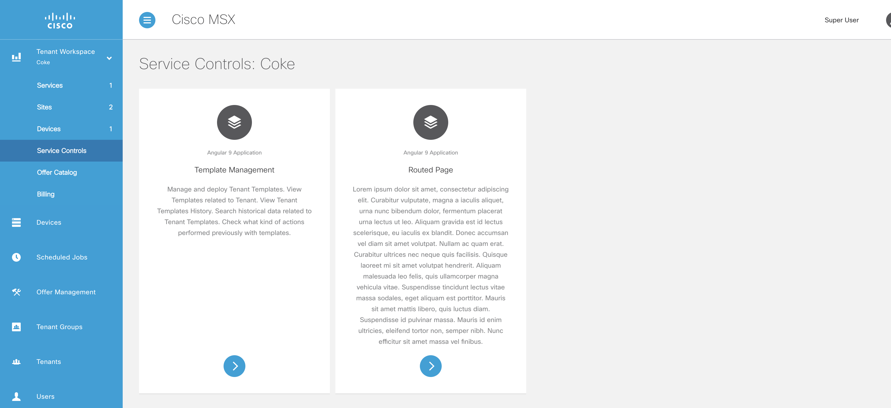

# Working With Service Controls
* [Introduction](#introduction)
* [Goals](#goals)
* [Finding Service Controls](#finding-service-controls)
* [Customizing Service Controls](#customizing-service-controls)
* [Updating Service Controls](#updating-service-controls)
* [Add Service Control](#add_new_service_control)


## Introduction
Another way to extend the functionality of a service pack is to by the use of service controls. 

## Goals
* adding service controls
* customize service controls


## Finding Service Controls
A tenant can access all the service controls for all the services they are subscribed to via the panel on the left.




## Customizing Service Controls
The components that are used to customize the pre-configured service controls can be found here:

| Component             | Description |
|-----------------------|-------------|
| tcui-hooks.ts         | This is where service controls are registered with the platform UI. |
| routed-page.module.ts | This is where routing gets defined, and a routing link to a component is what is passed into service controls (in tcui-hooks). Any routing module that maps state to component will do. |


## Updating Service Controls
The service controls included in this example are pointing to two different service controls. You may notice that of the two service controls, only one of them (`routed-page.component.ts`) is included in this example. That is because service controls get registered (in tc-ui hooks) using routes, as opposed to components. 

To make any changes to the existing service controls component `routed-page.component.ts` is simple enough. For the sake of the example, lets replace a call to `app.template-workspace` (an MSX pre-defined route) with a route that points to our existing component `routed-page.component.ts`.

Make both of the service controls display the same component, noting the new route value `app.helloworld`.

```typescript
{
  label: "test.service.service.controls.templatemanagement",
  iconClass: "vms_fi_editor7040-24",
  description: "test.service.service.controls.template.description",
  route: "app.helloworld",
  stateParams: {
    obj: {
      label: "test.service.service.controls.templatemanagement",
      backTo: 'app.service-controls',
      serviceType: 'test',
      tenantMode: true,
      disableImportTemplates: true,
      disableAssignTenants: true,
      columns: [{
        type: "string",
        name: "serviceConfigId",
        label: "test.service.service.controls.config.column.label",
        className: "",
        order: 3,
        width: "25rem"
      }, {
        type: "string",
        name: "assignedTenantName",
        label: "test.service.service.controls.assigned.tenants.column.label",
        className: "",
        order: 4,
        width: "25rem"
      }]
    }
  }
},
```

Next update the `routed-page.module.ts` to include the new url in the imports, such that the imports array looks like this:

```typescript
  imports: [  
    UIRouterModule.forChild({
      states: [
        {
          name: 'app.test',
          url: '/test',
          views: {
            'module@app': {
              component: RoutedPageComponent
            }
          },
        },        {
          name: 'app.helloworld',
          url: '/helloworld',
          views: {
            'module@app': {
              component: RoutedPageComponent
            }
          },
        },
      ]
    })
  ],
```

Finally, in `routes.ts`, add a new entry:

```typescript
  {
    name: 'app.helloworld.**',
    url: '/helloworld',
    loadChildren: () =>
      import('./routed-page').then(mod => mod.RoutedPageModule),
  },
```

### Adding Service Controls
As was implied in the previous section, to add a new service control just update the controls array in `tcui-hooks`.

Add this new section to point to the route we created earlier.
```typescript
{
					label: "Yet Another Service Control",
					iconClass: "vms_fi_editor7040-24",
					description: "Description of our service control",
					route: "app.helloworld"
}
```

After doing a build, there will be three service controls in your tenant workspace.

There are a few things to note about adding a new component to service controls. The routes are declared at the module level, so a new module will need to be created (alternatively, you can add a new component to the routed-page module). As it stands components used by service controls cannot be called from other places in your service pack, be sure to plan out your modules accordingly.
