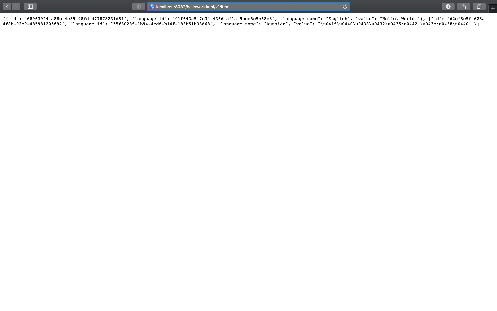

# Creating a Hello World Service in Python
* [Introduction](#introduction)
* [Goals](#goals)
* [Prerequisites](#prerequisites)
* [Creating the Project](#creating-the-project)
* [Configuring the Project](#configuring-the-project) 
    * [requirements.txt](#requirementstxt)
    * [Manually Installing Dependencies](#manually-installing-dependencies)
* [Adding the Models](#adding-the-models)
    * [models/language.py](#modelslanguagepy)
    * [models/item.py](#modelsitempy)
* [Adding the Controllers](#adding-the-controllers)
    * [controllers/languages_controller.py](#modelslanguagepy)
    * [models/item.py](#modelsitempy)
* [Adding the Routes](#adding-the-routes)
    * [app.py](#apppy)
* [Testing the Service](#testing-the-service)
    * [Getting Languages](#getting-languages)
    * [Getting Items](#getting-items)
* [Conclusion](#conclusion)
* [References](#references)

## Introduction
In this guide, we describe how to build a simple Python service that exposes the API for a simple Hello World Service. We cover project creation configuration as well basic controller implementation, leaving security and database specifics to later guides. 

To just dive straight in, you can download the Hello World Service source [(help me)][https://github.com/CiscoDevNet/msx-examples/tree/main/python-hello-world-service-1], but we encourage you work through the guides to learn by doing.

<br>

## Goals
* create and configure Flask application
* write basic controllers

<br>

## Prerequisites
* Python Hello World Service 1 [(help me)](https://github.com/CiscoDevNet/msx-examples/tree/main/python-hello-world-service-1)
* [JetBrains PyCharm](https://www.jetbrains.com/pycharm/)

<br>

## Creating the Project
We use the PyCharm Flask Wizard to create the project, but you can use which ever tools you prefer. Open PyCharm and create a new project called `hello-world-service` as shown in the screenshot below.


<br>

## Configuring the Project

### requirements.txt
The chances are that Flask, and the associated dependencies, are already installed on your computer. However, when we containerize the application in a later guide we will need to install them ourselves. Create a file called `requirements.txt` with the following contents.

```
Flask==1.1.2
Flask-Cors==3.0.10
flask-restplus==0.13.0
Werkzeug==0.16.1
```

### Manually Installing Dependencies
We can test we have specified the dependencies properly by running Pip as shown. You can see from the output that all the requirements are already satisfied.

```shell
$ pip3 install -r requirements.txt
Requirement already satisfied: Flask==1.1.2 in /usr/local/lib/python3.9/site-packages (from -r requirements.txt (line 1)) (1.1.2)
Requirement already satisfied: Flask-Cors==3.0.10 in /usr/local/lib/python3.9/site-packages (from -r requirements.txt (line 2)) (3.0.10)
Requirement already satisfied: flask-restplus==0.13.0 in /usr/local/lib/python3.9/site-packages (from -r requirements.txt (line 3)) (0.13.0)
Requirement already satisfied: Werkzeug==0.16.1 in /usr/local/lib/python3.9/site-packages (from -r requirements.txt (line 4)) (0.16.1)
Requirement already satisfied: click>=5.1 in /usr/local/lib/python3.9/site-packages (from Flask==1.1.2->-r requirements.txt (line 1)) (7.1.2)
Requirement already satisfied: itsdangerous>=0.24 in /usr/local/lib/python3.9/site-packages (from Flask==1.1.2->-r requirements.txt (line 1)) (1.1.0)
Requirement already satisfied: Jinja2>=2.10.1 in /usr/local/lib/python3.9/site-packages (from Flask==1.1.2->-r requirements.txt (line 1)) (2.11.3)
Requirement already satisfied: Six in /Users/hagraham/Library/Python/3.9/lib/python/site-packages/six-1.15.0-py3.9.egg (from Flask-Cors==3.0.10->-r requirements.txt (line 2)) (1.15.0)
Requirement already satisfied: jsonschema in /usr/local/lib/python3.9/site-packages (from flask-restplus==0.13.0->-r requirements.txt (line 3)) (3.2.0)
Requirement already satisfied: pytz in /usr/local/lib/python3.9/site-packages (from flask-restplus==0.13.0->-r requirements.txt (line 3)) (2021.1)
Requirement already satisfied: aniso8601>=0.82 in /usr/local/lib/python3.9/site-packages (from flask-restplus==0.13.0->-r requirements.txt (line 3)) (9.0.1)
Requirement already satisfied: MarkupSafe>=0.23 in /usr/local/lib/python3.9/site-packages (from Jinja2>=2.10.1->Flask==1.1.2->-r requirements.txt (line 1)) (1.1.1)
Requirement already satisfied: pyrsistent>=0.14.0 in /usr/local/lib/python3.9/site-packages (from jsonschema->flask-restplus==0.13.0->-r requirements.txt (line 3)) (0.17.3)
Requirement already satisfied: setuptools in /usr/local/lib/python3.9/site-packages (from jsonschema->flask-restplus==0.13.0->-r requirements.txt (line 3)) (54.2.0)
Requirement already satisfied: attrs>=17.4.0 in /usr/local/lib/python3.9/site-packages (from jsonschema->flask-restplus==0.13.0->-r requirements.txt (line 3)) (20.3.0)
```

<br>

## Adding the Models
The Hello World service will let manage language and Hello World item resources. Create a folder called `models` in the root of the project then add the following files to it.

### models/language.py

```python
class Language:
	def __init__(self, id=None, name=None, description=None):
		self._id = id
		self._name = name
		self._description = description

	def to_dict(self):
		return {
			"id": self._id,
			"name": self._name,
			"description": self._description
		}
```


### models/item.py

```python
class Item:
	def __init__(self, id=None, language_id=None, language_name=None, value=None):
		self._id = id
		self._language_id = language_id
		self._language_name = language_name
		self._value = value

	def to_dict(self):
		return {
			"id": self._id,
			"language_id": self._language_id,
			"language_name": self._language_name,
			"value": self._value
		}
```

<br>

## Adding the Controllers
Next create a folder called `controllers` and add the following files to it.

### controllers/languages_controller.py

```python
from flask_restplus import Resource
from models.language import Language


LANGUAGE_ENGLISH = Language(
    id="01f643a5-7e34-4366-af1a-9cce5e5c68e8",
    name="English",
    description="A West Germanic language that uses the Roman alphabet.")


LANGUAGE_RUSSIAN = Language(
    id="55f3028f-1b94-4edd-b14f-183b51b33d68",
    name="Russian",
    description="An East Slavic language that uses the Cyrillic alphabet.")


class LanguagesApi(Resource):
    def get(self):
        return [LANGUAGE_ENGLISH.to_dict(), LANGUAGE_RUSSIAN.to_dict()], 200

    def post(self):
        return LANGUAGE_ENGLISH.to_dict(), 201


class LanguageApi(Resource):
    def get(self, id):
        return LANGUAGE_ENGLISH.to_dict(), 200

    def put(self, id):
        return LANGUAGE_ENGLISH.to_dict(), 200

    def delete(self, id):
        return "", 204
```


### controllers/items_controller.py

```python
from flask_restplus import Resource
from models.item import Item


HELLO_WORLD_ENGLISH = Item(
    id="68963944-a88c-4e39-98fd-d77878231d81",
    language_id="01f643a5-7e34-4366-af1a-9cce5e5c68e8",
    language_name="English",
    value="Hello, World!")

HELLO_WORLD_RUSSIAN = Item(
    id="62ef8e5f-628a-4f8b-92c9-485981205d92",
    language_id="55f3028f-1b94-4edd-b14f-183b51b33d68",
    language_name="Russian",
    value="Привет мир!")


class ItemsApi(Resource):
    def get(self):
        return [HELLO_WORLD_ENGLISH.to_dict(), HELLO_WORLD_RUSSIAN.to_dict()], 200

    def post(self):
        return HELLO_WORLD_ENGLISH.to_dict(), 201


class ItemApi(Resource):
    def get(self, id):
        return HELLO_WORLD_ENGLISH.to_dict(), 200

    def put(self, id):
        return HELLO_WORLD_ENGLISH.to_dict(), 200

    def delete(self, id):
        return "", 204
```

<br>

## Adding the Routes
We have added a number of files to the project, and the directory listing should now look like this:

```shell
.
├── app.py
├── controllers
│   ├── items_controller.py
│   └── languages_controller.py
├── models
│   ├── item.py
│   └── language.py
├── requirements.txt
├── static
└── templates
```

### app.py
Now that we have models and controllers we need to plumb them into application. Update the contents of `app.py` as shown to complete the first version of Hello World Service.

```python
from flask import Flask
from flask_restplus import Api
from controllers.items_controller import ItemsApi, ItemApi
from controllers.languages_controller import LanguageApi, LanguagesApi

app = Flask(__name__)
api = Api(app)
api.add_resource(ItemsApi, "/helloworld/api/v1/items")
api.add_resource(ItemApi, "/helloworld/api/v1/items/<id>")
api.add_resource(LanguagesApi, "/helloworld/api/v1/languages")
api.add_resource(LanguageApi, "/helloworld/api/v1/languages/<id>")

if __name__ == '__main__':
	app.run()
```

<br>

## Testing the Service
You can start the service using `Python` or `Flask`, we use the latter to illustrate how to start it on a custom port:

```shell
$ flask run --host 0.0.0.0 --port 8082
 * Environment: production
   WARNING: This is a development server. Do not use it in a production deployment.
   Use a production WSGI server instead.
 * Debug mode: off
 * Running on http://0.0.0.0:8082/ (Press CTRL+C to quit)
```

### Getting Languages
So far our service only returns canned responses, but it is still useful to check we get something back. Once you have started the service run some `curl` commands, or use a browser, to check everything is working.

```shell
$ curl --request GET http://localhost:8082/helloworld/api/v1/languages
[
  {
    "id": "01f643a5-7e34-4366-af1a-9cce5e5c68e8", 
    "name": "English", 
    "description": "A West Germanic language that uses the Roman alphabet."
  }, 
  {
    "id": "55f3028f-1b94-4edd-b14f-183b51b33d68", 
    "name": "Russian", 
    "description": "An East Slavic language that uses the Cyrillic alphabet."
  }
]
```

### Getting Items
We can do the same for Hello World items, in a browser this time.



<br>

## Conclusion 
In this guide we have built a simple Hello World Service that returns canned responses. Whilst we can run it locally, we have not yet learnt how to deploy it to an MSX environment, which is the subject of the next guide.

<br>

## References
[PyCharm - The Python IDE for Professional Developers](https://www.jetbrains.com/pycharm/)

[Flask - Web Development One Drop at a Time](https://flask.palletsprojects.com/en/2.0.x/) 