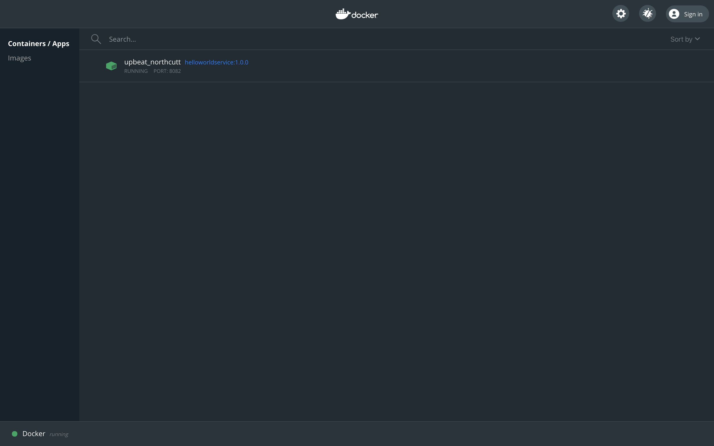
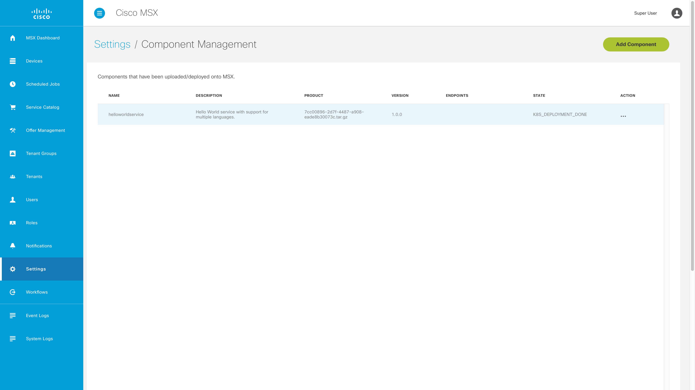

# Building the Component
* [Introduction](#introduction)
* [Goals](#goals)
* [Prerequisites](#prerequisites)
* [Configuring the Project](#configuring-the-project)
    * [manifest.yml](#manifestxml)
    * [Dockerfile](#dockerfile)
    * [Makefile](#makefile)
* [Packaging the Component](#packaging-the-component)
* [Testing the Container](#testing-the-container)
* [Deploying the Component](#deploying-the-component)
* [Testing the Component](#testing-the-component)
* [Conclusion](#conclusion)


## Introduction
Before we can install the Hello World Service in MSX, we need to containerize it and write a Component Manager manifest. This guide describes how to do those things.

<br>

## Goals
* containerize Hello World Service
* write a Component Manger manifest
* create a Component Manager component

<br>

## Prerequisites
* Python Hello World Service 1 [(help me)](https://github.com/CiscoDevNet/msx-examples/tree/main/python-hello-world-service-1)
* access to an MSX environment [(help me)](../01-msx-developer-program-basics/02-getting-access-to-an-msx-environment.md)
* basic understanding of SLM [(help me)](../03-msx-component-manager/01-what-is-component-manager-in-a-nutshell.md)
* [Docker Desktop](https://www.docker.com/products/docker-desktop)

<br>

## Configuring the Project
Before we can package up the Hello World Service component and deploy it into MSX with Component Manager [(help me)](../03-msx-component-manager/01-what-is-component-manager-in-a-nutshell.md), we need to create some configuration files.

### manifest.xml
The first file is the SLM manifest which tells MSX how to deploy the associated containers. Create `manifest.yml` in the root folder of the project with the following contents:

```yaml
---
Name: "helloworldservice"
Description: "Hello World service with support for multiple languages."
Version: "1.0.0"
Type: Internal

Containers:
  - Name: "helloworldservice"
    Version: "1.0.0"
    Artifact: "helloworldservice-1.0.0.tar.gz"
    Port: 8082
    ContextPath: "/helloworld"
    Tags:
      - "3.10.0"
      - "4.0.0"
      - "4.1.0"
      - "4.2.0"
      - "managedMicroservice"
      - "name=Hello World Service"
      - "componentAttributes=serviceName:helloworldservice~context:helloworld~name:Hello World Service~description:Hello World service with support for multiple languages."
    Check:
      Http:
        Scheme: "http"
        Host: "127.0.0.1"
        Path: "/helloworld/api/v1/items"
      IntervalSec: 60
      InitialDelaySec: 30
      TimeoutSec: 30
    Limits:
      Memory: "1000Mi"
      CPU: "1"
    Command:
      - "/usr/local/bin/flask"
      - "run"
      - "--host"
      - "0.0.0.0"
      - "--port"
      - "8082"
```

### Dockerfile
Next we create or edit Dockerfile, so that we can containerize Hello World Service. Create `Dockerfile` as shown below:

```dockerfile
FROM python:3.9.6-slim-buster
WORKDIR /app
ADD . /app
RUN pip3 install -r requirements.txt
EXPOSE 8082
ENTRYPOINT ["flask", "run", "--host", "0.0.0.0", "--port", "8082"]
```

> **GOTCHA**
>
> Take care to make sure the ports in `Dockerfile` and `manifest.xml` match.

### Makefile
There are several steps to containerize and package the component. This will be done multiple times during development, so we use a build utility. Create a file called `Makefile` with the contents below.

```bash
IMAGE = ${NAME}-${VERSION}.tar.gz
OUTPUT = ${NAME}-${VERSION}-component.tar.gz

build: clean package

package:
	docker build -t ${NAME}:${VERSION} .
	docker save ${NAME}:${VERSION} | gzip > ${IMAGE}
	tar -czvf ${OUTPUT} manifest.yml ${IMAGE}
	rm -f ${IMAGE}

clean:
	rm -f ${IMAGE}
	rm -f ${OUTPUT}
```

<br>

## Packaging the Component
Build the component tarball `helloworldservice-1.0.0-component.tar.gz` by calling make with component "NAME" and "VERSION" parameters. 

```bash
$ make NAME=helloworldservice VERSION=1.0.0 
.
.
.
docker save helloworldservice:1.0.0 | gzip > helloworldservice-1.0.0.tar.gz
tar -czvf helloworldservice-1.0.0-component.tar.gz manifest.yml helloworldservice-1.0.0.tar.gz
a manifest.yml
a helloworldservice-1.0.0.tar.gz
rm -f helloworldservice-1.0.0.tar.gz
```

If everything goes well the tarball `helloworldservice-1.0.0-component.tar.gz` will be created in  the project root.

<br>

## Testing the Container
Before we attempt to deploy Hello World Service to MSX we check that the container works as expected. To do that can unpack the tarball then make some simple `Docker` commands:

```bash
$ tar xvfz helloworldservice-1.0.0-component.tar.gz
x manifest.yml
x helloworldservice-1.0.0.tar.gz

$ docker load -i helloworldservice-1.0.0.tar.gz
Loaded image: helloworldservice:1.0.0

$ docker run -d -p 8082:8082 helloworldservice:1.0.0
d27a810af86a122773ecbfc73e4eef238e1aaa32c8e89c816cd4eef2dd5b415c
```

To check that the container is working make some `curl` requests like we did at the end of the first guide:

```shell
$ curl --request GET http://localhost:8082/helloworld/api/v1/languages
[
  {
    "id": "01f643a5-7e34-4366-af1a-9cce5e5c68e8", 
    "name": "English", 
    "description": "A West Germanic language that uses the Roman alphabet."
  }, 
  {
    "id": "55f3028f-1b94-4edd-b14f-183b51b33d68", 
    "name": "Russian", 
    "description": "An East Slavic language that uses the Cyrillic alphabet."
  }
]
```

An alternative is to look for Hello World Service in  the `Docker Dashboard`. You can look at the logs or connect to the container if you see something went wrong, and you need to debug.



<br>

## Deploying the Component
Log in to your MSX environment and deploy `helloworldservice-1.0.0-component.tar.gz` using the “Component Manager” in the “Settings” section [(help me)]( ../03-msx-component-manager/04-onboarding-and-deploying-components.md). The component will appear in the manager as shown.



<br>


## Testing the Component
We can now test the component by updating the request we made to localhost. 
The HelloWorldService component has been installed on MSX, and we can make service requests. Set the value of "MY_MSX_ENVIRONMENT" to match your MSX environment, then run the curl command.

```bash
$ export MY_MSX_HOSTNAME=dev-plt-aio1.lab.ciscomsx.com
$ curl --insecure --request GET "https://$MY_MSX_HOSTNAME/helloworld/api/v1/languages"
[
  {
    "id": "01f643a5-7e34-4366-af1a-9cce5e5c68e8", 
    "name": "English", 
    "description": "A West Germanic language that uses the Roman alphabet."
  }, 
  {
    "id": "55f3028f-1b94-4edd-b14f-183b51b33d68", 
    "name": "Russian", 
    "description": "An East Slavic language that uses the Cyrillic alphabet."
  }
]
```

<br>


## Conclusion
In this guide we containerized Hello World Service and deployed it to an MSX environment. In the next guide we show to add Consul support for your service in MSX.