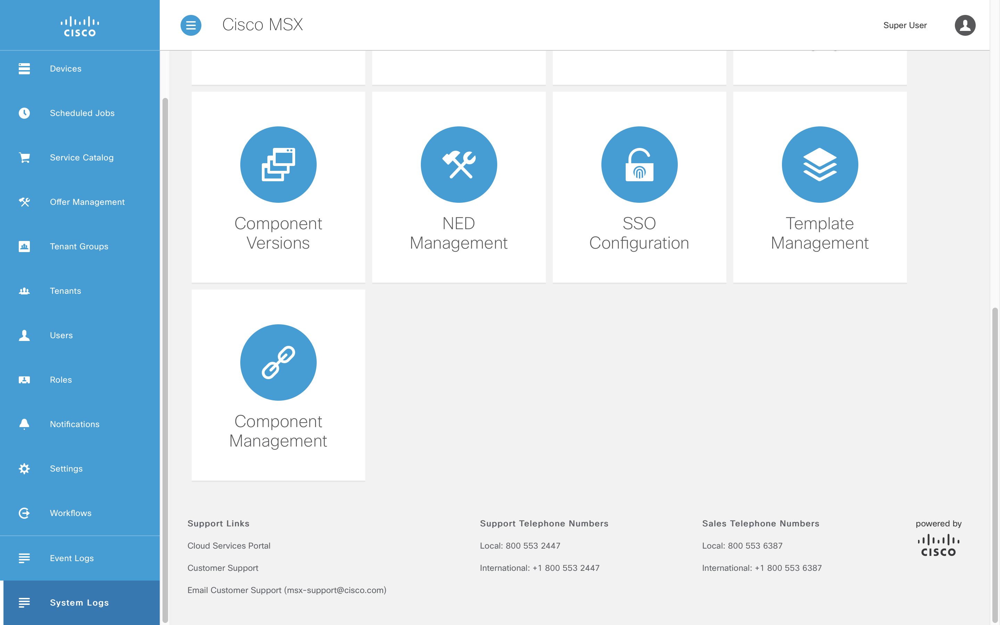

# Adding Consul Configuration
* [Introduction](#introduction)
* [Goals](#goals)
* [Prerequisites](#prerequisites)
* [Bootstrapping Consul](#bootstrapping-consul)
  * [helloworld.yml](#helloworldyml)
  * [manifest.yml](#manifestyml)
  * [config.py](#configpy)
  * [helpers/consul_helper.py](#helpersconsul_helperpy)
  * [app.py](#apppy)
  * [Dockerfile](#Dockerfile)
  * [Makefile](#makefile)
  * [requirements.txt](#requirementstxt)
* [Building the Component](#building-the-component)
* [Deploying the Component](#deploying-the-component)
* [Inspecting the Server Log](#inspecting-the-server-log)
* [Conclusion](#conclusion)


## Introduction
Services and applications need to be passed configuration to control integrations and behaviours. In this guide will show how to bootstrap Consul integration and pass non-sensitive key value pairs through `manifest.xml`.


## Goals
* bootstrap Consul integration
* pass non-sensitive key value pairs
* inspect service logs with Kibana


## Prerequisites
* Python Hello World Service 2 [(help me)](https://github.com/CiscoDevNet/msx-examples/tree/main/python-hello-world-service-2)
* access to an MSX environment [(help me)](../01-msx-developer-program-basics/02-getting-access-to-an-msx-environment.md)


## Bootstrapping Consul
When a service is started inside MSX it is passed the required Consul configuration as environment variables:

```
SPRING_CLOUD_CONSUL_HOST = https://localhost
SPRING_CLOUD_CONSUL_PORT = 8500
```

We also need a convenient way to configure Consul when developing locally, and a common mechanism to surface those key value pairs to our service or application. Your project will look like this once you have added the required files.


<br>

### helloworld.yml
This is where we pass the values to bootstrap Consul, some of which will be overridden by environment variables at runtime when deployed in to MSX. Create `helloworld.yml` with the Consul bootstrapping values below.

```yaml
consul:
  host: "http://127.0.0.1"               # Bound to env var SPRING_CLOUD_CONSUL_HOST at runtime.
  port: "8500"                           # Bound to env var SPRING_CLOUD_CONSUL_PORT at runtime.
  cacert: "/etc/ssl/certs/ca-bundle.crt" # Required by MSX.
```

<br>

### manifest.yml
We have to update `manifest.xml` that we introduced in the last example to tell the container where to pick up the bootstrap configuration, and create some **Consul** key value pairs for testing.

```yaml
.
.
.
ConfigFiles:
  - Name: "helloworld.yml"
    MountTo:
      Container: "helloworldservice"
      Path: "/helloworld.yml"

ConsulKeys:
  - Name: "favourite.color"
    Value: "Green"
  - Name: "favourite.food"
    Value: "Pizza"
  - Name: "favourite.dinosaur"
    Value: "Moros Intrepidus"
.
.
.
```

<br>

### config.py
The file `config.py` defines the configuration structures for Hello World Service. It also binds the environment variables passed by MSX to the configuration.

```python
import pkgutil
from os import environ
from collections import namedtuple
import yaml
from consul import ACLPermissionDenied

ConsulConfig = namedtuple("ConsulConfig", ["host", "port", "cacert"])
VaultConfig = namedtuple("VaultConfig", ["scheme", "host", "port", "token", "cacert"])
CockroachConfig = namedtuple("CockroachConfig", ["host", "port", "databasename","username", "sslmode", "cacert"])
SwaggerConfig = namedtuple("SwaggerConfig", ["rootpath", "secure", "ssourl", "clientid", "swaggerjsonpath"])
SecurityConfig = namedtuple("SecurityConfig", ["ssourl", "clientid", "clientsecret"])


class Config(object):
    def __init__(self, resource_name):
        # Load and parse the configuration.
        resource = pkgutil.get_data(__name__, resource_name)
        config = yaml.safe_load(resource)
        self._config_prefix = None

        # Apply environment variables and create Consul config object.
        config["consul"]["host"] = environ.get("SPRING_CLOUD_CONSUL_HOST", config["consul"]["host"])
        config["consul"]["port"] = environ.get("SPRING_CLOUD_CONSUL_PORT", config["consul"]["port"])
        self.consul = ConsulConfig(**config["consul"])

    # Find the correct Consul/Vault prefix.
    def find_consul_vault_prefix(self, consul_helper):
        try:
            test_value = consul_helper.get_string("thirdpartycomponents/defaultapplication/swagger.security.sso.baseUrl", None)
        except ACLPermissionDenied:
            test_value = None
        self._config_prefix = "thirdpartycomponents" if test_value else "thirdpartyservices"
        return self._config_prefix

    @property
    def config_prefix(self):
        return self._config_prefix
```

<br>

### helpers/consul_helper.py
The module `helpers/consul_helper.py` provides the code to connect to Consul and retrieve the value for a given key. We also include a method that retrieves and logs some values from Consul.

```python
import consul
import urllib3.util
import logging

from config import ConsulConfig


class ConsulHelper(object):
    def __init__(self, config: ConsulConfig):
        url = urllib3.util.parse_url(config.host)
        self._client = consul.Consul(
            host=url.hostname,
            port=config.port,
            scheme=url.scheme,
            verify=config.cacert)

    def get_string(self, key, default):
        index, data = self._client.kv.get(key)
        return data["Value"].decode("utf-8") if data else default

    def test(self, prefix):
        # Read our favourites from Consul and print them to the console.
        # Do not leak config in production as it is a security violation.
        favourite_colour = self.get_string(f"{prefix}/helloworldservice/favourite.color", "UNKNOWN")
        logging.info(f"My favourite color is {favourite_colour}")
        favourite_food = self.get_string(f"{prefix}/helloworldservice/favourite.food", "UNKNOWN")
        logging.info(f"My favourite food is {favourite_food}")
        favourite_dinosaur = self.get_string(f"{prefix}/helloworldservice/favourite.dinosaur", "UNKNOWN")
        logging.info(f"My favourite dinosaur is {favourite_dinosaur}")


```

Pay attention to the key paths in the `test`m as there are different patterns for different MSX versions and uses.

| Pattern                              | Description                 |
|--------------------------------------|-----------------------------|
| {prefix}/helloworldservice/my.key    | for service specific values |
| {prefix}/defaultapplication/my.key   | for common system values    |


<br>

The prefix depends on the version of MSX you are running:

| MSX Version | Prefix               |
|-------------|----------------------|
| <= 4.0.0    | thirdpartyservices   |
| >= 4.1.0    | thirdpartycomponents |

<br>

### app.py
We have to do a few things in `app.py`, for brevity we only include the new code.
* load the configuration file
* connect to Consul
* retrieve and print Consul values

```python
.
.
.
from config import Config
from helpers.consul_helper import ConsulHelper

config = Config("helloworld.yml")
consul_helper = ConsulHelper(config.consul)
config.find_consul_vault_prefix(consul_helper)

app = Flask(__name__)
consul_helper.test(config.config_prefix)
.
.
.
```

<br>

### Dockerfile
No changes are required in the Dockerfile.

<br>

### Makefile
If you followed the project structure described in the guides, then your service will find the configuration file `helloworld.yml` in the working folder when you start the service locally. We have to update the `Makefile` to include it on our MSX Component tarball.

```Makefile
.
.
.
package:
    docker build -t ${NAME}:${VERSION} .
    docker save ${NAME}:${VERSION} | gzip > ${IMAGE}
    # REGION ADD BOOTSTRAP FILE
    tar -czvf ${OUTPUT} manifest.yml helloworld.yml ${IMAGE}
    # ENDREGION ADD BOOTSTRAP FILE
    rm -f ${IMAGE}
.
.
.
```

<br>

### requirements.txt
The code we added above has dependencies on PyYAML and Consul, so we have to include references to them in `requirements.txt`.

```
Flask==1.1.2
Flask-Cors==3.0.10
flask-restplus==0.13.0
Werkzeug==0.16.1
PyYAML==5.4.1
python-consul==1.1.0
urllib3==1.24.1
```


## Building the Component
Like we did in earlier guides build the component `helloworldservice-1.0.0-component.tar.gz` by calling make with component "NAME" and "VERSION" parameters. If you do not see `helloworld.yml` being added to the tarball you need to back and check the Makefile.

```bash
$ make NAME=helloworldservice VERSION=1.0.0
.
.
.
docker save helloworldservice:1.0.0 | gzip > helloworldservice-1.0.0.tar.gz
tar -czvf helloworldservice-1.0.0-component.tar.gz manifest.yml helloworld.yml helloworldservice-1.0.0.tar.gz
a manifest.yml
a helloworld.yml
a helloworldservice-1.0.0.tar.gz
rm -f helloworldservice-1.0.0.tar.gz
```


## Deploying the Component
Log in to your MSX environment and deploy `helloworldservice-1.0.0-component.tar.gz` using **MSX UI->Settings->Components** [(help me)](../03-msx-component-manager/04-onboarding-and-deploying-components.md). If the helloworldservice is already deployed, delete it before uploading it again.


## Inspecting the Server Log
Leaking Consul configuration to the console is a security violation, but it is convenient for testing this example. Recall that we specified some Consul key value pairs in `manifest.xml`, and retrieved and printed them in `main.go`. To prove that it worked we will use Kibana.
 
Click on "System Logs" in the left-hand navigation panel of the Cisco MSX Portal.



<br>

Kibana will launch in a new window. This is not a Kibana tutorial, but we will scratch the surface deep enough to dig out the messages we wrote to the console. 


<br>

Click on "Discover" in the left-hand navigation panel of the Kibana interface. Then add a new filter of "kubernetes.labels.app is helloworldservice" as shown.


<br>

We only care about the time and log so add "log" from the "Available Fields" as shown.


<br>

One of the tricks to finding what you are looking for is being aware of "when" you are looking. Setting the time window to "Daily" is an easy way to make sure we see logs for the service we just deployed.


<br>

The last step is to filter on the word "favourite" in the search box at the top of the screen. If you do not see my favourite dinosaur then check back through your work.


<br>

You have now boot-strapped Consul into your service and passed some configuration. In the next guide we add support for Vault.


## Conclusion
In this guide we added configuration to Hello World Service to bootstrap Consul support. Then we set some Consul values in the manifest before retrieving them at runtime and inspecting them using Kibana. Do not leak configuration in production as it is a security risk.