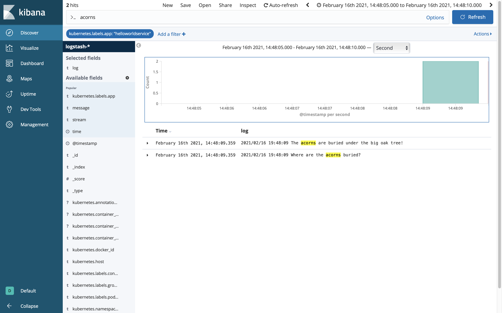

# Adding Vault Configuration
* [Introduction](#introduction)
* [Goals](#goals)
* [Prerequisites](#prerequisites)
* [Bootstrapping Vault](#bootstrapping-vault)
  * [helloworld.yml](#helloworldyml)
  * [manifest.yml](#manifestyml)
  * [config.py](#config.py)
  * [helpers/vault_helper.py](#helpersvault_helperpy)
  * [app.py](#apppy)
  * [Dockerfile](#Dockerfile)
  * [Makefile](#makefile)
  * [requirements.txt](#requirementstxt)
* [Building the Component](#building-the-component)
* [Deploying the Component](#deploying-the-component)
* [Inspecting the Server Log](#inspecting-the-server-log)
* [Conclusion](#conclusion)


## Introduction
In addition to non-sensitive configuration that we can pass with Consul, we also need a way to pass sensitive values like passwords and secrets. In this guide will show how to bootstrap Vault integration and pass sensitive key value pairs through `manifest.xml`.


## Goals
* bootstrap Vault integration
* pass sensitive key value pairs
* inspect service logs with Kibana


## Prerequisites
* Python Hello World Service 3 [(help me)](https://github.com/CiscoDevNet/msx-examples/tree/main/python-hello-world-service-3)
* access to an MSX environment [(help me)](../01-msx-developer-program-basics/02-getting-access-to-an-msx-environment.md)


## Bootstrapping Vault
When a service is started inside MSX it is passed the required Vault configuration as environment variables:

```
SPRING_CLOUD_VAULT_HOST   = vault.service.consul
SPRING_CLOUD_VAULT_PORT   = 8200
SPRING_CLOUD_VAULT_SCHEME = https
SPRING_CLOUD_VAULT_TOKEN  = [a valid vault token]
```

As with Consul, we also need a convenient way to configure Vault when developing locally, and a common mechanism to surface those key value pairs to our service or application. We laid the groundwork for this in the previous guide on Consul, so for brevity we will document the required incremental changes.

> **GOTCHA**
> The Vault token passed as environment variable SPRING_CLOUD_VAULT_TOKEN expires after 30 days. 
Renewing the Vault token is left as an exercise for the reader.

<br>

### helloworld.yml
The file `helloworld.yml` is where we pass the values to bootstrap Vault, some of which will be overridden by environment variables at runtime when deployed in to MSX.

```yaml
.
.
.
vault:
  scheme: "http"                         # Bound to env var SPRING_CLOUD_VAULT_SCHEME at runtime.
  host: "127.0.0.1"                      # Bound to env var SPRING_CLOUD_VAULT_HOST at runtime.
  port: "8200"                           # Bound to env var SPRING_CLOUD_VAULT_PORT at runtime.
  token: "s.l06JWgzNUHCwZCXM124iyIXr"    # Bound to env var SPRING_CLOUD_VAULT_TOKEN at runtime.
  cacert: "/etc/ssl/certs/ca-bundle.crt" # Required by MSX.
.
.
.
```

<br>

### manifest.yml
Update `manifest.yml` to set a secret in Vault that we can retrieve at runtime.

```yaml
.
.
.
Secrets:
  - Name: "secret.squirrel.location"
    Value: "The acorns are buried under the big oak tree!"
.
.
.
```

<br>

### config.py
Add a named tuple to `config.py` for the Vault configuration:

```python
.
.
.
ConsulConfig = namedtuple("ConsulConfig", ["host", "port", "cacert"])
VaultConfig = namedtuple("VaultConfig", ["scheme", "host", "port", "token", "cacert"])
.
.
.
```

Then populate it in the `__init__` method:

```python
    def __init__(self, resource_name):
        .
        .
        .
        # Apply environment variables and create Consul config object.
        config["consul"]["host"] = environ.get("SPRING_CLOUD_CONSUL_HOST", config["consul"]["host"])
        config["consul"]["port"] = environ.get("SPRING_CLOUD_CONSUL_PORT", config["consul"]["port"])
        self.consul = ConsulConfig(**config["consul"])

        # Apply environment variables and create Vault config object.
        config["vault"]["scheme"] = environ.get("SPRING_CLOUD_VAULT_SCHEME", config["vault"]["scheme"])
        config["vault"]["host"] = environ.get("SPRING_CLOUD_VAULT_HOST", config["vault"]["host"])
        config["vault"]["port"] = environ.get("SPRING_CLOUD_VAULT_PORT", config["vault"]["port"])
        config["vault"]["token"] = environ.get("SPRING_CLOUD_VAULT_TOKEN", config["vault"]["token"])
        self.vault = VaultConfig(**config["vault"])
        .
        .
        .
```

### helpers/vault_helper.py
The module `helpers/vault_helper.py` provides the code to connect to Vault and retrieve the value for a given key.

```python
import hvac
import logging

from hvac.exceptions import InvalidPath

from config import VaultConfig


class VaultHelper(object):
    def __init__(self, config: VaultConfig):
        self._client = hvac.Client(
            url=config.scheme + "://" + config.host + ":" + config.port,
            token=config.token,
            verify=config.cacert)

    def get_string(self, secret, key, default):
        try:
            response = self._client.secrets.kv.v1.read_secret(secret)
            if response and response["data"] and key in response["data"]:
                return response["data"][key]
        except InvalidPath as e:
            logging.error(str(e))
        return default

    def test(self, prefix):
        # Read a secret from Vault  and it to the console.
        # Do not leak secrets in production as it is a security violation.
        secret_squirrel_location = self.get_string(f"{prefix}/helloworldservice/", "secret.squirrel.location", "UNKNOWN")
        logging.info("Where are the acorns buried?")
        logging.info(secret_squirrel_location)
```

Pay attention to the key path in the `test` noting that the `secrets/` prefix is added automatically. There are different patterns for different MSX versions and uses.

| Pattern                              | Description                  |
|--------------------------------------|------------------------------|
| {prefix}/helloworldservice/my.key    | for service specific secrets |
| {prefix}/defaultapplication/my.key   | for common system secrets    |

<br>

The prefix depends on the version of MSX you are running:

| MSX Version | Prefix               |
|-------------|----------------------|
| <= 4.0.0    | thirdpartyservices   |
| >= 4.1.0    | thirdpartycomponents |

<br>

### app.py
We have to do a few things in 'app.py', for brevity we only include the changes.
* connect to Vault
* retrieve and print Vault values

```python
.
.
.
from config import Config
from helpers.consul_helper import ConsulHelper
from helpers.vault_helper import VaultHelper

config = Config("helloworld.yml")
consul_helper = ConsulHelper(config.consul)
vault_helper = VaultHelper(config.vault)
config.find_consul_vault_prefix(consul_helper)

app = Flask(__name__)
consul_helper.test(config.config_prefix)
vault_helper.test(config.config_prefix)
.
.
.
```

<br>

### Dockerfile
No changes are required in the Dockerfile.

<br>

### Makefile
No changes are required in the Makefile from the Consul guide where we added `helloworld.yml`, which contains the configuration to bootstrap Consul and Vault.

<br>

### requirements.txt
The code we added above has dependencies on Vault, so we have to update `requirements.txt`.

```
Flask==1.1.2
Flask-Cors==3.0.10
flask-restplus==0.13.0
Werkzeug==0.16.1
PyYAML==5.4.1
python-consul==1.1.0
urllib3==1.24.1
hvac==0.10.14
```


## Building the Component
Like we did in earlier guides build the component `helloworldservice-1.0.0-component.tar.gz` by calling make with component "NAME" and "VERSION" parameters. If you do not see `helloworld.yml` being added to the tarball you need to back and check the Makefile.

```bash
$ make NAME=helloworldservice VERSION=1.0.0
.
.
.
docker save helloworldservice:1.0.0 | gzip > helloworldservice-1.0.0.tar.gz
tar -czvf helloworldservice-1.0.0-component.tar.gz manifest.yml helloworld.yml helloworldservice-1.0.0.tar.gz
a manifest.yml
a helloworld.yml
a helloworldservice-1.0.0.tar.gz
rm -f helloworldservice-1.0.0.tar.gz
```


## Deploying the Component
Log in to your MSX environment and deploy `helloworldservice-1.0.0-component.tar.gz` using **MSX UI->Settings->Components** [(help me)](../03-msx-component-manager/04-onboarding-and-deploying-components.md). If the helloworldservice is already deployed, delete it before uploading it again.


## Inspecting the Server Log
Leaking Vault configuration to the console is a security violation, but it is convenient for testing this example. Recall that we specified a Vault key "secret.squirrel.location" in `manifest.xml`, and retrieved and printed it in `app.py`. To prove that it worked we will use Kibana in the same we did for the Consul guide, but this time we will search for "acorns".




## Conclusion
In this guide we added Vault support to the Hello World Service. Then we set secrets in the manifest before retrieving them at runtime and inspecting them using Kibana. Do not leak secrets in production as it is a security risk.