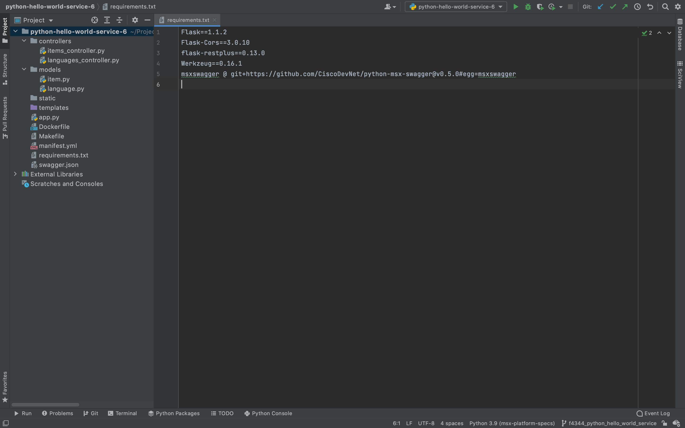
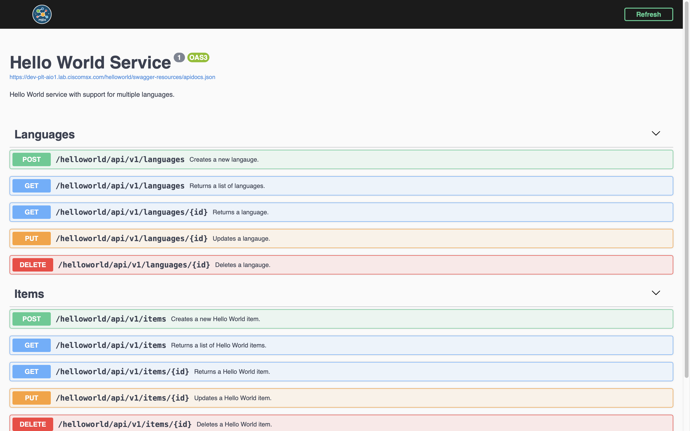

# Adding Swagger Support
* [Introduction](#introduction)
* [Goals](#goals)
* [Prerequisites](#prerequisites)
* [Configuring the Project](#configuring-the-project)
    * [requirements.txt](#requirementstxt)
    * [Dockerfile](#dockerfile)
    * [Creating the Security Client](#creating-the-security-client)
* [Updating the Project](#updating-the-project)
    * [swagger.json](#swaggerjson)
    * [app.py](#apppy)
* [Building the Component](#building-the-component)
* [Deploying the Component](#deploying-the-component)
* [Finding the Swagger Documentation](#finding-the-swagger-documentation)
* [Conclusion](#conclusion)

## Introduction
Swagger is an important tool that allows users to explore an API [(help me)](../01-msx-developer-program-basics/04-using-the-swagger-documentation.md). In this guide, we will update Hello World Service so that we can browse its 
Swagger documentation in the Cisco MSX Portal. 

<br>

## Goals
* browse Hello World Service Swagger documentation 

<br>

## Prerequisites
* Go Hello World Service 2 [(help me)](https://github.com/CiscoDevNet/msx-examples/tree/main/python-hello-world-service-2)
* access to an MSX environment [(help me)](../01-msx-developer-program-basics/02-getting-access-to-an-msx-environment.md)
* Python MSX Swagger [(help me)](https://github.com/CiscoDevNet/python-msx-swagger)

<br>

## Configuring the Project
A number of changes and new files are required to add Swagger support to Hello World Service. The screenshot below shows what we are aiming for once the configuration is done.



### requirements.txt
In order to add Swagger support we need to add MSX Python Swagger package to `requirements.txt`. This is the file we created in the first example to manage the project dependencies, update the contents as shown.

```
Flask==1.1.2
Flask-Cors==3.0.10
flask-restplus==0.13.0
Werkzeug==0.16.1
msxswagger @ git+https://github.com/CiscoDevNet/python-msx-swagger@v0.6.0#egg=msxswagger
```

### Dockerfile
The MSX Swagger package is hosted on GitHub, so we have to make some changes to the `Dockerfile` so that it can be installed in the container. We also add the file `swagger.json` which contains the OpenAPI Specification we display in the Cisco MSX Portal.

```dockerfile
FROM python:3-alpine3.12
COPY requirements.txt requirements.txt
COPY app.py app.py
# Add the OpenAPI Specification we want to display.
COPY swagger.json swagger.json
COPY models/item.py models/item.py
COPY models/language.py models/language.py
COPY controllers/items_controller.py controllers/items_controller.py
COPY controllers/languages_controller.py controllers/languages_controller.py
# Install git so that pip3 can install msxswagger.
RUN apk update && apk add git
RUN pip3 install -r requirements.txt
EXPOSE 8082
ENTRYPOINT ["flask", "run", "--host", "0.0.0.0", "--port", "8082"]
```

<br>

## Creating the Security Client
To integrate the Hello World Service with MSX SSO, so that we can make secure requests from Swagger, we need to create a public security client [(help me)](../01-msx-developer-program-basics/80-configuring-security-clients.md). If you are using Swagger to create the security client use the payload below:

```json
{
  "clientId": "hello-world-service-public-client",
  "grantTypes": [
    "refresh_token",
    "authorization_code"
  ],
  "maxTokensPerUser": -1,
  "useSessionTimeout": false,
  "resourceIds": [
  ],
  "scopes": [
    "address",
    "read",
    "phone",
    "openid",
    "profile",
    "write",
    "email"
  ],
  "autoApproveScopes": [
    "address",
    "read",
    "phone",
    "openid",
    "profile",
    "write",
    "email"
  ],
  "authorities": [
    "ROLE_USER",
    "ROLE_PUBLIC"
  ],
  "registeredRedirectUris": [
    "/**/swagger-sso-redirect.html"
  ],
  "accessTokenValiditySeconds": 9000,
  "refreshTokenValiditySeconds": 18000,
  "additionalInformation": {
  }
}
```

<br> 

## Updating the Project
Now that the project is configured we need to add the OpenAPI Specification and update the application to serve up a Swagger UI for it.

### swagger.json
Create `swagger.json` in the root folder of the project with the contents of the OpenAPI specification from the example [(download me)](https://github.com/CiscoDevNet/msx-examples/tree/main/python-hello-world-service-6/swagger.json). T


### app.py
The service we wrote in the first example already conforms to the contract above, so all that remains is to serve up the Swagger UI. Open `app.py` and update the contents as shown. In our example we load `swagger.json` and display a Swagger UI for it when the user hits `/helloworld/swagger`. The Python MSX Swagger package can also generate the Swagger UI from annotations in the code [(help me)](https://github.com/CiscoDevNet/python-msx-swagger/blob/main/README.md).

```python
from flask import Flask
from msxswagger import MSXSwaggerConfig, Security, DocumentationConfig, Sso
from controllers.items_controller import ItemsApi, ItemApi
from controllers.languages_controller import LanguageApi, LanguagesApi


app = Flask(__name__)
sso = Sso(base_url='https://MY_MSX_HOSTNAME/idm',
          client_id='hello-world-service-public-client')

documentation_config = DocumentationConfig(
	root_path='/helloworld',
	security=Security(True, sso))

swagger = MSXSwaggerConfig(
	app,
	documentation_config,
	swagger_resource="swagger.json")

swagger.api.add_resource(ItemsApi, "/api/v1/items")
swagger.api.add_resource(ItemApi, "/api/v1/items/<id>")
swagger.api.add_resource(LanguagesApi, "/api/v1/languages")
swagger.api.add_resource(LanguageApi, "/api/v1/languages/<id>")
app.register_blueprint(swagger.api.blueprint)

if __name__ == '__main__':
	app.run()
```

Make sure you update `sso.base_url` and `sso.client_id` to match your MSX environment and security client respectively. After you have added Consul support to your application you will be able to look up those values at runtime, so they do not need to be hard coded. To disable SSO integration set `security.enabled` to false, or remove the `Security` object from `DocumentationConfig`.

| Property | Consul Property | Example |
|----------|-----------------|----------|
| sso.base_url | thirdpartyservices/defaultapplication/swagger.security.sso.baseUrl | https://dev-plt-aio1.lab.ciscomsx.com/idm |
| sso.client_id | thirdpartyservices/helloworldservice/public.security.clientId | hello-world-service-public-client |

<br>

## Building the Component
Like we did in earlier guides, build the component `helloworldservice-1.0.0-component.tar.gz` by calling make with component "NAME" and "VERSION" parameters.

```bash
$ make NAME=helloworldservice VERSION=1.0.0 
.
.
.
 => [2/10] COPY requirements.txt requirements.txt
 => [3/10] COPY app.py app.py
 => [4/10] COPY swagger.json swagger.json
 => [5/10] COPY models/item.py models/item.py
 => [6/10] COPY models/language.py models/language.py
 => [7/10] COPY controllers/items_controller.py controllers/items_controller.py
 => [8/10] COPY controllers/languages_controller.py controllers/languages_controller.py
 => [9/10] RUN apk update && apk add git
 => [10/10] RUN pip3 install -r requirements.txt
 => exporting to image
 => => exporting layers
 => => writing image sha256:2999bbdf208b7187c5dee474ccfbead438c43ad83f9abcb04083c049b7ff9ec1
 => => naming to docker.io/library/helloworldservice:1.0.0
docker save helloworldservice:1.0.0 | gzip > helloworldservice-1.0.0.tar.gz
tar -czvf helloworldservice-1.0.0-component.tar.gz manifest.yml helloworldservice-1.0.0.tar.gz
a manifest.yml
a helloworldservice-1.0.0.tar.gz
rm -f helloworldservice-1.0.0.tar.gz
```

<br>

## Deploying the Component
Log in to your MSX environment and deploy `helloworldservice-1.0.0-component.tar.gz` using **MSX UI->Settings->Components** [(help me)](../03-msx-component-manager/04-onboarding-and-deploying-components.md). If the helloworldservice is already deployed, delete it before uploading it again.

<br>

## Finding the Swagger Documentation
There are two ways to find the Swagger documentation for Hello World Service in 
the Cisco MSX Portal. The first is to browse to this URL once you have made 
replaced the hostname.

```
https://MY_MSX_HOSTNAME/helloworld/swagger/
```

The second is to use the Cisco MSX Portal to navigate to the Swagger documentation 
for all services [(help me)](../01-msx-developer-program-basics/04-using-the-swagger-documentation.md). 
Whichever path you take once you get there it will look like this.



This ability to try the API is a powerful tool than can help you refine your service before you ship it. If you have not used Swagger before, take this opportunity to explore. 

<br>

## Conclusion
We have now built a Hello World Service that we can deploy to MSX, that has a Swagger interface that can be used to make real requests. When you are ready to write your own service consider starting with an OpenAPI Specification and using a generator to write the boilerplate code.