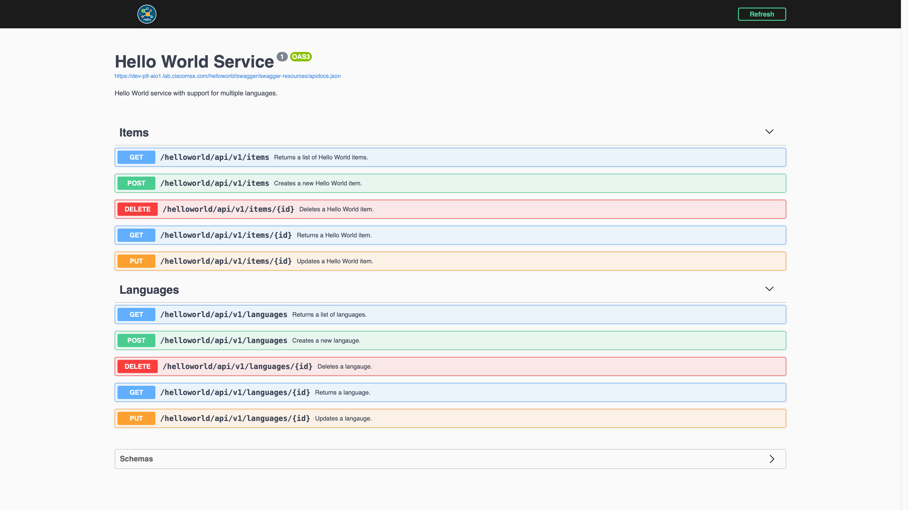
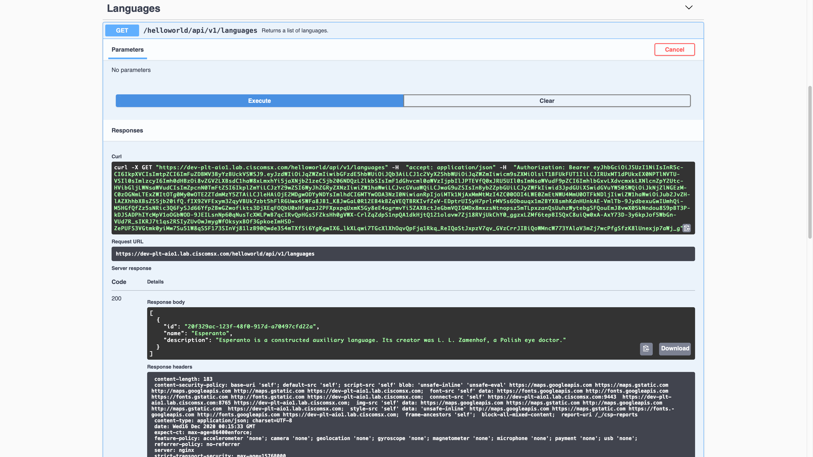
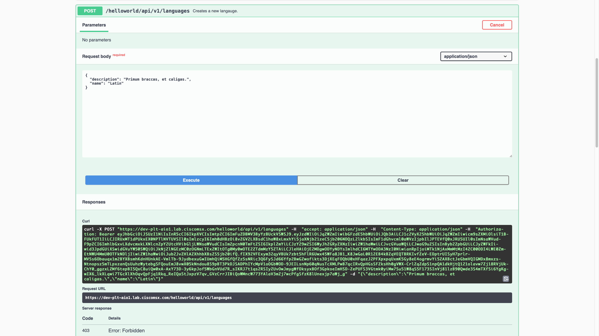

# Implementing Role Based Access Control
* [Introduction](#introduction)
* [Goals](#goals)
* [Prerequisites](#prerequisites)
* [Configuring the Project](#configuring-the-project)
    * [requirements.txt](#requirementstxt)
    * [Dockerfile](#dockerfile)
    * [helloworld.yml](#helloworldyml)
* [Updating the Project](#updating-the-project)
    * [models/error.py](#modelserrorpy)
    * [controllers/languages_controller.py](#controllerslanguages_controllerpy)
    * [helpers/security_helper.py](#helperssecurity_helperpy)
    * [config.py](#configpy)
    * [app.py](#apppy)
* [Building the Component](#building-the-component)
* [Deploying the Component](#deploying-the-component)
* [Testing the Component](#testing-the-component)
    * [Creating Custom Permissions](#creating-custom-permissions)
    * [Creating Custom Roles](#creating-custom-roles)
    * [Creating a Special User](#creating-a-special-user)
    * [Making Requests As Jeff](#making-requests-as-jeff)
* [Conclusion](#conclusion)


## Introduction
All the Hello World Service requests we have made so far were insecure because we have not passed an access token in the header. In this guide we will add that security and show how to validate the access token and get a list of permissions associated with it.

<br>

## Goals
* secure the API requests
* validate the access token
* define and enforce RBAC rules

<br>

## Prerequisites
* Python Hello World Service 6 [(help me)](https://github.com/CiscoDevNet/msx-examples/tree/main/python-hello-world-service-6)
* access to an MSX environment [(help me)](../01-msx-developer-program-basics/02-getting-access-to-an-msx-environment.md)

<br>

## Configuring the Project
Adding security to the Hello World Service is an exercise in configuration. In addition to updating some existing files, we will also add some new ones. Take note of the vertical ellipsis which are used to demarcate partial updates.

<br>

### requirements.txt
An MSX integration library is required to support RBAC (roles based access control) and Tenancy. We declare that dependency in `requirements.txt` as shown:

```python
Flask==1.1.2
Flask-Cors==3.0.10
flask-restplus==0.13.0
Werkzeug==0.16.1
psycopg2-binary==2.9.1
PyYAML==5.4.1
python-consul==1.1.0
urllib3==1.24.1
hvac==0.10.14
msxswagger @ git+https://github.com/CiscoDevNet/python-msx-swagger@v0.6.0
msxsecurity @ git+https://github.com/CiscoDevNet/python-msx-security@v0.1.0
```

<br>

### Dockerfile
The MSX Swagger package is hosted on GitHub, so we have to make some changes to the `Dockerfile` so that it can be installed in the container. 

```dockerfile
FROM python:3.9.6-slim-buster
WORKDIR /app
ADD . /app
RUN apt-get update \
&& apt-get install -y --no-install-recommends git \
&& apt-get purge -y --auto-remove \
&& rm -rf /var/lib/apt/lists/*
RUN pip3 install -r requirements.txt
EXPOSE 8082
ENTRYPOINT ["flask", "run", "--host", "0.0.0.0", "--port", "8082"]
```

<br> 

### helloworld.yml
When a service is deployed to MSX it will pick up the Security configuration from Consul and Vault. When developing locally you can pass values in `helloworld.yml` instead.

```yaml
.
.
.
security:
  ssourl: "http://localhost:9515/idm" # CONSUL {prefix}/defaultapplication/swagger.security.sso.baseUrl
  clientid: "local-private-client" # CONSUL {prefix}/helloworldservice/integration.security.clientId
  clientsecret: "make-up-a-private-client-secret-and-keep-it-safe" # Required by MSX.
.
.
.
```

## Updating the Project

### models/error.py
So far all the Hello World Service responses have been fixed. As we are going to introduce RBAC we need to declare the error model defined in the contract, so we return suitable responses.

```python
class Error:
    def __init__(self, code=None, message=None):
        self._code = code
        self._message = message

    def to_dict(self):
        return {
            "code": self._code,
            "message": self._message,
        }
```


<br>

### controllers/languages_controller.py
Hello World Service uses `GET /helloworld/api/v1/items` for the health check, so we cannot add security to that endpoint. Instead, we secure the `Languages` controller updating it as follows:

```python
import http
import logging

import flask
from flask_restplus import Resource
from flask_restplus import reqparse

from models.error import Error
from models.language import Language
from config import Config
from helpers.cockroach_helper import CockroachHelper

LANGUAGE_INPUT_ARGUMENTS = ['name', 'description']

LANGUAGE_NOT_FOUND = 'Language not found'


def get_access_token():
    # Authorization: Bearer MY_ACCESS_TOKEN
    return flask.request.headers.get("Authorization", "")[7:]


class LanguagesApi(Resource):
    def __init__(self, *args, **kwargs):
        self._config = kwargs["config"]
        self._security = kwargs["security"]

    def get(self):
        if not self._security.has_permission("HELLOWORLD_READ_LANGUAGE", get_access_token()):
            return Error(code="my_error_code", message="permission denied").to_dict(), 403

        with CockroachHelper(self._config) as db:
            rows = db.get_rows('Languages')
            logging.info(rows)

        languages = [Language(row=x) for x in rows]
        return [x.to_dict() for x in languages], http.HTTPStatus.OK

    def post(self):
        if not self._security.has_permission("HELLOWORLD_WRITE_LANGUAGE", get_access_token()):
            return Error(code="my_error_code", message="permission denied").to_dict(), 403

        parser = reqparse.RequestParser()
        [parser.add_argument(arg) for arg in LANGUAGE_INPUT_ARGUMENTS]
        args = parser.parse_args()
        logging.info(args)

        with CockroachHelper(self._config) as db:
            row = db.insert_row('Languages', args)
            return Language(row=row).to_dict(), http.HTTPStatus.CREATED


class LanguageApi(Resource):
    def __init__(self, *args, **kwargs):
        self._config = kwargs["config"]
        self._security = kwargs["security"]

    def get(self, id):
        if not self._security.has_permission("HELLOWORLD_READ_LANGUAGE", get_access_token()):
            return Error(code="my_error_code", message="permission denied").to_dict(), 403

        with CockroachHelper(self._config) as db:
            row = db.get_row('Languages', id)
            if not row:
                return LANGUAGE_NOT_FOUND, http.HTTPStatus.NOT_FOUND

            return Language(row=row).to_dict(), http.HTTPStatus.OK

    def put(self, id):
        if not self._security.has_permission("HELLOWORLD_WRITE_LANGUAGE", get_access_token()):
            return Error(code="my_error_code", message="permission denied").to_dict(), 403

        parser = reqparse.RequestParser()
        [parser.add_argument(arg) for arg in LANGUAGE_INPUT_ARGUMENTS]
        args = parser.parse_args()
        logging.info(args)

        with CockroachHelper(self._config) as db:
            row = db.update_row('Languages', id, args)
            if not row:
                return LANGUAGE_NOT_FOUND, http.HTTPStatus.NOT_FOUND

            return Language(row=row).to_dict(), http.HTTPStatus.OK

    def delete(self, id):
        if not self._security.has_permission("HELLOWORLD_WRITE_LANGUAGE", get_access_token()):
            return Error(code="my_error_code", message="permission denied").to_dict(), 403

        with CockroachHelper(self._config) as db:
            result = db.delete_row("Languages", id)
            if result == "DELETE 1":
                 return None, http.HTTPStatus.NO_CONTENT

            return LANGUAGE_NOT_FOUND, http.HTTPStatus.NOT_FOUND
```

We have added `__init__` methods to both classes, which take an `MSXSecurity` object as an argument. The convenience method `has_permission` checks if the user has a given permission, takes the permission name and MSX access token as arguments. You can pull the MSX access token out of the HTTP Authorization header.

If you want to implement Tenancy use `has_tenant`, passing it the tenant identifier you care about.

<br>

### helpers/security_helper.py
The module `helpers/security_helper.py` provides the code to support RBAC and Tenancy.

```python
from msxsecurity import MSXSecurityConfig

from config import Config
from helpers.consul_helper import ConsulHelper
from helpers.vault_helper import VaultHelper


class SecurityHelper(object):
    def __init__(self, config: Config, consul_helper: ConsulHelper, vault_helper: VaultHelper):
        self._config = config
        self._consul_helper = consul_helper
        self._vault_helper = vault_helper

    def get_config(self, cache_enabled, cache_ttl_seconds):
        sso_url = self._consul_helper.get_string(
            key=f"{self._config.config_prefix}/defaultapplication/swagger.security.sso.baseUrl",
            default=self._config.security.ssourl)
        client_id = self._consul_helper.get_string(
            key=f"{self._config.config_prefix}/helloworldservice/integration.security.clientId",
            default=self._config.security.clientid)
        client_secret = self._vault_helper.get_string(
            secret=f"{self._config.config_prefix}/helloworldservice",
            key="integration.security.clientSecret",
            default=self._config.security.clientsecret)

        return MSXSecurityConfig(
            sso_url=sso_url,
            client_id=client_id,
            client_secret=client_secret,
            cache_enabled=cache_enabled,
            cache_ttl_seconds=cache_ttl_seconds)
```

<br>

### config.py
In previous guides we created `config.py` to bootstrap Consul and Vault into our service. That same module also serves as a common place for us to store other configuration. Update `config.py` to include a structure to store the Security values. Note that they will be populated from Consul, Vault, and `helloworld.yml`, depending on whether your service is running on local infrastructure or in an MSX environment.

Add a named tuple to `config.py` for the Security configuration:

```python
.
.
.
ConsulConfig = namedtuple("ConsulConfig", ["host", "port", "cacert"])
VaultConfig = namedtuple("VaultConfig", ["scheme", "host", "port", "token", "cacert"])
CockroachConfig = namedtuple("CockroachConfig", ["host", "port", "databasename","username", "sslmode", "cacert"])
SwaggerConfig = namedtuple("SwaggerConfig", ["rootpath", "secure", "ssourl", "clientid", "swaggerjsonpath"])
SecurityConfig = namedtuple("SecurityConfig", ["ssourl", "clientid", "clientsecret"])
.
.
.
```

Then populate it in the `__init__` method:

```python
    def __init__(self, resource_name):
        .
        .
        .
        # Create Cockroach config object.
        self.cockroach = CockroachConfig(**config["cockroach"])

        # Create Swagger config object.
        self.swagger = SwaggerConfig(**config["swagger"])

        # Create Security config object.
        self.security = SecurityConfig(**config["security"])
        .
        .
        .
```

<br>

### app.py
We updated the `Languages` controller to take an `MSXSecurity` object, but we have not created it yet. The changes to `app.py` below configure that instance and pass it to the controller.

```python
import logging
from flask import Flask
from msxsecurity import MSXSecurity
from msxswagger import MSXSwaggerConfig
from config import Config
from controllers.items_controller import ItemsApi, ItemApi
from controllers.languages_controller import LanguageApi, LanguagesApi
from helpers.consul_helper import ConsulHelper
from helpers.security_helper import SecurityHelper
from helpers.swagger_helper import SwaggerHelper
from helpers.vault_helper import VaultHelper
from helpers.cockroach_helper import CockroachHelper

config = Config("helloworld.yml")
consul_helper = ConsulHelper(config.consul)
vault_helper = VaultHelper(config.vault)
swagger_helper = SwaggerHelper(config, consul_helper)
security_helper = SecurityHelper(config, consul_helper, vault_helper)

app = Flask(__name__)
consul_helper.test()
vault_helper.test()

with CockroachHelper(config) as db:
    db.test()

swagger = MSXSwaggerConfig(
    app=app,
    documentation_config=swagger_helper.get_documentation_config(),
    swagger_resource=swagger_helper.get_swagger_resource())

security = MSXSecurity(
    config=security_helper.get_config(cache_enabled=True, cache_ttl_seconds=300))

swagger.api.add_resource(ItemsApi, "/api/v1/items", resource_class_kwargs={"config": config})
swagger.api.add_resource(ItemApi, "/api/v1/items/<id>", resource_class_kwargs={"config": config})
swagger.api.add_resource(LanguagesApi, "/api/v1/languages", resource_class_kwargs={"config": config, "security": security})
swagger.api.add_resource(LanguageApi, "/api/v1/languages/<id>", resource_class_kwargs={"config": config, "security": security})
app.register_blueprint(swagger.api.blueprint)

if __name__ == '__main__':
    app.run()
```

## Building the Component
Like we did in earlier guides build the component `helloworldservice-1.0.0-component.tar.gz` by calling make with component "NAME" and "VERSION" parameters. If you do not see `helloworld.yml` being added to the tarball you need to back and check the Makefile.

```bash
$ make NAME=helloworldservice VERSION=1.0.0
.
.
.
docker save helloworldservice:1.0.0 | gzip > helloworldservice-1.0.0.tar.gz
tar -czvf helloworldservice-1.0.0-component.tar.gz manifest.yml helloworld.yml helloworldservice-1.0.0.tar.gz
a manifest.yml
a helloworld.yml
a helloworldservice-1.0.0.tar.gz
rm -f helloworldservice-1.0.0.tar.gz
```


## Deploying the Component
Log in to your MSX environment and deploy `helloworldservice-1.0.0-component.tar.gz` using **MSX UI->Settings->Components** [(help me)](../03-msx-component-manager/04-onboarding-and-deploying-components.md). If the helloworldservice is already deployed, delete it before uploading it again.


## Testing the Component
Looking at the code above in `app.py` you can see that we only secured the Languages controller. So you can still make insecure Item requests like this.

```bash
$ export MY_MSX_HOSTNAME=dev-plt-aio1.lab.ciscomsx.com
$ curl --insecure --request GET https://$MY_MSX_HOSTNAME/helloworld/api/v1/items
[
  {
    "id": "68963944-a88c-4e39-98fd-d77878231d81", 
    "language_id": "01f643a5-7e34-4366-af1a-9cce5e5c68e8", 
    "language_name": "English", "value": "Hello, World!"
  }, 
  {
    "id": "62ef8e5f-628a-4f8b-92c9-485981205d92", 
    "language_id": "55f3028f-1b94-4edd-b14f-183b51b33d68", 
    "language_name": "Russian", 
    "value": "\u041f\u0440\u0438\u0432\u0435\u0442 \u043c\u0438\u0440!"}
]
```

However, if you try to get a collection of Languages without passing an access token, you will get a "permission denied" response.

```bash
$ export MY_MSX_HOSTNAME=dev-plt-aio1.lab.ciscomsx.com
$ curl --insecure --request GET https://$MY_MSX_HOSTNAME/helloworld/api/v1/languages
{
  "code": "my_error_code", 
  "message": "permission denied"
}
```

If you log in to the Cisco MSX Portal as superuser and go to the Swagger documentation for the Hello World Service, you will be able to make a request that works because the superuser can do everything. To restrict access to the API, we need to create some roles and permissions then assign them to a user.

<br>

### Creating Custom Permissions
To keep things simple, we will use Swagger to create the Permissions.

Capabilities are synonymous with Permissions in the UI, so use the payload below with **Swagger -> IDM Microservice -> Roles -> POST /idm/api/v1/roles/capabilities** to create the Permissions.

```json
{
  "capabilities": [
    {
      "name": "HELLOWORLD_WRITE_LANGUAGE",
      "displayName": "com.example.helloworldservice.HELLOWORLD_WRITE_LANGUAGE",
      "description": "Permission to write Hello World Language resources."
    },
    {
      "name": "HELLOWORLD_READ_LANGUAGE",
      "displayName": "com.example.helloworldservice.HELLOWORLD_READ_LANGUAGE",
      "description": "Permission to read Hello World Language resources."
    },
    {
      "name": "HELLOWORLD_WRITE_ITEM",
      "displayName": "com.example.helloworldservice.HELLOWORLD_WRITE_ITEM",
      "description": "Permission to write Hello World Item resources."
    },
    {
      "name": "HELLOWORLD_READ_ITEM",
      "displayName": "com.example.helloworldservice.HELLOWORLD_READ_ITEM",
      "description": "Permission to read Hello World Item resources."
    }
  ]
}
```

<br>

The response will look like this but with different identifiers.

```json
{
  "capabilities": [
    {
      "id": "2c6cfb30-3f2d-11eb-8762-6dbfa7fa7420",
      "name": "HELLOWORLD_WRITE_LANGUAGE",
      "displayName": "com.example.helloworldservice.HELLOWORLD_WRITE_LANGUAGE",
      "description": "Permission to write Hello World Language resources.",
      "isSeeded": "false",
      "owner": "system",
      "category": null,
      "objectName": null,
      "operation": null,
      "isDefault": null,
      "resources": null
    },
    {
      "id": "2c722b50-3f2d-11eb-8762-6dbfa7fa7420",
      "name": "HELLOWORLD_READ_LANGUAGE",
      "displayName": "com.example.helloworldservice.HELLOWORLD_READ_LANGUAGE",
      "description": "Permission to read Hello World Language resources.",
      "isSeeded": "false",
      "owner": "system",
      "category": null,
      "objectName": null,
      "operation": null,
      "isDefault": null,
      "resources": null
    },
    {
      "id": "2c73b1f0-3f2d-11eb-8762-6dbfa7fa7420",
      "name": "HELLOWORLD_WRITE_ITEM",
      "displayName": "com.example.helloworldservice.HELLOWORLD_WRITE_ITEM",
      "description": "Permission to write Hello World Item resources.",
      "isSeeded": "false",
      "owner": "system",
      "category": null,
      "objectName": null,
      "operation": null,
      "isDefault": null,
      "resources": null
    },
    {
      "id": "2c755fa0-3f2d-11eb-8762-6dbfa7fa7420",
      "name": "HELLOWORLD_READ_ITEM",
      "displayName": "com.example.helloworldservice.HELLOWORLD_READ_ITEM",
      "description": "Permission to read Hello World Item resources.",
      "isSeeded": "false",
      "owner": "system",
      "category": null,
      "objectName": null,
      "operation": null,
      "isDefault": null,
      "resources": null
    }
  ]
}
```

<br>

### Creating Custom Roles
Now that we have some Permissions we can create an administration role with read/write access to the Language resources, and a consumer role with read-only access.

Create the consumer role with read-only access with the following payload, and an `owner` of `helloworld` using **Swagger -> IDM Microservice -> Roles -> POST /idm/api/v1/roles**.

```json
{
  "roleName": "HELLOWORLD_CONSUMER",
  "description": "A consumer role for the Hello World Service.",
  "capabilitylist": [
    "HELLOWORLD_READ_LANGUAGE",
    "HELLOWORLD_READ_ITEM"
  ],
  "displayName": "Hello World Consumer"
}
```

Save the response, as we will need the `roleid` when we create the user in the next step. Note that the `roleid` from your system will be different.

```json
{
  "status": "Success",
  "href": "/v1/roles/HELLOWORLD_CONSUMER",
  "roleid": "1811c107-9433-4285-872b-84d6130c8dcf",
  "roleName": "HELLOWORLD_CONSUMER",
  "capabilitylist": [
    "HELLOWORLD_READ_ITEM",
    "HELLOWORLD_READ_LANGUAGE"
  ],
  "displayName": "Hello World Consumer",
  "description": "A consumer role for the Hello World Service.",
  "isSeeded": "false",
  "owner": "helloworld",
  "resourceDescriptor": null
}
```

Creating the administration role is left as an exercise for the reader. You need to update the name and description in the original payload and add the other Permissions.

<br>

### Creating a Special User
We still need to create a user that is assigned the Role `HELLOWORLD_CONSUMER`, but for it to have access to the Cisco MSX Portal we also need to give it the `OPERATOR` role.

Use **Swagger -> IDM Microservice -> Roles -> GET /idm/api/v1/roles/{name}** in the Swagger documentation to look up the role identifier for `OPERATOR`. On the system we used that requests looks like as follows, but your access token and response will be different.

```bash
$ export MY_MSX_HOSTNAME=dev-plt-aio1.lab.ciscomsx.com
$ curl -k -X GET "https://$MY_MSX_HOSTNAME/idm/api/v1/roles/OPERATOR" \
-H  "accept: application/json" \
-H  "Authorization: Bearer eyJhb…truncated…abc"
```

You now have role identifiers for `HELLOWORLD_CONSUMER` and `OPERATOR` which we can use to create a user.

Expand the Swagger documentation for Users and find **Swagger -> IDM Microservice -> User -> POST /idm/api/v8/user**”, plug your role identifiers into the payload below, then call it.

```json
{
  "email": "nobody@example.com",
  "firstName": "Jeff",
  "lastName": "Pop",
  "password": "Password@1",
  "passwordPolicyName": "ppolicy_default",
  "roleIds": [
    "1811c107-9433-4285-872b-84d6130c8dcf",
    "d6660cd0-38cf-11eb-9843-0916e7f369e0"
  ],
  "username": "jeff"
}
```

If everything went according to plan you have created a user called `Jeff` with roles `OPERATOR` and `HELLOWORLD_CONSUMER`, and a terrible password of `Password@1`. The response from our test environment looks like the following, but your identifiers will be different.

```json
{
  "id": "9bce0e6e-6902-4254-b939-8758c51c8e87",
  "status": "true",
  "deleted": "false",
  "username": "jeff",
  "firstName": "Jeff",
  "lastName": "Pop",
  "email": "nobody@example.com",
  "roleIds": [
    "d6660cd0-38cf-11eb-9843-0916e7f369e0",
    "1811c107-9433-4285-872b-84d6130c8dcf"
  ],
  "tenantIds": [
    "d66e4a30-38cf-11eb-9843-0916e7f369e0"
  ],
  "passwordPolicyName": "ppolicy_default",
  "password": null
}
```

## Making Requests As Jeff
If you have not used Swagger much, the last few steps might have seemed like a chore, but we hope you made it. We will cover scripting the creation of roles and permissions in a future guide to take the sting out of it.

We are now ready to make some requests as Jeff. Open the Cisco MSX Portal in an incognito browser window and login in a `jeff` with password `Password@1`.

Once you logged in navigate to the Hello World Service Swagger documentation
[(help me)](../01-msx-developer-program-basics/04-using-the-swagger-documentation.md).



<br>

Our implementation only enforces RBAC rules on the language resources and `HELLOWORLD_CONSUMER` can only read language resources, so we should be able to do a `GET` but not `POST`, `PUT`, or `DELETE`. Here is a screenshot showing a successful `GET` request.



<br>

The RBAC rules will prevent Jeff from creating a new language; Poor Jeff. _Aut viam inveniam aut faciam._



<br>


## Conclusion
That is it folks. We created a service from an OpenAPI Specification that integrates with MSX Swagger, and MSX Security. Then we containerized, packaged, deployed, and tested it in a production-like MSX environment.

Please check back periodically for new MSX development guides.


| [PREVIOUS](09-adding-swagger-support.md) | [HOME](../index.md#python-hello-world-service-example) |
|---|---|