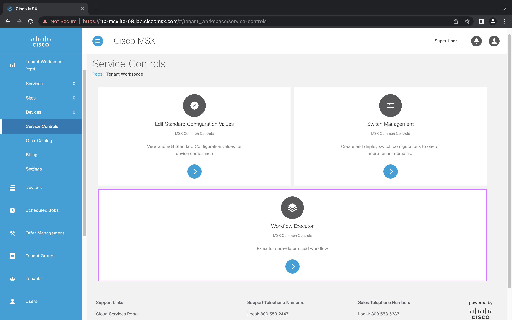
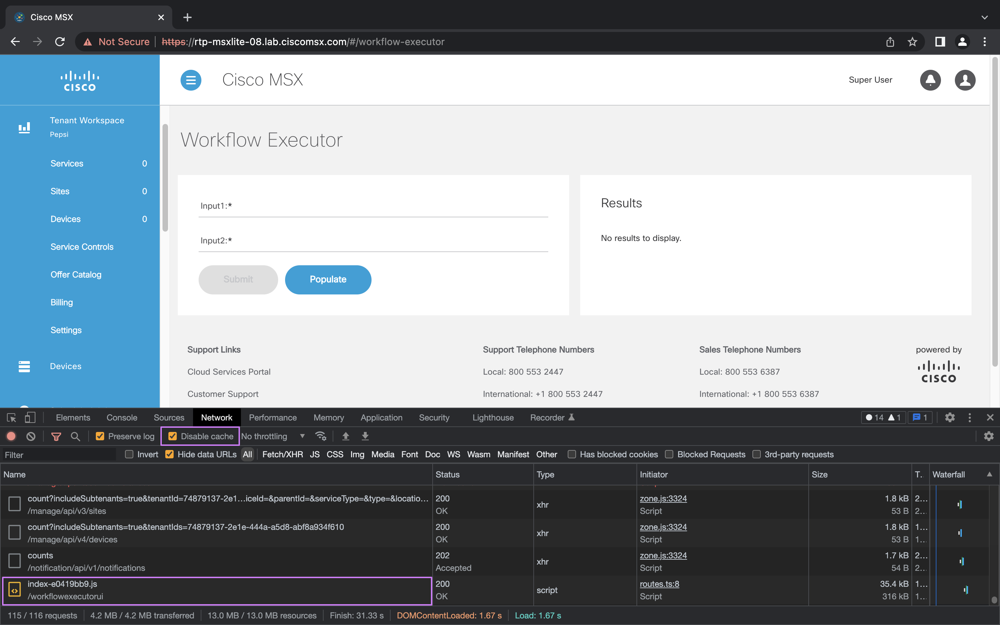

# Finding an SLM Component UI Path

* [Introduction](#introduction)
* [Goals](#goals)
* [Building and Deploying a Service Control](#building-and-deploying-a-service-control)
* [Building and Deploying a Service Pack](#building-and-deploying-a-service-pack)
* [Finding the SLM Component UI Path](#finding-the-slm-component-ui-path)
* [Conclusion](#conclusion)

## Introduction
The `msx-dev-proxy` works by layering an alternate UI on top of what is served from an MSX instance using a proxy. This
means that until we can use it we first need to build, and package, and deploy the SLM component into MSX. In this guide 
will show how to use the Chrome Developer Tools to find the path your UI is being server from. We need that information
to configure `msx-dev-proxy`.

## Goals
* building an SLM component
* deploying an SLM component
* finding the UI path

## Building and Deploying a Service Control
We are going to build a service control project from the examples. Start by downloading the source 
[here](https://github.com/CiscoDevNet/msx-examples/tree/main/workflow-service-control-example), then follow the 
instructions in the [README](https://github.com/CiscoDevNet/msx-examples/blob/main/workflow-service-control-example/README.md).

Once you have built and deployed the workflow service control you can find the tile to launch it in 
`Tenant Workspace -> Service Controls`. The tile is highlighted in the screenshot below. Note that if your MSX instance 
does not have any tenants you will need to create one first.

## Building and Deploying a Service Pack
The main difference between a Service Control and Service Pack is that you need to subscribe to the latter. 
There is a separate guide that walks you through generating, building, and deploying a Service Pack [(help me)](../07-angular-user-interface-example/01-introduction-to-tenant-centric-ui.md).

## Finding the SLM Component UI Path
Before you open the service control open the `Developer Tools` in your browser and select the `Network` tab. 
You can also save yourself some headaches by disabling caching. After you have opened the service control look in the 
`Network` tab for the path the UI was served from. See the highlighted areas in the screenshot. So in this example the 
value we are looking for is `/workflowexecutorui`.

## Conclusion
In this guide we built, deployed, and ran an SLM component before using the browser to spy on where the UI was being
served from. You can also look in the SLM manifest [(help me)](https://github.com/CiscoDevNet/msx-examples/blob/94bff756a1bb74f324d8ec9447715a4832c5807e/workflow-service-control-example/config/manifest.yml#L15) for your component to find the context path. We used the `Developer Tools` as there is often a difference between what should happen and reality. If you jumped straight into this guide the SLM manifest is included
in the tarball of the component you upload to MSX [(help)](../03-msx-component-manager/02-configuring-the-component-manifest.md).

| [PREVIOUS](01-installing-the-msx-dev-proxy.md) | [NEXT](03-serving-an-slm-component-ui-locally.md) | [HOME](../index.md#msx-dev-proxy) |

