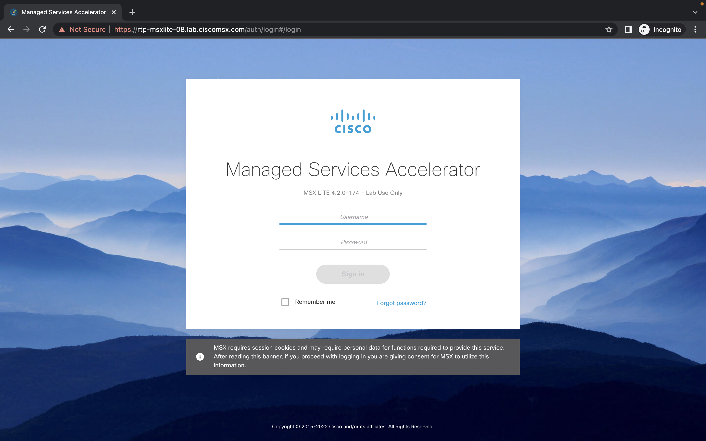
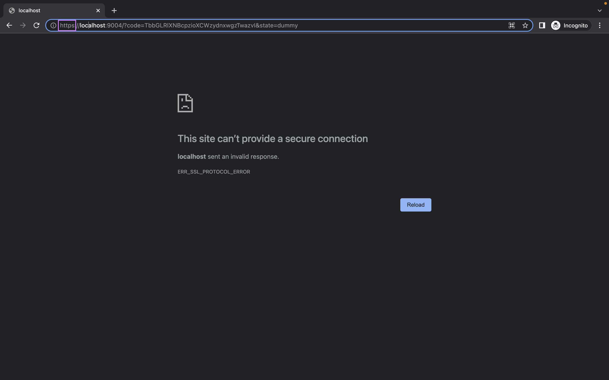
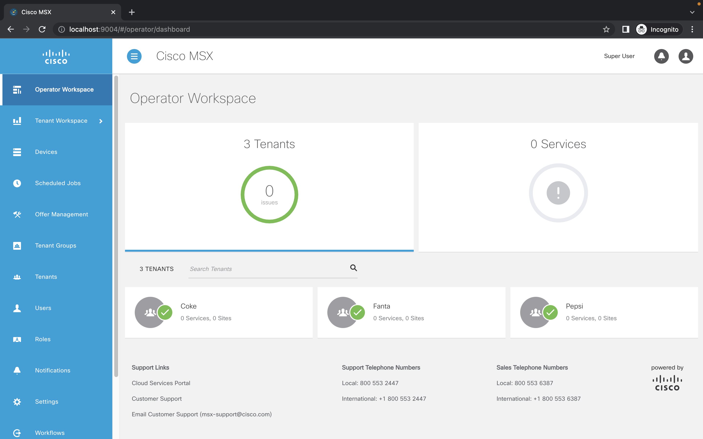
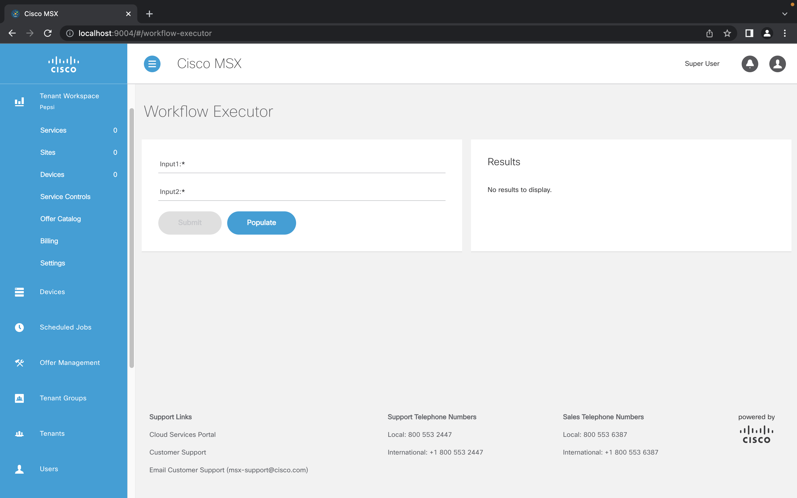
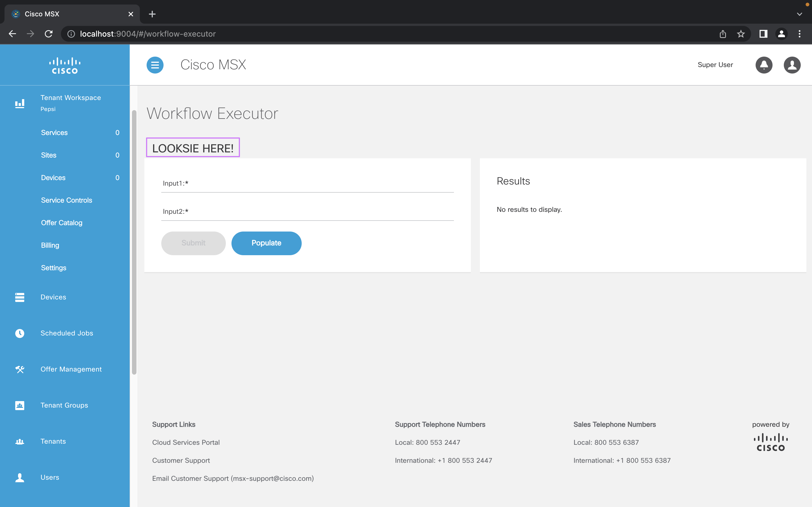

# Running the MSX Dev Proxy

* [Introduction](#introduction)
* [Goals](#goals)
* [Starting msx-dev-proxy](#starting-msx-dev-proxy)
* [Going Through an SSO Flow](#going-through-an-sso-flow)
* [Navigating to the Workflow Executor](#navigating-to-the-workflow-executor)
* [Making a Local Change](#making-a-local-change)
* [Viewing the Local Change](#viewing-the-local-change)
* [Conclusion](#conclusion)


## Introduction
We have built and deployed and SLM component, found the path it is server on, then started serving the UI from that path locally. Now we are going to use `msx-dev-proxy` to develop our UI locally against a remote MSX instance.


## Goals
* start msx-dev-proxy
* do local UI development


## Starting msx-dev-proxy
To start the `msx-dev-proxy` navigate to the root folder of the `workflow-service-control-example` then run the following 
command. Make sure you replace `rtp-msxlite-08.lab.ciscomsx.com` with the hostname of your MSX instance.

```shell
$ cd ~/Projects/workflow-service-control-example
$ npx msx-dev-proxy ./build/ rtp-msxlite-08.lab.ciscomsx.com
```


## Going Through an SSO Flow
Open an incognito browser and go to `https://localhost:9004`, if you are not redirected to an SSO login page edit the 
URL to be `http://localhost:9004` and press enter. You should see a screen like this:



After you have entered your credentials you will be redirected to a URL like `https://localhost:9004/?code=eVQBBOqbHoxpSsbFZbDwTJwhGbHgUTeH&state=dummy`, this time you will definitely need to change `https` to `http` and press enter. Sorry about that... we will fix this in the next `msx-dev-proxy` release.



You should then find yourself on the `Operator Workspace` page.




## Navigating to the Workflow Executor
Navigate to the service control by selecting `Tenant Workspace -> Service Control -> Workflow Executor`.




## Making a Local Change
Go the source for `workflow-service-control-example` and edit the file `./src/ui/workflow-executor/workflow-executor.component.html`. Add something after the title like this and save the file.
```html
<h1 class="sk-font-page-title page-title-section"
  msxResourceString="workflowexecutor.service_control.workflow_executor.name">
</h1>

<h2>&nbsp;&nbsp;&nbsp;&nbsp; LOOKSIE HERE!</h2>
.
.
.
```


## Viewing the Local Change
Hit refresh on the browser and navigate to the service control again. You should see you change.



> **GOTCHA**
>
> Remember we are running a proxy between localhost and your MSX instance. 
> This does not update the version of your component on the MSX instance.

## Conclusion
You can not work on your SLM component UI locally without having to package and upload it to MSX every time. There are some hoops to jump through, like the SSO redirect workaround and having to reload the entire application, but it faster that building, packaging, and deploying everytime.


| [PREVIOUS](03-serving-an-slm-component-ui-locally.md) |  [HOME](../index.md#msx-dev-proxy) |