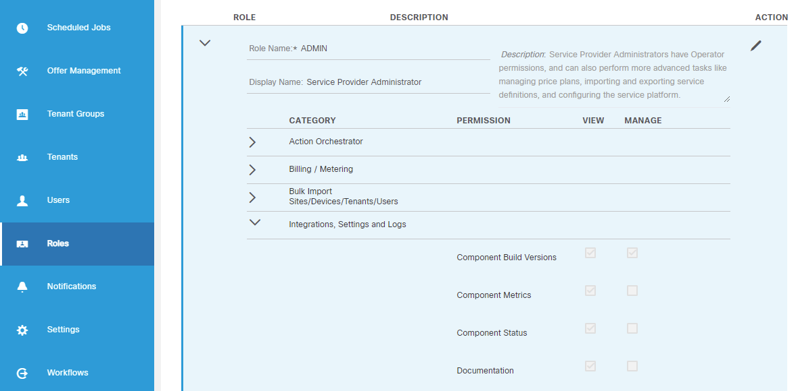

# MSX Roles

MSX comes with a set of preinstalled Roles and Permissions.

* Permission can be VIEW or MANAGE. Example: MANAGE_COMPONENT_METRICS, VIEW_DEVICES.
* Permission has category attribute. Example: Billing / Metering. Permissions categories 
  help to navigate through the long list of permissions.
* List of MSX Permissions is extendable. Services deplyed to MSX can introduce their Permissions.

MSX Role is a named group of MSX Permissions. Example: ADMIN, Tenant Administrator.
All MSX preinstalled roles can be changed or deleted.
New roles can be added to MSX. The is no limit to number of roles that can be configured in MSX.

Permission can be associated with multiple roles.

Example:  
Role `New User` can have permissions
```
MANAGE_SCHEDULE_TASK  
MANAGE_LICENSING_CONFIGURATION  
MANAGE_WORKFLOW_VARIABLE  
MANAGE_SERVICE_EXTENSION
```

Role `Other User` can have permissions  
```
MANAGE_WORKFLOW_VARIABLE  
MANAGE_SERVICE_EXTENSION  
DEVICE_MANAGEMENT
MANAGE_TARGET
ACCESS_ALL_TENANTS
```

Notice permissions `MANAGE_WORKFLOW_VARIABLE` and `MANAGE_SERVICE_EXTENSION` are present in both roles.

## Roles and Users

MSX Roles are assigned to Users. Taking example above user `cokeuser` can have both `New User`and `Other User` roles assigned to him
and list of effective permissions for this user will be the combination of permissions in both roles.

```
MANAGE_SCHEDULE_TASK  
MANAGE_LICENSING_CONFIGURATION  
MANAGE_WORKFLOW_VARIABLE  
MANAGE_SERVICE_EXTENSION  
DEVICE_MANAGEMENT
MANAGE_TARGET
ACCESS_ALL_TENANTS
```

* Roles consist of permissions
* Roles are assigned to users
* Roles can not be assigned to roles
* Roles can not be assigned to tenant 
* Permissions are granted to users through Roles, permissions can not be assigned directly to User
* There are only "allow" type permissions in MSX, no "denied" type permissions

Note: Detailed list of preconfigured Roles and Permissions can be found in the
[User Guide](https://www.cisco.com/c/en/us/support/cloud-systems-management/managed-services-accelerator/series.html).

MSX Portal screen demonstrating Roles and Permissions.


Answering the following questions will help position your service in MSX:
* What built in MSX permissions are relevant to My Service?
* Does My Service need to introduce new Permissions?
* Does My Service need to introduce new Roles?
* What permissions MSX users need have to use My Service?
