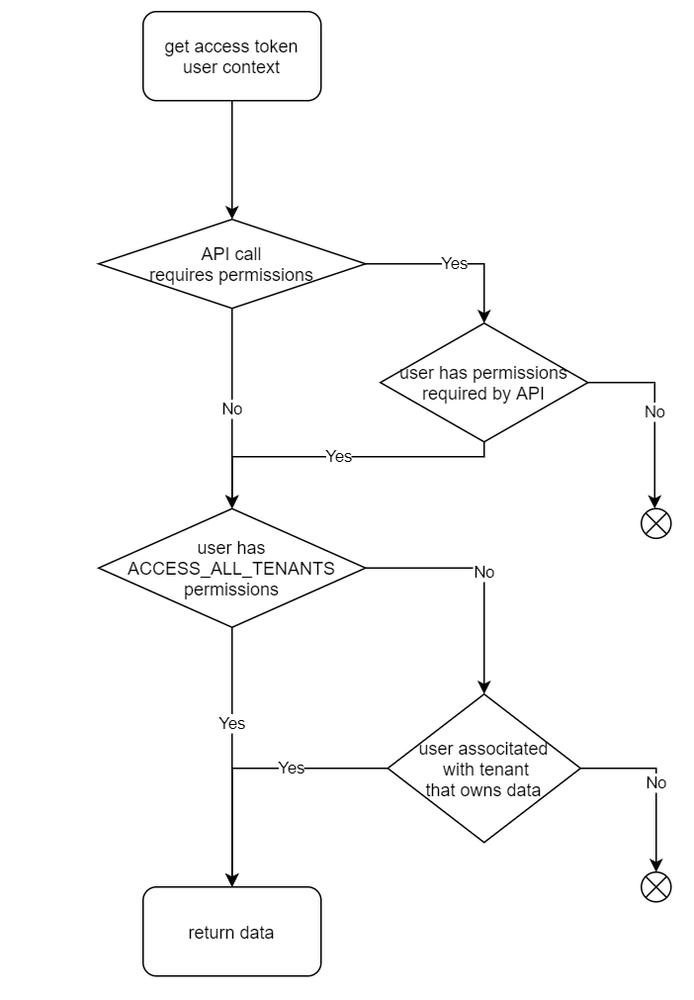
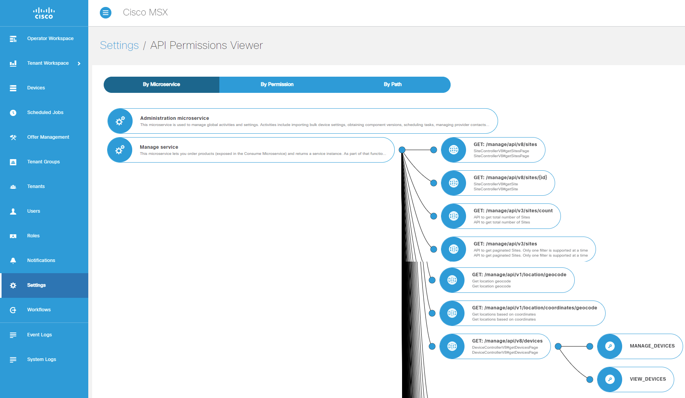

# How do MSX Users, Tenants, Roles and Permissions Work Together?

MSX Web Portal is backed up by a set of Microservices exposing REST API.  
MSX User gets access token assigned to him when he logs into the MSX Web Portal.  
Consecutive User actions on the MSX Web Portal use access token when calling MSX APIs. MSX Web Portal User Interface takes user permissions into account however logic is easier to demonstrate on REST API call.

Here is the logic flow for the API call that tries to receive tenant data.

MSX Comes with API Permissions Viewer that shows what permissions are required for each API call.  

## Practical Examples

GET /manage/api/d8/devices API is used for the examples below.

Let's say there are two tenants in the system `Coke` and `Pepsi`. Each tenant has 5 devices in MSX. Call is asking for all devices that current user can see.

Example 1: User `theadmin` has `MANAGE_DEVICE`, `VIEW_DEVICE` and `ALL_TENANTS` permissions.  
User `theadmin` is not associated with any tenant.  
User calls GET /manage/api/d8/devices API.  
Result: User `theadmin` will get 10 device from both tenants because he has all API permissions and `ALL_TENANTS` permission.

Example 2: User `thetenantops` has `MANAGE_DEVICE` and `VIEW_DEVICE` permissions.  
User `thetenantops` is associated with tenants `Coke` and `Pepsi`.
User calls GET /manage/api/d8/devices API.  
Result: User `thetenantops` will get 10 device from both tenants because he has all API permissions and is associated with both tenants.

Example 3: User `thecokeuser` has `MANAGE_DEVICE` and `VIEW_DEVICE` permissions.  
User `thecokeuser` is associated with tenant `Coke`.
User calls GET /manage/api/d8/devices API.  
Result: User `thecokeuser` will get 5 device from tenant `Coke` because he has all API permissions and is associated only with tenant `Coke`.

Example 4: User `theviewer` has `VIEW_DEVICE` permissions.  
User `theviewer` is associated with tenants `Coke` and `Pepsi`.
User calls GET /manage/api/d8/devices API.  
Result: User `theviewer` will not get any devices since he does not have `MANAGE_DEVICE` permissions requried by API.

